# Cignal Chatbot (TALA) — Process Flow Documentation (Visual)

Companion to `CIGNAL_CHATBOT_SYSTEM_DISCOVERY.md`. Discovery date: 2 Oct 2026 (read-only exploration of `https://chatbot.mycignal.ph/admin`).

**Labels:** **[OBSERVED]** = seen in configuration, logs or transcripts · **[INFERRED]** = likely, needs backend validation · **[PROPOSED]** = recommended for reporting. In the diagrams, dashed arrows (`-.->`) mark **inferred** paths.

## Contents

1. Overall chatbot flow
2. Entry, consent & pre-chat
3. Menu hierarchy — Cignal
4. Menu hierarchy — SatLite
5. Menu hierarchy — Cignal Play
6. Customer journey (stages)
7. Authentication / account lookup flow
8. Transaction flow — Pay Bill or Topup (lookup + routing)
9. Successful transaction (sequence)
10. Failed transaction (sequence)
11. Resolution check & closing sequence
12. AI free-text & fallback flow
13. Escalation flow
14. Live-agent lifecycle (sequence)
15. Sales / Apply Now flow
16. Session termination & abandonment
17. Conversation state model
18. Data / reporting event flow
19. Episode & summary-row model (why rows double-count)
20. Proposed reporting pipeline

---

## 1. Overall chatbot flow [OBSERVED, closing order INFERRED]

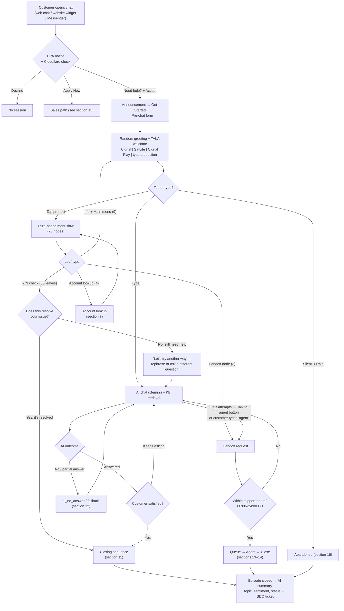
```mermaid
flowchart TD
    A["Customer opens chat<br/>(web chat / website widget / Messenger)"] --> B{"DPA notice<br/>+ Cloudflare check"}
    B -- "Decline" --> X0["No session"]
    B -- "Apply Now" --> S["Sales path (see section 15)"]
    B -- "Need help? + Accept" --> C["Announcement → Get Started<br/>→ Pre-chat form"]
    C --> D["Random greeting + TALA welcome<br/>Cignal | SatLite | Cignal Play | type a question"]
    D --> E{"Tap or type?"}
    E -- "Tap product" --> F["Rule-based menu flow<br/>(73 nodes)"]
    E -- "Type" --> G["AI chat (Gemini) + KB retrieval"]
    F --> H{"Leaf type"}
    H -- "Y/N check (30 leaves)" --> I{"Does this resolve<br/>your issue?"}
    H -- "Info + Main menu (9)" --> D
    H -- "Account lookup (4)" --> L["Account lookup<br/>(section 7)"]
    H -- "Handoff node (3)" --> Q["Handoff request"]
    I -- "Yes, it's resolved" --> K["Closing sequence<br/>(section 11)"]
    I -- "No, still need help" --> R["'Let's try another way —<br/>rephrase or ask a different question'"]
    R --> G
    L --> F
    G --> M{"AI outcome"}
    M -- "Answered" --> N{"Customer satisfied?"}
    N -. "Yes" .-> K
    N -- "Keeps asking" --> G
    M -- "No / partial answer" --> O["ai_no_answer / fallback<br/>(section 12)"]
    O --> G
    G -- "3 KB attempts → Talk to agent button<br/>or customer types 'agent'" --> Q
    Q --> P{"Within support hours?<br/>06:00–24:00 PH"}
    P -- "No" --> G
    P -- "Yes" --> T["Queue → Agent → Close<br/>(sections 13–14)"]
    K --> Z["Episode closed → AI summary,<br/>topic, sentiment, status → SDQ ticket"]
    T --> Z
    E -- "Silent 30 min" --> AB["Abandoned (section 16)"]
    AB --> Z
```

---

## 2. Entry, consent & pre-chat [OBSERVED]

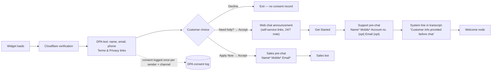
```mermaid
flowchart LR
    W["Widget loads"] --> CF["Cloudflare verification"]
    CF --> DPA["DPA text: name, email, phone<br/>Terms & Privacy links"]
    DPA --> CH{"Customer choice"}
    CH -- "Decline" --> END0["Exit — no consent record"]
    CH -- "Apply Now → Accept" --> SF["Sales pre-chat<br/>Name* Mobile* Email*"]
    CH -- "Need help? → Accept" --> AN["Web chat announcement<br/>(self-service links, 24/7 note)"]
    AN --> GS["Get Started"]
    GS --> PF["Support pre-chat<br/>Name* Mobile* Account no. (opt) Email (opt)"]
    PF --> SYS["System line in transcript:<br/>'Customer info provided before chat'"]
    SYS --> WEL["Welcome node"]
    SF --> SALES["Sales bot"]
    DPA -. "consent logged once per sender + channel" .-> LOG[("DPA consent log")]
```

Messenger: consent text comes from the *DPA Consent Message* setting. Each FB page has its own plain-text announcement and its own entry node (Page Flow Assignment). **[OBSERVED]**

---

## 3. Menu hierarchy — Cignal [OBSERVED]

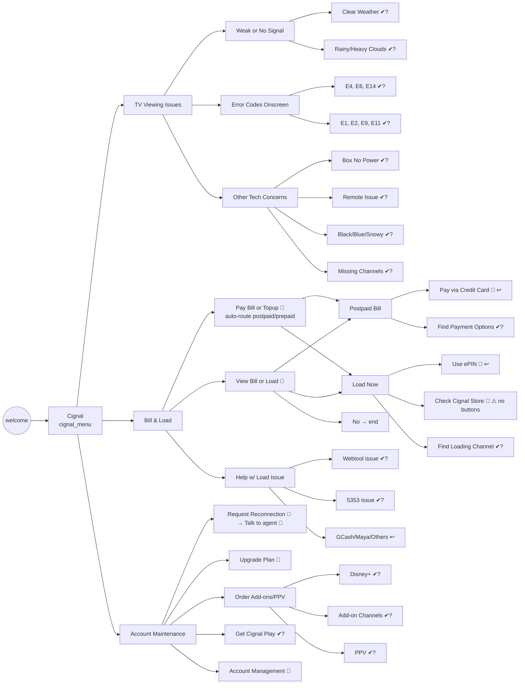
```mermaid
flowchart LR
    W(("welcome")) --> CM["Cignal<br/>cignal_menu"]
    CM --> T["TV Viewing Issues"]
    CM --> B["Bill & Load"]
    CM --> AC["Account Maintenance"]

    T --> WS["Weak or No Signal"]
    WS --> WC["Clear Weather ✔?"]
    WS --> WR["Rainy/Heavy Clouds ✔?"]
    T --> ER["Error Codes Onscreen"]
    ER --> E1["E4, E6, E14 ✔?"]
    ER --> E2["E1, E2, E9, E11 ✔?"]
    T --> OT["Other Tech Concerns"]
    OT --> BP["Box No Power ✔?"]
    OT --> RM["Remote Issue ✔?"]
    OT --> VB["Black/Blue/Snowy ✔?"]
    OT --> MC["Missing Channels ✔?"]

    B --> VI["View Bill or Load 🔐"]
    VI --> PP
    VI --> LN
    VI --> VIN["No → end"]
    B --> PT["Pay Bill or Topup 🔐<br/>auto-route postpaid/prepaid"]
    PT --> PP["Postpaid Bill"]
    PT --> LN["Load Now"]
    PP --> CC["Pay via Credit Card 🔗 ↩"]
    PP --> PO["Find Payment Options ✔?"]
    LN --> EP["Use ePIN 🔗 ↩"]
    LN --> ST["Check Cignal Store 🔗 ⚠ no buttons"]
    LN --> OC["Find Loading Channel ✔?"]
    B --> HL["Help w/ Load Issue"]
    HL --> WT["Webtool issue ✔?"]
    HL --> F5["5353 issue ✔?"]
    HL --> GC["GCash/Maya/Others ↩"]

    AC --> RC["Request Reconnection 🔐 → Talk to agent 👤"]
    AC --> UP["Upgrade Plan 👤"]
    AC --> AD["Order Add-ons/PPV"]
    AD --> DS["Disney+ ✔?"]
    AD --> CH["Add-on Channels ✔?"]
    AD --> PV["PPV ✔?"]
    AC --> GP["Get Cignal Play ✔?"]
    AC --> AM["Account Management 👤"]
```

Legend: ✔? = Yes/No resolution check · 🔐 = account lookup · 👤 = live-agent handoff · 🔗 = link · ↩ = "Main menu" button only · ⚠ = dead end.

---

## 4. Menu hierarchy — SatLite [OBSERVED]

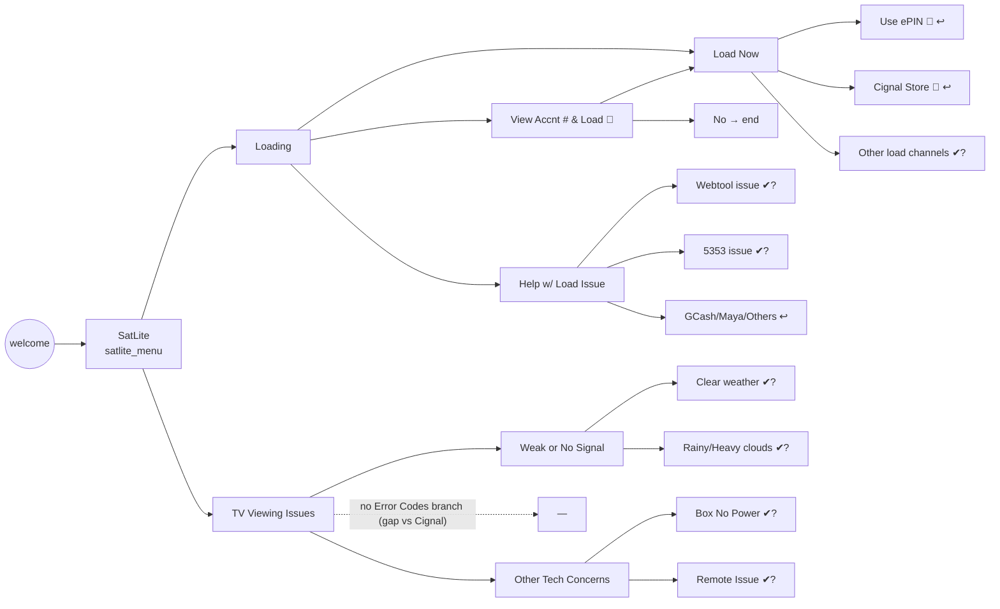
```mermaid
flowchart LR
    W(("welcome")) --> SM["SatLite<br/>satlite_menu"]
    SM --> LO["Loading"]
    SM --> TV["TV Viewing Issues"]
    LO --> VA["View Accnt # & Load 🔐"]
    VA --> LN["Load Now"]
    VA --> NO["No → end"]
    LO --> LN
    LN --> EP["Use ePIN 🔗 ↩"]
    LN --> CS["Cignal Store 🔗 ↩"]
    LN --> OL["Other load channels ✔?"]
    LO --> HL["Help w/ Load Issue"]
    HL --> WT["Webtool issue ✔?"]
    HL --> F5["5353 issue ✔?"]
    HL --> GC["GCash/Maya/Others ↩"]
    TV --> WS["Weak or No Signal"]
    WS --> WC["Clear weather ✔?"]
    WS --> WR["Rainy/Heavy clouds ✔?"]
    TV --> OT["Other Tech Concerns"]
    OT --> BP["Box No Power ✔?"]
    OT --> RM["Remote Issue ✔?"]
    TV -. "no Error Codes branch (gap vs Cignal)" .-> GAP["—"]
```

---

## 5. Menu hierarchy — Cignal Play [OBSERVED]

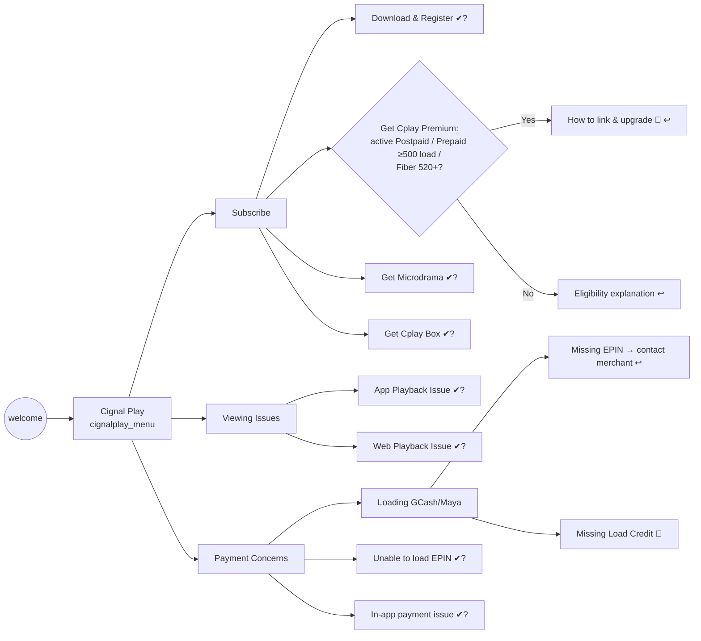
```mermaid
flowchart LR
    W(("welcome")) --> PM["Cignal Play<br/>cignalplay_menu"]
    PM --> SU["Subscribe"]
    PM --> VI["Viewing Issues"]
    PM --> PA["Payment Concerns"]
    SU --> DL["Download & Register ✔?"]
    SU --> PR{"Get Cplay Premium:<br/>active Postpaid / Prepaid ≥500 load /<br/>Fiber 520+?"}
    PR -- "Yes" --> PRY["How to link & upgrade 🔗 ↩"]
    PR -- "No" --> PRN["Eligibility explanation ↩"]
    SU --> MD["Get Microdrama ✔?"]
    SU --> BX["Get Cplay Box ✔?"]
    VI --> AP["App Playback Issue ✔?"]
    VI --> WB["Web Playback Issue ✔?"]
    PA --> GM["Loading GCash/Maya"]
    GM --> ME["Missing EPIN → contact merchant ↩"]
    GM --> MLC["Missing Load Credit 👤"]
    PA --> UE["Unable to load EPIN ✔?"]
    PA --> IA["In-app payment issue ✔?"]
```

The *Cignal Play* Facebook page enters directly at `cignalplay_menu`. **[OBSERVED]**

---

## 6. Customer journey (stages) [PROPOSED reporting view]

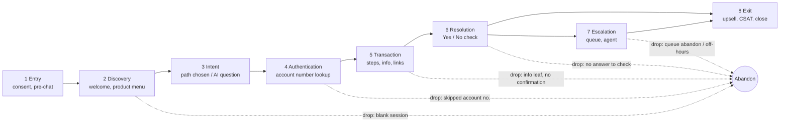
```mermaid
flowchart LR
    S1["1 Entry<br/>consent, pre-chat"] --> S2["2 Discovery<br/>welcome, product menu"]
    S2 --> S3["3 Intent<br/>path chosen / AI question"]
    S3 --> S4["4 Authentication<br/>account number lookup"]
    S4 --> S5["5 Transaction<br/>steps, info, links"]
    S5 --> S6["6 Resolution<br/>Yes / No check"]
    S6 --> S8["8 Exit<br/>upsell, CSAT, close"]
    S6 --> S7["7 Escalation<br/>queue, agent"]
    S7 --> S8
    S2 -. "drop: blank session" .-> D1(("Abandon"))
    S4 -. "drop: skipped account no." .-> D1
    S5 -. "drop: info leaf, no confirmation" .-> D1
    S6 -. "drop: no answer to check" .-> D1
    S7 -. "drop: queue abandon / off-hours" .-> D1
```

---

## 7. Authentication / account lookup flow [OBSERVED config; failure path INFERRED]

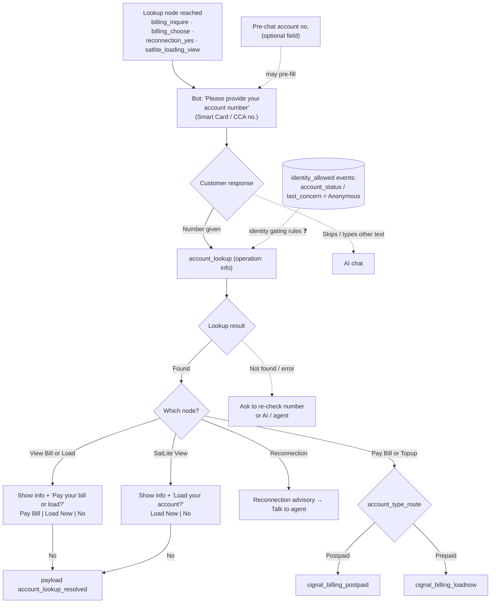
```mermaid
flowchart TD
    A["Lookup node reached<br/>billing_inquire · billing_choose ·<br/>reconnection_yes · satlite_loading_view"] --> B["Bot: 'Please provide your account number'<br/>(Smart Card / CCA no.)"]
    PC["Pre-chat account no.<br/>(optional field)"] -. "may pre-fill" .-> B
    B --> C{"Customer response"}
    C -- "Number given" --> D["account_lookup (operation: info)"]
    C -. "Skips / types other text" .-> AI["AI chat"]
    D --> E{"Lookup result"}
    E -- "Found" --> F{"Which node?"}
    F -- "View Bill or Load" --> G["Show info + 'Pay your bill or load?'<br/>Pay Bill | Load Now | No"]
    F -- "Pay Bill or Topup" --> H{"account_type_route"}
    H -- "Postpaid" --> I["cignal_billing_postpaid"]
    H -- "Prepaid" --> J["cignal_billing_loadnow"]
    F -- "Reconnection" --> K["Reconnection advisory → Talk to agent"]
    F -- "SatLite View" --> L["Show info + 'Load your account?'<br/>Load Now | No"]
    E -. "Not found / error" .-> M["Ask to re-check number<br/>or AI / agent"]
    G -- "No" --> N["payload account_lookup_resolved"]
    L -- "No" --> N
    ID[("identity_allowed events:<br/>account_status / last_concern = Anonymous")] -. "identity gating rules ❓" .-> D
```

No OTP/PIN step was observed. **[OBSERVED absence]**

---

## 8. Transaction flow — Pay Bill or Topup [OBSERVED]

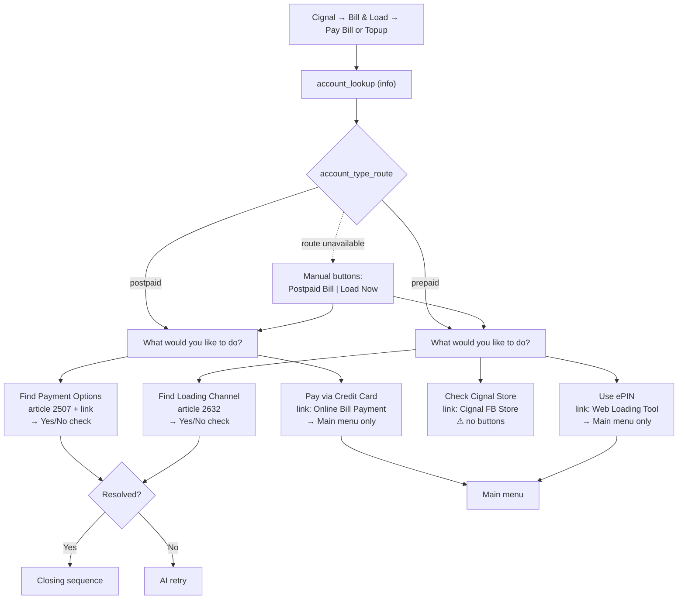
```mermaid
flowchart TD
    A["Cignal → Bill & Load → Pay Bill or Topup"] --> B["account_lookup (info)"]
    B --> C{"account_type_route"}
    C -- "postpaid" --> D["What would you like to do?"]
    C -- "prepaid" --> E["What would you like to do?"]
    C -. "route unavailable" .-> F["Manual buttons:<br/>Postpaid Bill | Load Now"]
    F --> D
    F --> E
    D --> D1["Pay via Credit Card<br/>link: Online Bill Payment<br/>→ Main menu only"]
    D --> D2["Find Payment Options<br/>article 2507 + link<br/>→ Yes/No check"]
    E --> E1["Use ePIN<br/>link: Web Loading Tool<br/>→ Main menu only"]
    E --> E2["Check Cignal Store<br/>link: Cignal FB Store<br/>⚠ no buttons"]
    E --> E3["Find Loading Channel<br/>article 2632<br/>→ Yes/No check"]
    D2 --> Y{"Resolved?"}
    E3 --> Y
    Y -- "Yes" --> CL["Closing sequence"]
    Y -- "No" --> AI["AI retry"]
    D1 --> MM["Main menu"]
    E1 --> MM
```

The bot **does not process payments**. It routes to external payment and loading tools, and those outcomes are **not visible** to reporting. **[OBSERVED]**

---

## 9. Successful transaction (sequence) [OBSERVED]

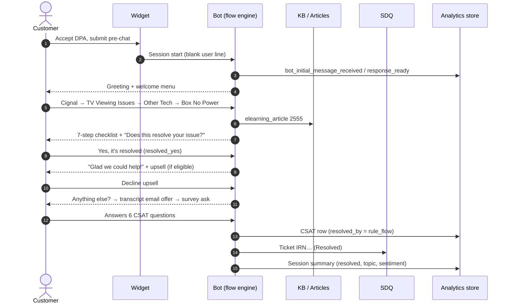
```mermaid
sequenceDiagram
    autonumber
    actor C as Customer
    participant W as Widget
    participant B as Bot (flow engine)
    participant K as KB / Articles
    participant S as SDQ
    participant A as Analytics store
    C->>W: Accept DPA, submit pre-chat
    W->>B: Session start (blank user line)
    B->>A: bot_initial_message_received / response_ready
    B-->>C: Greeting + welcome menu
    C->>B: Cignal → TV Viewing Issues → Other Tech → Box No Power
    B->>K: elearning_article 2555
    B-->>C: 7-step checklist + "Does this resolve your issue?"
    C->>B: Yes, it's resolved (resolved_yes)
    B-->>C: "Glad we could help!" + upsell (if eligible)
    C->>B: Decline upsell
    B-->>C: Anything else? → transcript email offer → survey ask
    C->>B: Answers 6 CSAT questions
    B->>A: CSAT row (resolved_by = rule_flow)
    B->>S: Ticket IRN… (Resolved)
    B->>A: Session summary (resolved, topic, sentiment)
```

---

## 10. Failed transaction (sequence) [OBSERVED transcript]

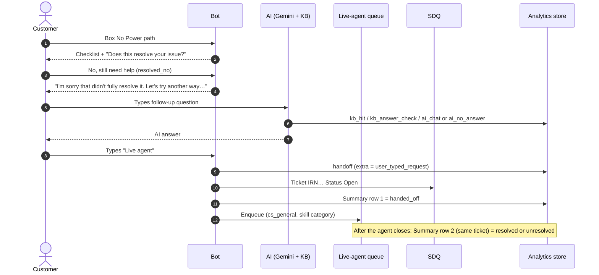
```mermaid
sequenceDiagram
    autonumber
    actor C as Customer
    participant B as Bot
    participant G as AI (Gemini + KB)
    participant Q as Live-agent queue
    participant S as SDQ
    participant A as Analytics store
    C->>B: Box No Power path
    B-->>C: Checklist + "Does this resolve your issue?"
    C->>B: No, still need help (resolved_no)
    B-->>C: "I'm sorry that didn't fully resolve it. Let's try another way…"
    C->>G: Types follow-up question
    G->>A: kb_hit / kb_answer_check / ai_chat or ai_no_answer
    G-->>C: AI answer
    C->>B: Types "Live agent"
    B->>A: handoff (extra = user_typed_request)
    B->>S: Ticket IRN… Status Open
    B->>A: Summary row 1 = handed_off
    B->>Q: Enqueue (cs_general, skill category)
    Note over Q,A: After the agent closes: Summary row 2 (same ticket) = resolved or unresolved
```

---

## 11. Resolution check & closing sequence [OBSERVED settings; exact order INFERRED]

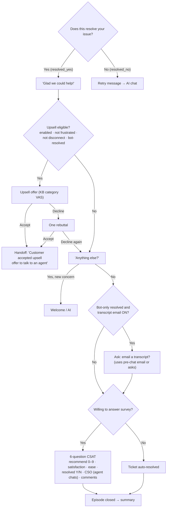
```mermaid
flowchart TD
    A{"Does this resolve your issue?"} -- "Yes (resolved_yes)" --> B["'Glad we could help!'"]
    A -- "No (resolved_no)" --> R["Retry message → AI chat"]
    B --> U{"Upsell eligible?<br/>enabled · not frustrated ·<br/>not disconnect · bot-resolved"}
    U -- "Yes" --> U1["Upsell offer (KB category VAS)"]
    U1 -- "Accept" --> H["Handoff: 'Customer accepted upsell<br/>offer to talk to an agent'"]
    U1 -- "Decline" --> U2["One rebuttal"]
    U2 -- "Accept" --> H
    U2 -- "Decline again" --> E
    U -- "No" --> E["'Anything else?'"]
    E -- "Yes, new concern" --> W["Welcome / AI"]
    E -- "No" --> T{"Bot-only resolved and<br/>transcript email ON?"}
    T -- "Yes" --> T1["Ask: email a transcript?<br/>(uses pre-chat email or asks)"]
    T -- "No" --> SV
    T1 --> SV{"Willing to answer survey?"}
    SV -- "Yes" --> CS["6-question CSAT<br/>recommend 0–9 · satisfaction · ease ·<br/>resolved Y/N · CSO (agent chats) · comments"]
    SV -- "No" --> AR["Ticket auto-resolved"]
    CS --> END["Episode closed → summary"]
    AR --> END
```

---

## 12. AI free-text & fallback flow [OBSERVED events; thresholds INFERRED]

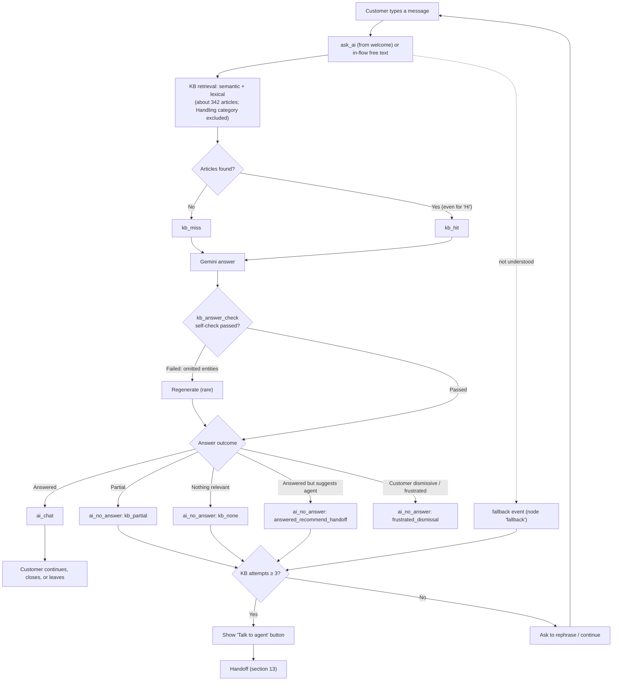
```mermaid
flowchart TD
    A["Customer types a message"] --> B["ask_ai (from welcome) or in-flow free text"]
    B --> C["KB retrieval: semantic + lexical<br/>(about 342 articles; Handling category excluded)"]
    C --> D{"Articles found?"}
    D -- "No" --> KM["kb_miss"]
    D -- "Yes (even for 'Hi')" --> KH["kb_hit"]
    KH --> G["Gemini answer"]
    KM --> G
    G --> SC{"kb_answer_check<br/>self-check passed?"}
    SC -- "Failed: omitted entities" --> RG["Regenerate (rare)"]
    RG --> OUT
    SC -- "Passed" --> OUT{"Answer outcome"}
    OUT -- "Answered" --> AC["ai_chat"]
    OUT -- "Partial" --> NP["ai_no_answer: kb_partial"]
    OUT -- "Nothing relevant" --> NN["ai_no_answer: kb_none"]
    OUT -- "Answered but suggests agent" --> NR["ai_no_answer: answered_recommend_handoff"]
    OUT -- "Customer dismissive / frustrated" --> NF["ai_no_answer: frustrated_dismissal"]
    B -. "not understood" .-> FB["fallback event (node 'fallback')"]
    NP --> CNT{"KB attempts ≥ 3?"}
    NN --> CNT
    NR --> CNT
    FB --> CNT
    CNT -- "Yes" --> TA["Show 'Talk to agent' button"]
    CNT -- "No" --> RP["Ask to rephrase / continue"]
    RP --> A
    TA --> HO["Handoff (section 13)"]
    AC --> NEXT["Customer continues, closes, or leaves"]
```

Invalid input · unknown intent · repeated invalid input · lookup failure · backend failure — summary of what is known:

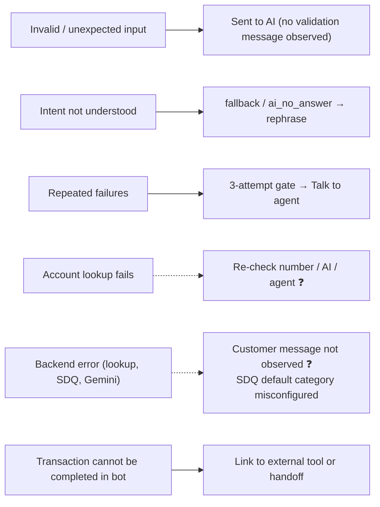
```mermaid
flowchart LR
    I1["Invalid / unexpected input"] --> AI["Sent to AI (no validation message observed)"]
    I2["Intent not understood"] --> FB["fallback / ai_no_answer → rephrase"]
    I3["Repeated failures"] --> GATE["3-attempt gate → Talk to agent"]
    I4["Account lookup fails"] -.-> RE["Re-check number / AI / agent ❓"]
    I5["Backend error (lookup, SDQ, Gemini)"] -.-> UNK["Customer message not observed ❓<br/>SDQ default category misconfigured"]
    I6["Transaction cannot be completed in bot"] --> LINK["Link to external tool or handoff"]
```

---

## 13. Escalation flow [OBSERVED]

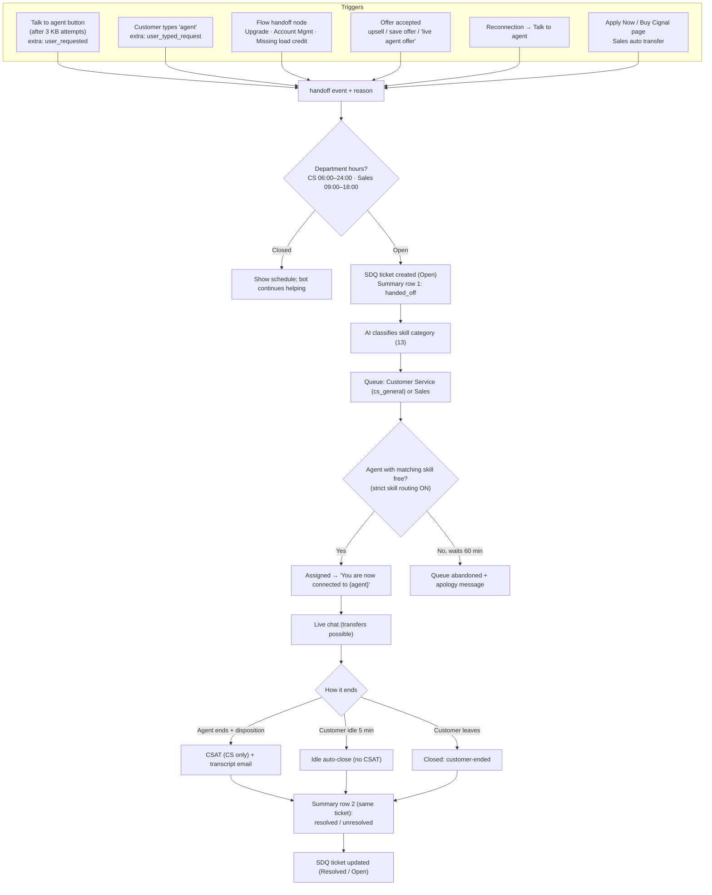
```mermaid
flowchart TD
    subgraph Triggers
        T1["Talk to agent button<br/>(after 3 KB attempts)<br/>extra: user_requested"]
        T2["Customer types 'agent'<br/>extra: user_typed_request"]
        T3["Flow handoff node<br/>Upgrade · Account Mgmt · Missing load credit"]
        T4["Offer accepted<br/>upsell / save offer / 'live agent offer'"]
        T5["Reconnection → Talk to agent"]
        T6["Apply Now / Buy Cignal page<br/>Sales auto transfer"]
    end
    T1 --> H["handoff event + reason"]
    T2 --> H
    T3 --> H
    T4 --> H
    T5 --> H
    T6 --> H
    H --> HR{"Department hours?<br/>CS 06:00–24:00 · Sales 09:00–18:00"}
    HR -- "Closed" --> SCH["Show schedule; bot continues helping"]
    HR -- "Open" --> TK["SDQ ticket created (Open)<br/>Summary row 1: handed_off"]
    TK --> SK["AI classifies skill category (13)"]
    SK --> QU["Queue: Customer Service (cs_general) or Sales"]
    QU --> AS{"Agent with matching skill free?<br/>(strict skill routing ON)"}
    AS -- "Yes" --> AG["Assigned → 'You are now connected to {agent}'"]
    AS -- "No, waits 60 min" --> QA["Queue abandoned + apology message"]
    AG --> CH["Live chat (transfers possible)"]
    CH --> CL{"How it ends"}
    CL -- "Agent ends + disposition" --> CS["CSAT (CS only) + transcript email"]
    CL -- "Customer idle 5 min" --> IC["Idle auto-close (no CSAT)"]
    CL -- "Customer leaves" --> CE["Closed: customer-ended"]
    CS --> R2["Summary row 2 (same ticket):<br/>resolved / unresolved"]
    IC --> R2
    CE --> R2
    R2 --> TU["SDQ ticket updated (Resolved / Open)"]
```

---

## 14. Live-agent lifecycle (sequence) [OBSERVED Customer Journey timeline]

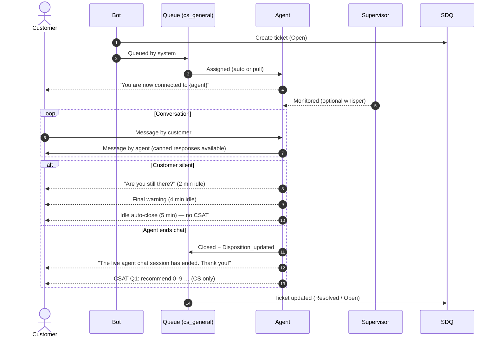
```mermaid
sequenceDiagram
    autonumber
    actor C as Customer
    participant B as Bot
    participant Q as Queue (cs_general)
    participant AG as Agent
    participant SV as Supervisor
    participant S as SDQ
    B->>S: Create ticket (Open)
    B->>Q: Queued by system
    Q->>AG: Assigned (auto or pull)
    AG-->>C: "You are now connected to {agent}"
    SV-->>AG: Monitored (optional whisper)
    loop Conversation
        C->>AG: Message by customer
        AG->>C: Message by agent (canned responses available)
    end
    alt Customer silent
        AG-->>C: "Are you still there?" (2 min idle)
        AG-->>C: Final warning (4 min idle)
        AG-->>C: Idle auto-close (5 min) — no CSAT
    else Agent ends chat
        AG->>Q: Closed + Disposition_updated
        AG-->>C: "The live agent chat session has ended. Thank you!"
        AG-->>C: CSAT Q1: recommend 0–9 … (CS only)
    end
    Q->>S: Ticket updated (Resolved / Open)
```

---

## 15. Sales / Apply Now flow [OBSERVED]

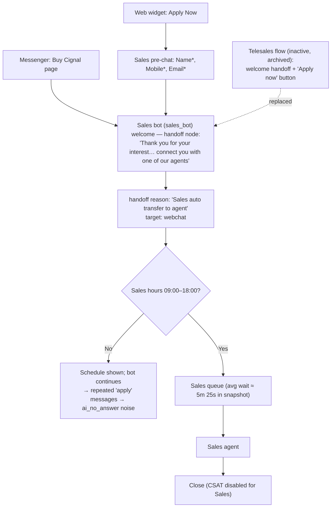
```mermaid
flowchart TD
    A1["Web widget: Apply Now"] --> F["Sales pre-chat: Name*, Mobile*, Email*"]
    A2["Messenger: Buy Cignal page"] --> SB
    F --> SB["Sales bot (sales_bot) welcome — handoff node:<br/>'Thank you for your interest… connect you with one of our agents'"]
    SB --> H["handoff reason: 'Sales auto transfer to agent'<br/>target: webchat"]
    H --> HR{"Sales hours 09:00–18:00?"}
    HR -- "No" --> SC["Schedule shown; bot continues<br/>→ repeated 'apply' messages → ai_no_answer noise"]
    HR -- "Yes" --> Q["Sales queue (avg wait ≈ 5m 25s in snapshot)"]
    Q --> AG["Sales agent"]
    AG --> END["Close (CSAT disabled for Sales)"]
    OLD["Telesales flow (inactive, archived):<br/>welcome handoff + 'Apply now' button"] -. "replaced" .-> SB
```

---

## 16. Session termination & abandonment [OBSERVED]

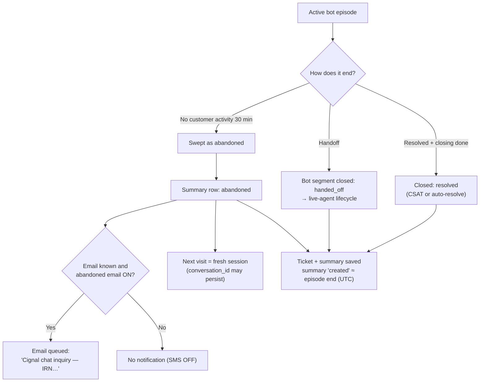
```mermaid
flowchart TD
    A["Active bot episode"] --> B{"How does it end?"}
    B -- "Resolved + closing done" --> C["Closed: resolved<br/>(CSAT or auto-resolve)"]
    B -- "Handoff" --> D["Bot segment closed: handed_off<br/>→ live-agent lifecycle"]
    B -- "No customer activity 30 min" --> E["Swept as abandoned"]
    E --> E1["Summary row: abandoned"]
    E1 --> E2{"Email known and<br/>abandoned email ON?"}
    E2 -- "Yes" --> E3["Email queued:<br/>'Cignal chat inquiry — IRN…'"]
    E2 -- "No" --> E4["No notification (SMS OFF)"]
    E1 --> E5["Next visit = fresh session<br/>(conversation_id may persist)"]
    C --> Z["Ticket + summary saved<br/>summary 'created' ≈ episode end (UTC)"]
    D --> Z
    E1 --> Z
```

---

## 17. Conversation state model [OBSERVED + PROPOSED]

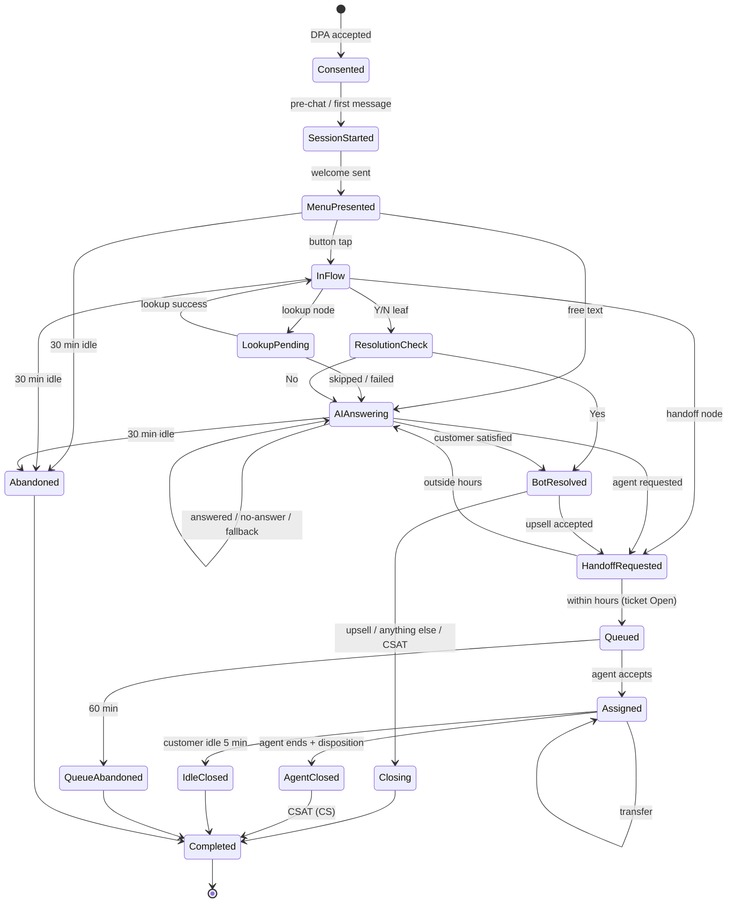
```mermaid
stateDiagram-v2
    [*] --> Consented: DPA accepted
    Consented --> SessionStarted: pre-chat / first message
    SessionStarted --> MenuPresented: welcome sent
    MenuPresented --> InFlow: button tap
    MenuPresented --> AIAnswering: free text
    InFlow --> LookupPending: lookup node
    LookupPending --> InFlow: lookup success
    LookupPending --> AIAnswering: skipped / failed
    InFlow --> ResolutionCheck: Y/N leaf
    ResolutionCheck --> BotResolved: Yes
    ResolutionCheck --> AIAnswering: No
    AIAnswering --> AIAnswering: answered / no-answer / fallback
    AIAnswering --> BotResolved: customer satisfied
    InFlow --> HandoffRequested: handoff node
    AIAnswering --> HandoffRequested: agent requested
    BotResolved --> HandoffRequested: upsell accepted
    HandoffRequested --> AIAnswering: outside hours
    HandoffRequested --> Queued: within hours (ticket Open)
    Queued --> Assigned: agent accepts
    Queued --> QueueAbandoned: 60 min
    Assigned --> Assigned: transfer
    Assigned --> AgentClosed: agent ends + disposition
    Assigned --> IdleClosed: customer idle 5 min
    BotResolved --> Closing: upsell / anything else / CSAT
    Closing --> Completed
    AgentClosed --> Completed: CSAT (CS)
    IdleClosed --> Completed
    QueueAbandoned --> Completed
    MenuPresented --> Abandoned: 30 min idle
    InFlow --> Abandoned: 30 min idle
    AIAnswering --> Abandoned: 30 min idle
    Abandoned --> Completed
    Completed --> [*]
```

---

## 18. Data / reporting event flow [OBSERVED sources]

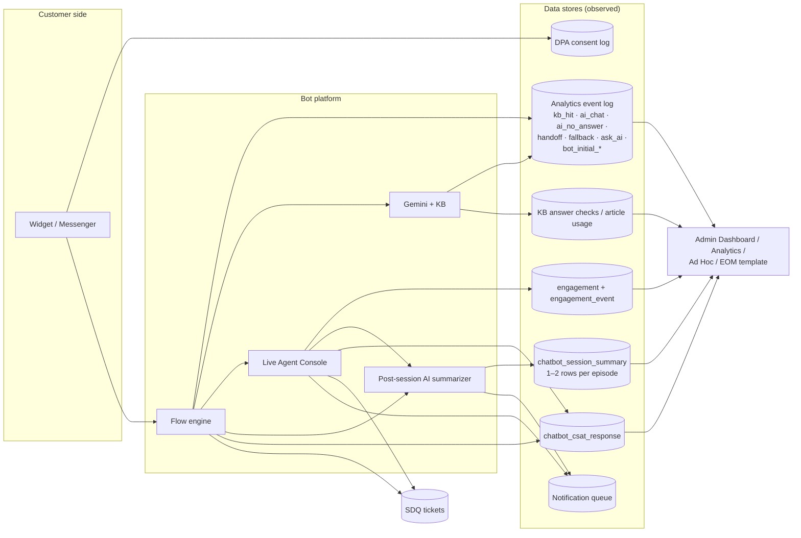
```mermaid
flowchart LR
    subgraph Customer_Side["Customer side"]
        W["Widget / Messenger"]
    end
    subgraph Bot_Platform["Bot platform"]
        FE["Flow engine"]
        AI["Gemini + KB"]
        LA["Live Agent Console"]
        SUM["Post-session AI summarizer"]
    end
    subgraph Stores["Data stores (observed)"]
        DPA[("DPA consent log")]
        EV[("Analytics event log<br/>kb_hit · ai_chat · ai_no_answer ·<br/>handoff · fallback · ask_ai ·<br/>bot_initial_*")]
        KB[("KB answer checks / article usage")]
        SS[("chatbot_session_summary<br/>1–2 rows per episode")]
        CS[("chatbot_csat_response")]
        EN[("engagement + engagement_event")]
        NQ[("Notification queue")]
    end
    SDQ[("SDQ tickets")]
    W --> DPA
    W --> FE
    FE --> EV
    FE --> AI
    AI --> EV
    AI --> KB
    FE --> LA
    LA --> EN
    FE --> SUM
    LA --> SUM
    SUM --> SS
    FE --> CS
    LA --> CS
    FE --> SDQ
    LA --> SDQ
    SUM --> NQ
    LA --> NQ
    EV --> RPT["Admin Dashboard / Analytics /<br/>Ad Hoc / EOM template"]
    SS --> RPT
    CS --> RPT
    EN --> RPT
    KB --> RPT
```

Join key across all sources: **conversation_id** (32-hex). Ticket ref exists only on summaries and SDQ. Timestamps: API and events in **UTC**; journey, SDQ and engagement timeline in **Manila**. **[OBSERVED]**

---

## 19. Episode & summary-row model — why rows double-count [OBSERVED]

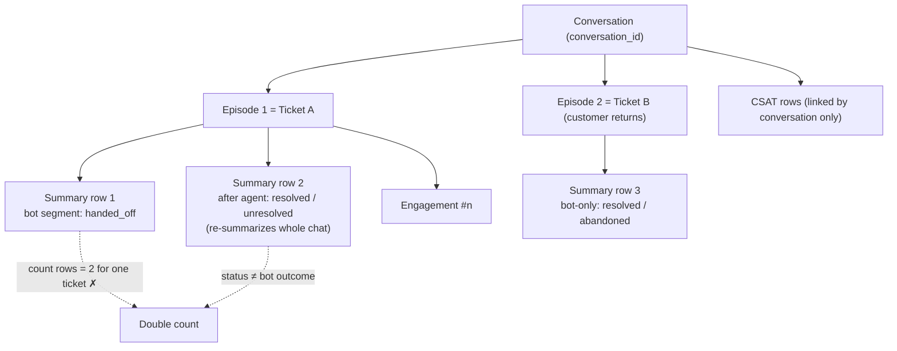
```mermaid
flowchart TD
    CV["Conversation (conversation_id)"] --> E1["Episode 1 = Ticket A"]
    CV --> E2["Episode 2 = Ticket B (customer returns)"]
    E1 --> R1["Summary row 1<br/>bot segment: handed_off"]
    E1 --> R2["Summary row 2<br/>after agent: resolved / unresolved<br/>(re-summarizes whole chat)"]
    E1 --> EG["Engagement #n"]
    E2 --> R3["Summary row 3<br/>bot-only: resolved / abandoned"]
    CV --> CSAT["CSAT rows (linked by conversation only)"]
    R1 -. "count rows = 2 for one ticket ✗" .-> X["Double count"]
    R2 -. "status ≠ bot outcome" .-> X
```

Snapshot proof: 258 tickets had several rows — 145 `handed_off → unresolved`, 108 `handed_off → resolved`, 3 `abandoned → abandoned`, 1 `handed_off → abandoned`, 1 `handed_off → resolved → resolved`.

---

## 20. Proposed reporting pipeline [PROPOSED]

```mermaid
flowchart LR
    A["Raw pulls (Ad Hoc / API)<br/>summaries · events · CSAT · engagements · KB"] --> B["Normalize<br/>UTC → Manila · strip prefixes ·<br/>GUID → 32-hex"]
    B --> C["Exclude<br/>webchat:test · test pages ·<br/>sales_bot · blank episodes (flagged)"]
    C --> D["Build Episode table<br/>group by ticket · order segments ·<br/>Bot_Outcome · Final_Outcome"]
    D --> E["Attach events / CSAT / engagements<br/>by conversation_id + time window"]
    E --> F["Metric layer<br/>(metric dictionary §14)"]
    F --> G["Dashboard pages 1–10<br/>+ EOM / MBR"]
```
