TALA Chatbot Discovery

[System Discovery](#doc-disc) [Process Flow](#doc-flow)

OBSERVEDINFERREDPROPOSED

System Discovery

- [1. Executive Summary](#d-1-executive-summary)
- [2. System Overview](#d-2-system-overview)
- [3. Feature Inventory](#d-3-feature-inventory)
- [4. Menu Hierarchy](#d-4-menu-hierarchy)
- [5. End-to-End Customer Journeys](#d-5-end-to-end-customer-journeys)
- [6. Mermaid Process Flow (summary)](#d-6-mermaid-process-flow-summary)
- [7. Transaction Flows](#d-7-transaction-flows)
- [8. State Transition Model](#d-8-state-transition-model)
- [9. Intent Dictionary](#d-9-intent-dictionary)
- [10. Input / Data Dictionary](#d-10-input-data-dictionary)
- [11. Business Rules](#d-11-business-rules)
- [12. System Behavior](#d-12-system-behavior)
- [13. Reporting Event Model](#d-13-reporting-event-model)
- [14. Metric Dictionary](#d-14-metric-dictionary)
- [15. Dimension Dictionary](#d-15-dimension-dictionary)
- [16. Funnel Analysis](#d-16-funnel-analysis)
- [17. Customer Journey Analytics](#d-17-customer-journey-analytics)
- [18. Reporting Grain](#d-18-reporting-grain)
- [19. Recommended Data Model PROPOSED](#d-19-recommended-data-model-proposed)
- [20. Mermaid ER Diagram](#d-20-mermaid-er-diagram)
- [21. Reporting Requirements](#d-21-reporting-requirements)
- [22. Dashboard Recommendations PROPOSED](#d-22-dashboard-recommendations-proposed)
- [23. Business Questions](#d-23-business-questions)
- [24. Backend Validation Questions](#d-24-backend-validation-questions)
- [25. Known Limitations](#d-25-known-limitations)
- [26. Observed vs Inferred vs Proposed Items](#d-26-observed-vs-inferred-vs-proposed-items)
- [27. Final Recommendations](#d-27-final-recommendations)
- [28. Exploration Coverage Checklist \&amp; Final Coverage Summary](#d-28-exploration-coverage-checklist-amp-final-coverage-summary)

Process Flow

- [1. Overall chatbot flow OBSERVED, closing order INFERRED](#f-1-overall-chatbot-flow-observed-closing-order-inferred)
- [2. Entry, consent \&amp; pre-chat OBSERVED](#f-2-entry-consent-amp-pre-chat-observed)
- [3. Menu hierarchy — Cignal OBSERVED](#f-3-menu-hierarchy-cignal-observed)
- [4. Menu hierarchy — SatLite OBSERVED](#f-4-menu-hierarchy-satlite-observed)
- [5. Menu hierarchy — Cignal Play OBSERVED](#f-5-menu-hierarchy-cignal-play-observed)
- [6. Customer journey (stages) PROPOSED reporting view](#f-6-customer-journey-stages-proposed-reporting-view)
- [7. Authentication / account lookup flow OBSERVED config; failure path INFERRED](#f-7-authentication-account-lookup-flow-observed-config-failure-path-in)
- [8. Transaction flow — Pay Bill or Topup OBSERVED](#f-8-transaction-flow-pay-bill-or-topup-observed)
- [9. Successful transaction (sequence) OBSERVED](#f-9-successful-transaction-sequence-observed)
- [10. Failed transaction (sequence) OBSERVED transcript](#f-10-failed-transaction-sequence-observed-transcript)
- [11. Resolution check \&amp; closing sequence OBSERVED settings; exact order INFERRED](#f-11-resolution-check-amp-closing-sequence-observed-settings-exact-ord)
- [12. AI free-text \&amp; fallback flow OBSERVED events; thresholds INFERRED](#f-12-ai-free-text-amp-fallback-flow-observed-events-thresholds-inferre)
- [13. Escalation flow OBSERVED](#f-13-escalation-flow-observed)
- [14. Live-agent lifecycle (sequence) OBSERVED Customer Journey timeline](#f-14-live-agent-lifecycle-sequence-observed-customer-journey-timeline)
- [15. Sales / Apply Now flow OBSERVED](#f-15-sales-apply-now-flow-observed)
- [16. Session termination \&amp; abandonment OBSERVED](#f-16-session-termination-amp-abandonment-observed)
- [17. Conversation state model OBSERVED + PROPOSED](#f-17-conversation-state-model-observed-proposed)
- [18. Data / reporting event flow OBSERVED sources](#f-18-data-reporting-event-flow-observed-sources)
- [19. Episode \&amp; summary-row model — why rows double-count OBSERVED](#f-19-episode-amp-summary-row-model-why-rows-double-count-observed)
- [20. Proposed reporting pipeline PROPOSED](#f-20-proposed-reporting-pipeline-proposed)

# Cignal Chatbot (TALA) — System Discovery, Process Mapping & Reporting Documentation

| Item | Value |
| --- | --- |
| System | Cignal Chatbot Admin Console — `https://chatbot.mycignal.ph/admin` |
| Bot persona | **TALA** — "Cignal Interactive Digital Assistant" |
| Discovery date | 2 Oct 2026 (production went live 30 Sep 2026) |
| Access used | Role `cegadmin` (not root admin), **read-only exploration** — no configuration was edited, saved, published or deleted; no live chats were accepted; no test chats were started |
| Data snapshot | Production data from go-live up to about 10:00 AM PH, 2 Oct 2026 (about 1.5 days of traffic). All counts below come from this small window and are **indicative only** |
| Companion file | `CIGNAL_CHATBOT_PROCESS_FLOW.md` (all diagrams) |

### Evidence labels used throughout

| Label | Meaning |
| --- | --- |
| **OBSERVED** | Seen directly in the admin console, its configuration screens, its read-only API responses, or session transcripts |
| **INFERRED** | Likely behavior based on what was observed, but it **needs backend validation** |
| **PROPOSED** | Recommended reporting logic or architecture. It may not exist today |

> Privacy note: transcripts and journey pages show unmasked customer data. **No customer names, numbers, emails or account numbers are copied into this document.** Ticket and conversation IDs are kept only where they explain a behavior.

---

## Table of Contents

1. Executive Summary
2. System Overview
3. Feature Inventory
4. Menu Hierarchy
5. End-to-End Customer Journeys
6. Mermaid Process Flow (summary — full set in the flow file)
7. Transaction Flows
8. State Transition Model
9. Intent Dictionary
10. Input / Data Dictionary
11. Business Rules
12. System Behavior
13. Reporting Event Model
14. Metric Dictionary
15. Dimension Dictionary
16. Funnel Analysis
17. Customer Journey Analytics
18. Reporting Grain
19. Recommended Data Model
20. Mermaid ER Diagram
21. Reporting Requirements
22. Dashboard Recommendations
23. Business Questions
24. Backend Validation Questions
25. Known Limitations
26. Observed vs Inferred vs Proposed Items
27. Final Recommendations
28. Exploration Coverage Checklist & Final Coverage Summary

---

## 1. Executive Summary

**What the bot is.** TALA is a **hybrid customer-service bot**. It is not a simple menu bot. One conversation can move through **five engines**, and each engine writes its own data:

1. **Rule-based menu flow** (Flow Editor) — 73 nodes covering 3 products (Cignal, SatLite, Cignal Play). Customers tap buttons, and leaf nodes give troubleshooting steps, eLearning articles or links, then ask "Does this resolve your issue?" **OBSERVED**
2. **Generative AI chat (Gemini) + knowledge base (RAG)** — typed questions are answered from about 342 indexed eLearning articles. Each answer gets a self-check ("KB answer quality"). **OBSERVED**
3. **Live-agent handoff** — an in-house Live Agent Console with Customer Service and Sales queues, skill-based routing, idle timeouts, dispositions and a QA checklist. **OBSERVED**
4. **SDQ ticketing** — every bot "episode" gets an SDQ ticket (`IRN…`). The AI classifies its SDQ service and category. **OBSERVED**
5. **Post-session AI analytics** — when a session closes, Gemini writes a summary and key points, and tags a **topic** (13-value concern taxonomy), a **sentiment** and a **resolution status**. CSAT is a 6-question survey. **OBSERVED**

**Channels.** Web chat (`webchat`, `webchat:website`, `webchat:test`) and Facebook Messenger (`facebook_messenger`, by page). Sales traffic ("Apply Now" and the *Buy Cignal* FB page) goes to a separate **Sales bot** that hands off to an agent right away. **OBSERVED**

**The most important findings for reporting:**

| # | Finding | Why it matters |
| --- | --- | --- |
| F1 | **A live-agent handoff creates TWO session-summary rows with the same ticket.** Row 1 is the bot segment (`handed_off`). Row 2 is written after the agent closes the chat, re-summarizes the whole conversation, and carries the **agent's** outcome (`resolved` or `unresolved`). Of 258 tickets with more than one row, 145 were `handed_off → unresolved` and 108 were `handed_off → resolved`. **OBSERVED** | Counting rows double-counts handoffs. **"Unresolved" mostly means "the live agent did not resolve it", not "the bot couldn't answer".** In this snapshot only **5** bot-only rows were `unresolved`. |
| F2 | The console's **"Bot Resolution 53.5%"** is a **query-level AI metric**: `ai_chat ÷ (ai_chat + ai_no_answer)` = 240 ÷ 449. It is **not** a session containment rate. **OBSERVED — reconciled** | Do not present it to management as containment. Bot-only resolved episodes were about **36 of 566 (≈6%)** in this snapshot. |
| F3 | **KB Hit Rate (≈99%) is structurally inflated.** A "hit" means "articles were retrieved". A plain "Hi" retrieves 2 articles and counts as a hit. Blank widget-open messages retrieve 5 billing articles. **OBSERVED** | KB Hit Rate cannot measure knowledge-base coverage. Use answer-quality, `ai_no_answer` subtypes and customer confirmation instead. |
| F4 | **One dashboard mixes grains.** "Sessions" = distinct session IDs. "Handoffs" = handoff **events** (341) shown as "87% of sessions". Resolution, sentiment and topic charts count **summary rows** (≈822). The product split counts sessions by product (sum is larger than total). **OBSERVED** | Shares and rates on the built-in dashboard are not comparable to each other. |
| F5 | **Test traffic is included** in every built-in number (`webchat:test` = 36 sessions; 7 of the 29 CSAT responses). **OBSERVED** | Exclude test traffic before reporting. |
| F6 | **Timezones are mixed.** API timestamps and dashboard day buckets are **UTC**. Customer Journey, SDQ tickets and live-agent event timelines show **Manila time**. **OBSERVED** | Daily and monthly cut-offs shift by 8 hours unless converted. |
| F7 | Identifiers are many-to-many. **One `conversation_id` can hold several tickets** (up to 4 seen) and several engagements. One `session_id` can hold several conversations (one had 14). **OBSERVED** | The reporting grain must be chosen on purpose (see §18). |
| F8 | 9 menu leaves give information or a link with **only a "Main menu" button and no resolution question**. One leaf (`cignal_billing_load_store`) has **no buttons at all**. **OBSERVED** | These paths can never produce a "resolved" signal. They likely end as "abandoned" and inflate abandonment. **INFERRED** |
| F9 | CSAT values seen are only 1, 2, 4 and 5 (no 3). CSAT is **disabled for Sales** and is not sent after idle auto-close. **OBSERVED** | CSAT is a biased sample. Report top-2-box with the response rate beside it. |

**Bottom line for the Reports Analyst.** The console's built-in reports are good for operational monitoring, but they **cannot be used as-is for a KPI framework**. The correct framework needs (a) an **episode/ticket grain** for outcomes, (b) a **conversation grain** for unique volume, (c) **event-level** data for AI/KB/handoff behavior, and (d) **explicit exclusions** (test traffic, Sales auto-handoff, blank sessions). Sections 14–22 give proposed definitions. Section 24 lists the questions IT must answer first.

---

## 2. System Overview

### 2.1 Purpose (business language)

TALA is Cignal's first line of digital customer service. It lets subscribers fix common problems themselves (no signal, error codes, box or remote issues, loading, bill payment, add-ons, Cignal Play subscriptions). It answers free-text questions from Cignal's knowledge base. When it cannot help, or when the customer asks, it passes the chat to a live agent. Every chat is logged as an SDQ ticket, summarized by AI, and measured through CSAT. **OBSERVED**

### 2.2 Platform components

| Component | What it does | Evidence |
| --- | --- | --- |
| Web chat widget | Customer-facing chat (phone-frame test page at `/`). First screen: DPA consent + **Apply Now** / **Need help?** + Cloudflare verification + Accept/Decline | OBSERVED Test Chat page (not interacted) |
| Facebook Messenger | FB pages mapped to bots or flows in *Page Flow Assignment* | OBSERVED |
| Bots | `customer_support_bot` (Cignal — Web Chat) and `sales_bot` (Sales — Web Chat) | OBSERVED Menu Flow |
| Flow engine | Versioned flows → nodes (`question`, `handoff`), options (buttons), actions | OBSERVED |
| AI engine | Gemini replies (style settings), KB retrieval (semantic + lexical), self-check, topic/sentiment/summary classification | OBSERVED Settings, KB Diagnostics, Landing Concerns |
| Knowledge base | E-Learning articles (≈342 indexed), 11 KB categories | OBSERVED KB Diagnostics, Settings |
| Live Agent Console | Agent Workspace, Supervisor Dashboard, Realtime Dashboard, QA Reviews, canned responses, statuses, teams, skills | OBSERVED |
| SDQ (ServiceDesk) | External ticketing; tickets `IRN…`; services/categories list pulled from SDQ | OBSERVED |
| Notifications | Email queue (abandoned-session email, transcript emails); SMS disabled | OBSERVED |
| Social listening | FB feed post/comment triage + auto-reply; App Store / Google Play reviews | OBSERVED (adjacent to the bot) |

### 2.3 Channels

| Channel value | Meaning | Evidence |
| --- | --- | --- |
| `webchat` | Main web chat widget | OBSERVED |
| `webchat:website` | Web chat embedded on a website | OBSERVED; exact host page INFERRED |
| `webchat:test` | Admin **Test Chat** page — **test traffic** that still creates real SDQ tickets | OBSERVED |
| `facebook_messenger` | Messenger; `page_key` names the page (Buy Cignal, Cignal Play, test pages, or *Unattributed*) | OBSERVED |

### 2.4 Main features (inventory summary)

- Product selector (Cignal / SatLite / Cignal Play) → category menus → troubleshooting/info leaves **OBSERVED**
- Free-text AI answers grounded in KB articles **OBSERVED**
- Account lookup by account number (bill/load info, account type routing postpaid vs prepaid, reconnection advisory) **OBSERVED**
- System lookups outside the flow: account status, ticket status, account information, "last concern" **OBSERVED** in event log node keys
- Upsell after a confirmed bot resolution; Save-offer (retention) on disconnection requests **OBSERVED** settings
- Live-agent handoff with support hours, skill routing, queue, idle handling, dispositions **OBSERVED**
- CSAT/NPS-style 6-question survey **OBSERVED**
- Transcript emails; abandoned-session email **OBSERVED**
- English/Filipino handling (AI replies follow customer language; flow messages in Filipino ON, button labels Filipino OFF) **OBSERVED**

### 2.5 Authentication & customer identification

| Mechanism | Detail | Label |
| --- | --- | --- |
| DPA consent | Must Accept before chatting; one consent record per sender per channel | OBSERVED |
| Bot-protection | Cloudflare verification on the widget's first screen | OBSERVED |
| Pre-chat form (Need help?) | Name **required**, Mobile **required**, Account No. *optional*, Email *optional* | OBSERVED |
| Pre-chat form (Apply Now / Sales) | Name, Mobile, Email — all required | OBSERVED |
| Pre-chat data in chat | Passed to the bot as a System message "\[Customer info provided before chat: …\]" | OBSERVED |
| Account lookup | Flow nodes ask "Please provide your account number" (Smart Card / CCA number); action `account_lookup` (operation `info`) | OBSERVED |
| Account-type routing | `account_type_route`: postpaid → bill payment; prepaid → load options | OBSERVED |
| Identity gating | `identity_allowed` events with value `Anonymous` for `account_status` and `last_concern` | OBSERVED; rules INFERRED |
| Widget identity / SSO | "Widget Embed & Identity" and "Identity Clients" pages exist but are **not accessible** to this role | ❌ |
| OTP / PIN | **Not observed.** No one-time-password or PIN challenge was seen | OBSERVED absence — confirm with IT |

### 2.6 Session behavior (summary)

- Web chat sender = browser-level ID (`web-<uuid>`). Messenger sender = page-scoped ID. **OBSERVED**
- **Bot session timeout = 30 minutes** of customer inactivity → the session is "abandoned", swept up, summarized, and the next visit starts fresh. **OBSERVED** setting
- A greeting is suppressed if the same user was greeted in the last 24 h and has not replied. **OBSERVED**
- Conversation IDs persist across days and episodes. Customer Journey shows the latest episode. **OBSERVED**
- Each **episode** (bot episode, then optional live-agent segment) has its own SDQ ticket. **OBSERVED**

### 2.7 Escalation, exit, error and fallback (summary)

| Behavior | Summary | Label |
| --- | --- | --- |
| Escalation to agent | Customer taps **Talk to agent** (shown after **3** KB attempts — "Min KB attempts before handoff"), types a request (`user_typed_request`), reaches a flow handoff node, accepts an upsell/save-offer agent option, or uses Apply Now (Sales) | OBSERVED |
| Outside agent hours | Customer sees the schedule; the bot keeps helping | OBSERVED setting |
| End of bot episode | Confirmed resolved → upsell (if eligible) → "anything else?" → transcript offer → survey-willingness ask → CSAT → close | OBSERVED setting text; exact order INFERRED |
| Customer silent | 30 min → abandoned (bot); live agent: warnings at 3 min and 1 min before a 5-min idle auto-close | OBSERVED |
| Not resolved | "No, still need help" → "I'm sorry that didn't fully resolve it. Let's try another way — you can rephrase or ask a different question…" → AI chat | OBSERVED transcript |
| Unknown / unanswerable | AI records `ai_no_answer` (subtypes `kb_partial`, `kb_none`, `answered_recommend_handoff`, `frustrated_dismissal`); `fallback` node events also exist | OBSERVED event log |

---

## 3. Feature Inventory

Source: published **Main Support Flow v1** (published 6 Jul 2026, 1:25 PM), read through the Flow Chart view and its read-only API. Columns follow the requested structure. "Y/N check" = the leaf shows **"Yes, it's resolved" / "No, still need help"**.

### 3.1 Entry (all products)

| Main Menu | Submenu | Feature / Intent (node) | Description | Inputs Required | Output | Possible Next Step |
| --- | --- | --- | --- | --- | --- | --- |
| Welcome | — | `welcome` (start) | "Hi there! I'm TALA… select the service… or type your question" + random greeting | Button or free text | 3 buttons | Cignal / SatLite / Cignal Play menu; typed text → AI chat |

### 3.2 Cignal (`cignal_menu`)

| Main Menu | Submenu | Feature / Intent (node) | Description | Inputs Required | Output | Possible Next Step |
| --- | --- | --- | --- | --- | --- | --- |
| Cignal | TV Viewing Issues | `cignal_technical` | "What can I help you fix today?" | Button | 3 options | Weak/No Signal · Error Codes · Other Tech |
| Cignal | TV Viewing › Weak or No Signal | `cignal_tech_weak_signal` | Asks about the weather | Button | Clear / Rainy | weather leaves |
| Cignal | › Clear Weather | `cignal_tech_weather_clear` | Signal-input/equipment steps + article 2583 | — | Y/N check | Resolved → closing; No → AI retry |
| Cignal | › Rainy/Heavy Clouds | `cignal_tech_weather_rainy` | Rain-fade guidance + article 2536 | — | Y/N check | same |
| Cignal | TV Viewing › Error Codes Onscreen | `cignal_tech_errors` | "Which error do you see?" | Button | 2 options | E4/E6/E14 · E1/E2/E9/E11 |
| Cignal | › E4, E6, or E14 | `cignal_tech_e4_e6_e14` | Fix steps + article 2827 | — | Y/N check | same |
| Cignal | › E1, E2, E9, or E11 | `cignal_tech_e1_e2_e9_e11` | Fix steps + article 2587 | — | Y/N check | same |
| Cignal | TV Viewing › Other Tech Concerns | `cignal_tech_other` | "Tell me what's going on." | Button | 4 options | Box No Power · Remote · Black/Blue/Snowy · Missing Channels |
| Cignal | › Box No Power | `cignal_tech_box_no_power` | 7-step power checklist + article 2555 | — | Y/N check | same |
| Cignal | › Remote Issue | `cignal_tech_remote` | Remote troubleshooting + article 2559 | — | Y/N check | same |
| Cignal | › Black, Blue or Snowy | `cignal_tech_video_bbs` | Video output fix + article 2584 | — | Y/N check | same |
| Cignal | › Missing Channels | `cignal_tech_video_skip` | Skipping/missing channels + article 2747 | — | Y/N check | same |
| Cignal | Bill & Load | `cignal_billing` | "What would you like to do today?" | Button | 3 options | View · Pay/Topup · Load issue |
| Cignal | › View Bill or Load | `cignal_billing_inquire` | **Account lookup** (info) → "Would you like to pay your bill or load your account?" | **Account number** | Account info + Pay Bill / Load Now / No | Postpaid bill · Load now · `account_lookup_resolved` |
| Cignal | › Pay Bill or Topup | `cignal_billing_choose` | **Account lookup + account-type route** (postpaid → bill; prepaid → load) | Account number | Auto-route or Postpaid Bill / Load Now | postpaid / loadnow |
| Cignal | › Postpaid | `cignal_billing_postpaid` | "What would you like to do?" | Button | 2 options | CC payment · Payment options |
| Cignal | › Pay via Credit Card | `cignal_billing_postpaid_cc` | Link: Online Bill Payment | — | Link + **Main menu only** | Welcome |
| Cignal | › Find Payment Options | `cignal_billing_postpaid_options` | Article 2507 + Online Bill Payment link | — | Y/N check | closing / AI |
| Cignal | › Load Now | `cignal_billing_loadnow` | "What would you like to do?" | Button | 3 options | ePIN · Store · Other channels |
| Cignal | › Use ePIN | `cignal_billing_load_epin` | Link: Web Loading Tool | — | Link + **Main menu only** | Welcome |
| Cignal | › Check Cignal Store | `cignal_billing_load_store` | Link: Cignal FB Store | — | Link, **no buttons** | ⚠ dead end (free text only) |
| Cignal | › Find Loading Channel | `cignal_billing_load_other` | Article 2632 | — | Y/N check | closing / AI |
| Cignal | › Help w/ Load Issue | `cignal_billing_help` | "Tell me what's going on." | Button | 3 options | Webtool · 5353 · GCash/Maya/Others |
| Cignal | › Webtool issue | `cignal_billing_webtool_issue` | Article 2565 | — | Y/N check | closing / AI |
| Cignal | › 5353 issue | `cignal_billing_5353_issue` | Article 2566 + Web Loading Tool link | — | Y/N check | closing / AI |
| Cignal | › GCash/Maya/Others | `cignal_billing_gcash_others` | "Contact the merchant who sold the pin/load" | — | **Main menu only** | Welcome |
| Cignal | Account Maintenance | `cignal_account` | "What would you like to do today?" | Button | 5 options | see below |
| Cignal | › Request Reconnection | `cignal_account_reconnection_yes` | **Account lookup** (advisory = reconnection) | Account number | Advisory + **Talk to agent** | Handoff |
| Cignal | › Upgrade Plan | `cignal_account_upgrade` | **Handoff node** — reason "Plan upgrade request" | — | Agent queue | Live agent |
| Cignal | › Order Add-ons/PPV | `cignal_account_addons` | "What would you like to add today?" | Button | 3 options | Disney+ · Add-on channels · PPV |
| Cignal | › Disney + | `cignal_account_addons_disney` | Article 2795 + Account Portal link | — | Y/N check | closing / AI |
| Cignal | › Add-on Channels | `cignal_account_addons_channels` | Article 2628 + Account Portal link | — | Y/N check | closing / AI |
| Cignal | › PPV | `cignal_account_addons_ppv` | Article 2851 + Account Portal link | — | Y/N check | closing / AI |
| Cignal | › Get Cignal Play | `cignal_account_getplay` | Article 2588 + Cignal Play link | — | Y/N check | closing / AI |
| Cignal | › Account Management | `cignal_account_management` | **Handoff node** — reason "Account management request" | — | Agent queue | Live agent |

### 3.3 SatLite (`satlite_menu`)

| Main Menu | Submenu | Feature / Intent (node) | Description | Inputs Required | Output | Possible Next Step |
| --- | --- | --- | --- | --- | --- | --- |
| SatLite | Loading | `satlite_loading` | "What would you like to do today?" | Button | 3 options | View acct & load · Load now · Load issue |
| SatLite | › View Accnt # & Load | `satlite_loading_view` | **Account lookup** → "Would you like to load your account?" | Account number | Load Now / No | loading_now · `account_lookup_resolved` |
| SatLite | › Load Now | `satlite_loading_now` | "Choose how you'd like to load" | Button | 3 options | ePIN · Store · Other |
| SatLite | › Use ePIN | `satlite_loading_epin` | Web Loading Tool link | — | **Main menu only** | Welcome |
| SatLite | › Cignal Store | `satlite_loading_store` | Cignal FB Store link | — | **Main menu only** | Welcome |
| SatLite | › Other load channels | `satlite_loading_other` | Article 2846 | — | Y/N check | closing / AI |
| SatLite | › Help w/ Load Issue | `satlite_loading_help` | "Tell me what's going on." | Button | 3 options | Webtool · 5353 · GCash |
| SatLite | › Webtool issue | `satlite_loading_webtool_issue` | Article 2565 | — | Y/N check | closing / AI |
| SatLite | › 5353 issue | `satlite_loading_5353_issue` | Article 2566 + link | — | Y/N check | closing / AI |
| SatLite | › GCash/Maya/Others | `satlite_loading_gcash_others` | Contact merchant | — | **Main menu only** | Welcome |
| SatLite | TV Viewing Issues | `satlite_technical` | "What can I help you fix today?" | Button | **2 options** (no Error Codes branch) | Weak signal · Other |
| SatLite | › Weak or No Signal | `satlite_tech_weak_signal` | Weather question | Button | Clear / Rainy | leaves |
| SatLite | › Clear weather | `satlite_tech_weather_clear` | Article 2583 | — | Y/N check | closing / AI |
| SatLite | › Rainy/Heavy clouds | `satlite_tech_weather_rainy` | Article 2536 | — | Y/N check | closing / AI |
| SatLite | › Other Tech Concerns | `satlite_tech_other` | 2 options (no BBS / Missing channels) | Button | Box No Power · Remote | leaves |
| SatLite | › Box No Power | `satlite_tech_box_no_power` | Article 2555 | — | Y/N check | closing / AI |
| SatLite | › Remote Issue | `satlite_tech_remote` | Article 2559 | — | Y/N check | closing / AI |

### 3.4 Cignal Play (`cignalplay_menu`)

| Main Menu | Submenu | Feature / Intent (node) | Description | Inputs Required | Output | Possible Next Step |
| --- | --- | --- | --- | --- | --- | --- |
| Cignal Play | Subscribe | `cignalplay_subscribe` | 4 options | Button | — | Download · Premium · Microdrama · Box |
| Cignal Play | › Download & Register | `cignalplay_download` | Article 2904 + Cignal Play link | — | Y/N check | closing / AI |
| Cignal Play | › Get Cplay Premium | `cignalplay_premium` | **Self-declared eligibility** question (active Postpaid / Prepaid ≥ 500 load / Fiber 520+) | Yes/No button | — | active / inactive |
| Cignal Play | › Yes | `cignalplay_premium_active` | Article 2588 + link | — | **Main menu only** | Welcome |
| Cignal Play | › No | `cignalplay_premium_inactive` | Eligibility explanation | — | **Main menu only** | Welcome |
| Cignal Play | › Get Microdrama | `cignalplay_microdrama` | Article 2615 + link | — | Y/N check | closing / AI |
| Cignal Play | › Get Cplay Box | `cignalplay_box` | Article 2911 + Cignal FB Store link | — | Y/N check | closing / AI |
| Cignal Play | Viewing Issues | `cignalplay_viewing` | 2 options | Button | — | App · Web playback |
| Cignal Play | › App Playback Issue | `cignalplay_viewing_app` | Article 2912 | — | Y/N check | closing / AI |
| Cignal Play | › Web Playback Issue | `cignalplay_viewing_web` | Article 2913 | — | Y/N check | closing / AI |
| Cignal Play | Payment Concerns | `cignalplay_payment` | 3 options | Button | — | GCash/Maya · ePIN · In-app |
| Cignal Play | › Loading GCash/Maya | `cignalplay_payment_gcash` | "What seems to be the issue…?" | Button | 2 options | Missing EPIN · Missing credit |
| Cignal Play | › Missing EPIN | `cignalplay_gcash_missing_epin` | Contact merchant | — | **Main menu only** | Welcome |
| Cignal Play | › Missing Load Credit | `cignalplay_gcash_missing_credit` | **Handoff node** — reason "Missing Gcash/Maya load credit" | — | Agent queue | Live agent |
| Cignal Play | › Unable to load EPIN | `cignalplay_payment_epin` | Article 2916 | — | Y/N check | closing / AI |
| Cignal Play | › In-app payment issue | `cignalplay_payment_inapp` | Article 2917 | — | Y/N check | closing / AI |

### 3.5 Non-menu features (outside the Flow Editor)

| Main Menu | Submenu | Feature / Intent | Description | Inputs | Output | Next Step | Label |
| --- | --- | --- | --- | --- | --- | --- | --- |
| (any point) | Free text | **AI chat** (`ask_ai`, `ai_chat`) | Gemini answer grounded in KB articles | Typed question | Answer (+ KB sources) | Continue, Talk to agent (after 3 attempts), or close | OBSERVED |
| (system) | — | `no_further_action` node | "Understood! Let me know if there's anything else…" + Main menu. **No incoming button** — triggered by the system | — | Main menu | Welcome | OBSERVED node; trigger INFERRED |
| (system) | — | Account status / ticket status / account information lookups | Node keys `account_status_lookup`, `ticket_status_lookup`, `account_information_lookup` appear on handoff events | Account number / ticket | Status info | Agent if requested | OBSERVED keys; triggers INFERRED AI intent |
| (system) | — | Upsell | After a confirmed bot resolution: cross-sell from KB category VAS (#42); decline once → rebuttal; decline twice → "anything else?" | Accept/decline | Offer; can lead to agent ("Customer accepted upsell offer to talk to an agent") | Agent or closing | OBSERVED |
| (system) | — | Save Offer | First disconnect/cancel request (exact phrase or AI intent) → retention message + "Talk to agent" / "No thanks, proceed with disconnection" | Choice | Offer or normal disconnection answer | Agent or KB answer | OBSERVED |
| Apply Now | Sales | **Sales bot** | Pre-chat (name, mobile, email) → "Thank you for your interest… let me connect you" → handoff reason "Sales auto transfer to agent", target `webchat` | Pre-chat form | Sales queue | Sales agent (09:00–18:00) | OBSERVED |
| Closing | — | Transcript email offer | Bot-only resolved chats are asked whether they want a transcript emailed | Yes/No (+email) | Email queued | CSAT | OBSERVED setting |
| Closing | — | CSAT survey | 6 questions: recommend (0–9), overall satisfaction (1–5), ease of resolution, resolved Y/N, CSO satisfaction (agent chats), comments | Taps / text | Survey row | End | OBSERVED |

---

## 4. Menu Hierarchy

Counts **OBSERVED**: 1 start node, 3 product menus, 8 category menus, 73 nodes in total (28 decision/menu nodes + 44 leaves + 1 system node), 147 button options.

```
welcome  (TALA greeting — buttons or free text)
├── Cignal  (cignal_menu)
│   ├── TV Viewing Issues  (cignal_technical)
│   │   ├── Weak or No Signal → Clear Weather ✔? | Rainy/Heavy Clouds ✔?
│   │   ├── Error Codes Onscreen → E4/E6/E14 ✔? | E1/E2/E9/E11 ✔?
│   │   └── Other Tech Concerns → Box No Power ✔? | Remote ✔? | Black/Blue/Snowy ✔? | Missing Channels ✔?
│   ├── Bill & Load  (cignal_billing)
│   │   ├── View Bill or Load 🔐 (account lookup) → Pay Bill → Postpaid… | Load Now → … | No (end)
│   │   ├── Pay Bill or Topup 🔐 (lookup + auto-route postpaid/prepaid)
│   │   │   ├── Postpaid Bill → Pay via Credit Card 🔗(Main menu) | Find Payment Options ✔?
│   │   │   └── Load Now → Use ePIN 🔗(Main menu) | Check Cignal Store 🔗(no buttons ⚠) | Find Loading Channel ✔?
│   │   └── Help w/ Load Issue → Webtool ✔? | 5353 ✔? | GCash/Maya/Others ↩(Main menu)
│   └── Account Maintenance  (cignal_account)
│       ├── Request Reconnection 🔐 → Talk to agent 👤
│       ├── Upgrade Plan 👤 (handoff)
│       ├── Order Add-ons/PPV → Disney+ ✔? | Add-on Channels ✔? | PPV ✔?
│       ├── Get Cignal Play ✔?
│       └── Account Management 👤 (handoff)
├── SatLite  (satlite_menu)
│   ├── Loading
│   │   ├── View Accnt # & Load 🔐 → Load Now → … | No (end)
│   │   ├── Load Now → Use ePIN 🔗(Main menu) | Cignal Store 🔗(Main menu) | Other load channels ✔?
│   │   └── Help w/ Load Issue → Webtool ✔? | 5353 ✔? | GCash/Maya/Others ↩(Main menu)
│   └── TV Viewing Issues
│       ├── Weak or No Signal → Clear ✔? | Rainy ✔?
│       └── Other Tech Concerns → Box No Power ✔? | Remote ✔?
└── Cignal Play  (cignalplay_menu)
    ├── Subscribe → Download & Register ✔? | Get Premium (Yes ↩ / No ↩) | Microdrama ✔? | Cplay Box ✔?
    ├── Viewing Issues → App Playback ✔? | Web Playback ✔?
    └── Payment Concerns → GCash/Maya (Missing EPIN ↩ | Missing Load Credit 👤) | Unable to load EPIN ✔? | In-app payment ✔?

Legend: ✔? = "Does this resolve your issue?" Yes/No   🔐 = account lookup   👤 = live-agent handoff
        🔗 = link   ↩ = "Main menu" button only   ⚠ = no buttons
```

**Leaf outcome profile OBSERVED**

| Leaf type | Count | Reporting implication |
| --- | --- | --- |
| Resolution check (Yes/No) | 30 | Only these produce an explicit customer-confirmed bot resolution (`resolved_yes`) |
| Info/link + "Main menu" only | 9 | No resolution signal is possible |
| Link with no buttons | 1 (`cignal_billing_load_store`) | Dead end |
| Flow handoff node | 3 | Forced handoff (no bot resolution attempt) |
| Account lookup + Talk to agent | 1 (reconnection) | Always ends in handoff if the customer continues |
| System node (`no_further_action`) | 1 | Not reachable from buttons |

**Entry-point variations OBSERVED** (Page Flow Assignment): the *Cignal Play* FB page starts at `cignalplay_menu`; the test pages start at `cignal_menu` / `satlite_menu` / `cignalplay_menu`; the *Buy Cignal* page uses the Sales bot; web chat and any unassigned page start at `welcome`.

---

## 5. End-to-End Customer Journeys

Every journey uses the same entry sequence. **J0 Entry OBSERVED**: widget opens → DPA notice + Cloudflare check → customer taps **Need help?** (support) or **Apply Now** (sales) → Accept → (Need help) web-chat announcement screen → **Get Started** → pre-chat form → bot session starts (a blank `User: —` line is logged) → random greeting + TALA welcome.

### J1 — Menu troubleshooting resolved by the bot (e.g., Cignal › TV Viewing › Box No Power)

| Step | Item | Detail | Label |
| --- | --- | --- | --- |
| Trigger | Customer opens chat and needs help | — | OBSERVED |
| Customer input | Taps Cignal → TV Viewing Issues → Other Tech Concerns → Box No Power | Button labels are logged as user messages | OBSERVED |
| Bot response | Numbered 7-step checklist, then "Does this resolve your issue?" | — | OBSERVED |
| Decision point | Yes, it's resolved / No, still need help | payloads `resolved_yes` / `resolved_no` | OBSERVED |
| Validation | None (button choice) | — | OBSERVED |
| Business rule | Upsell only if enabled, not frustrated, not a disconnect, bot-resolved | — | OBSERVED setting |
| System action | Closing sequence; SDQ ticket created/updated as Resolved; session summary written | Ticket timing for bot-only: created at end (beta test) | OBSERVED beta / INFERRED prod |
| Success condition | Customer taps "Yes, it's resolved" | — | OBSERVED |
| Failure condition | "No, still need help" → AI retry; or customer leaves → abandoned after 30 min | — | OBSERVED |
| Retry behavior | Bot invites the customer to rephrase; AI chat takes over | — | OBSERVED |
| Escalation condition | Customer types "Live agent" or taps Talk to agent (gate: 3 KB attempts) | — | OBSERVED |
| Completion condition | Closing sequence finishes (CSAT done or declined) | "declined survey → ticket auto-resolved" appears in summaries | OBSERVED |
| Session termination | Session closed and summarized; abandoned if idle 30 min | — | OBSERVED |

### J2 — Menu troubleshooting NOT resolved → live agent

Same as J1 until "No, still need help" → retry message → customer types *Live agent* → handoff event (`user_typed_request`, or `user_requested` via button) → System line "\[SDQ Ticket #IRN… — Status: Open\]" → queue `cs_general` → agent assigned → "You are now connected to {agent}" → chat → agent closes with disposition → CSAT (Customer Service only) → transcript email → **second session-summary row** with the agent outcome. **OBSERVED** (transcript + Customer Journey)

### J3 — Free-text AI question (any point)

| Step | Detail | Label |
| --- | --- | --- |
| Trigger | Customer types instead of tapping (`ask_ai`) | OBSERVED |
| System action | KB retrieval (semantic + lexical) → Gemini answer → self-check (`kb_answer_check`: passed/failed, omitted entities) → regenerate if incomplete (rare: 1 of 37 failures) | OBSERVED |
| Outcome events | `kb_hit` / `kb_miss`; `ai_chat` (answered) or `ai_no_answer` (`kb_partial`, `kb_none`, `answered_recommend_handoff`, `frustrated_dismissal`) | OBSERVED |
| Escalation | After 3 KB attempts a **Talk to agent** button appears; typing an agent request bypasses the gate | OBSERVED setting / INFERRED bypass |
| Resolution signal | Not always explicit. A resolution prompt after AI answers is INFERRED; the AI summary decides the final status at close | INFERRED |

### J4 — Account lookup (View Bill or Load / Pay Bill or Topup / SatLite View Account)

Customer selects the option → bot asks for the account number (Smart Card / CCA) → `account_lookup` (operation `info`) → shows account info and asks a follow-up ("Would you like to pay your bill or load your account?") → **Pay Bill / Load Now / No**. "No" sends payload `account_lookup_resolved`. For *Pay Bill or Topup*, `account_type_route` auto-routes postpaid → bill payment and prepaid → load options. **OBSERVED** config. Lookup failure messages and retry limits were **not observed** (summaries mention "after failing to confirm the account number, the customer…") → **INFERRED** that failures fall back to AI/agent.

### J5 — Reconnection request

Account Maintenance → Request Reconnection → "Please provide your account number" → lookup with `advisory: reconnection` → advisory text → **Talk to agent** (`talk_to_agent`) → handoff. **OBSERVED**

### J6 — Forced handoff nodes

Upgrade Plan, Account Management, Cignal Play › Missing Load Credit → handoff action with a reason ("Plan upgrade request", "Account management request", "Missing Gcash/Maya load credit") → queue. Account Management produced **42 handoff events** in the snapshot — the largest single flow source of handoffs. **OBSERVED**

### J7 — Sales / Apply Now

Apply Now → Sales pre-chat (name, mobile, email) → Sales bot `welcome` (handoff type): "Thank you for your interest… let me connect you with one of our agents" → reason "Sales auto transfer to agent" → Sales queue (avg wait 5 m 25 s vs 49 s for CS). Outside 09:00–18:00 the customer sees the schedule and the bot continues — this produces repeated "apply" messages that the AI cannot answer (seen in *Questions AI Couldn't Answer*). CSAT is disabled for Sales. **OBSERVED**

### J8 — Disconnection with Save Offer

Customer asks to disconnect/cancel → (first time in the session) retention message from KB category VAS + **Talk to agent** / **No thanks, proceed with disconnection** → decline → normal disconnection answer (KB articles such as *Voluntary Disconnection Requests*) → agent if needed. **OBSERVED** setting + KB usage (*Save Offers – Postpaid Disconnection* used 13×).

### J9 — Upsell after resolution

After `resolved_yes` → "Glad we could help!" + upsell (KB category VAS) → accept → agent (handoff reason "Customer accepted upsell offer to talk to an agent", **16** in the snapshot) / decline → one rebuttal → decline → "anything else?". **OBSERVED**

### J10 — Abandonment

Customer stops replying in the bot → 30 min → session swept: summary `abandoned`, abandoned-session email queued ("Cignal chat inquiry — IRN…") if an email is known. In the live-agent queue: 60 min unassigned → engagement abandoned + message. With an agent: idle warnings → 5-min auto-close (no CSAT). **OBSERVED**

---

## 6. Mermaid Process Flow (summary)

The full diagram set (menu hierarchy, authentication, transactions, fallback, escalation, termination, data/event flow) is in `CIGNAL_CHATBOT_PROCESS_FLOW.md`. Overall flow:

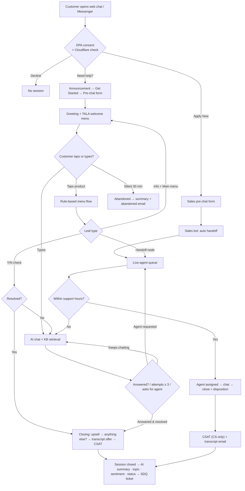
```mermaid
flowchart TD
    A[Customer opens web chat / Messenger] --> B{DPA consent<br/>+ Cloudflare check}
    B -- Decline --> Z0[No session]
    B -- Apply Now --> S1[Sales pre-chat form] --> S2[Sales bot: auto handoff] --> Q[Live-agent queue]
    B -- Need help? --> C[Announcement → Get Started → Pre-chat form]
    C --> D[Greeting + TALA welcome menu]
    D --> E{Customer taps or types?}
    E -- Taps product --> F[Rule-based menu flow]
    E -- Types --> G[AI chat + KB retrieval]
    F --> H{Leaf type}
    H -- Y/N check --> I{Resolved?}
    H -- Info + Main menu --> D
    H -- Handoff node --> Q
    I -- Yes --> J[Closing: upsell → anything else? → transcript offer → CSAT]
    I -- No --> G
    G --> K{Answered? / attempts ≥ 3 / asks for agent}
    K -- Answered & resolved --> J
    K -- Agent requested --> Q
    K -- Keeps chatting --> G
    Q --> L{Within support hours?}
    L -- No --> G
    L -- Yes --> M["Agent assigned → chat → close + disposition"] --> N["CSAT (CS only) + transcript email"]
    J --> O[Session closed → AI summary · topic · sentiment · status → SDQ ticket]
    N --> O
    E -- Silent 30 min --> P[Abandoned → summary + abandoned email]
```

---

## 7. Transaction Flows

"Transactions" in this bot are **mostly informational self-service**. The bot does **not** take payments, apply loads or change plans itself — it gives links and articles or hands off. The truly *system-processing* transactions observed are:

| # | Transaction | System action | Inputs | Success | Failure / Fallback | Label |
| --- | --- | --- | --- | --- | --- | --- |
| T1 | Account information lookup (bill/load view) | `account_lookup` op `info` | Account number | Info shown + follow-up options | Not observed; summaries suggest retries then agent | OBSERVED config / INFERRED failure |
| T2 | Account-type routing | `account_type_route` | Lookup result | Auto-route postpaid/prepaid | Manual buttons Postpaid Bill / Load Now exist as backup | OBSERVED |
| T3 | Reconnection advisory | `account_lookup` advisory `reconnection` | Account number | Advisory + Talk to agent | — | OBSERVED |
| T4 | Account status lookup | node `account_status_lookup` | Account number (identity `Anonymous` allowed) | Status shown | Handoff (3 seen) | OBSERVED key / INFERRED flow |
| T5 | Ticket status lookup | node `ticket_status_lookup` | Ticket / account | Status shown | Handoff (2 seen) | OBSERVED key / INFERRED flow |
| T6 | Live-agent handoff | handoff event + engagement + SDQ ticket (Open) | — | Agent assigned | Outside hours → schedule; queue abandon 60 min | OBSERVED |
| T7 | SDQ ticket creation | AI classifies SDQ service/category | Conversation | Ticket `IRN…` | Default service/category fallback (**currently misconfigured**: "#68 not found in SDQ") | OBSERVED |
| T8 | CSAT survey | Survey row written | 6 answers | Saved | Declined → ticket auto-resolved | OBSERVED |
| T9 | Transcript email | Email queued | Email (pre-chat or asked) | Queued/Sent | Pending (queue status) | OBSERVED |
| T10 | Self-service links | `link` / `elearning_article` actions | — | Link shown | No confirmation on 9 leaves | OBSERVED |

Per-transaction diagrams: see the flow file §5–7.

---

## 8. State Transition Model

### 8.1 States

Statuses that **exist in the data today** are marked **OBSERVED**. The rest are **PROPOSED** reporting states built from events.

| State | Exists as data? | Source |
| --- | --- | --- |
| Consented | OBSERVED | DPA consent log |
| Session Started | OBSERVED | `bot_initial_message_received` event |
| Greeting / Menu Presented | OBSERVED | `bot_initial_response_ready` |
| In Menu Flow | INFERRED | node keys (not reliably logged) |
| AI Answering | OBSERVED | `ask_ai`, `ai_chat`, `ai_no_answer`, `kb_*` |
| Account Lookup Pending / Success / Failed | PROPOSED | not separately logged |
| Resolution Check Shown | PROPOSED | not logged as an event |
| Bot Resolved (customer-confirmed) | OBSERVED partly | summary `resolved` (also used for agent outcomes) |
| Resolved (Unconfirmed) | OBSERVED as a filter value | Session Summaries filter — 0 rows seen |
| Fallback | OBSERVED | `fallback` event |
| Handoff Requested | OBSERVED | `handoff` event (reason) |
| Queued / Assigned / Transferred / Closed / Queue-Abandoned | OBSERVED | engagement + engagement_event |
| Handed Off (bot segment) | OBSERVED | summary `handed_off` |
| Agent Resolved / Agent Unresolved | OBSERVED | 2nd summary row `resolved`/`unresolved`; engagement "closed · Resolved" |
| Abandoned (bot) | OBSERVED | summary `abandoned` |
| Survey Completed / Declined | OBSERVED partly | CSAT row exists / summary text |
| Session Completed | PROPOSED | derived |

### 8.2 State-transition table

| Current State | Trigger | Next State | Description |
| --- | --- | --- | --- |
| (none) | Customer accepts DPA | Consented | Consent record per sender+channel OBSERVED |
| Consented | Pre-chat submitted / first message | Session Started | `bot_initial_message_received` OBSERVED |
| Session Started | Bot sends welcome | Menu Presented | `bot_initial_response_ready` (latency ms vs 10 s threshold) OBSERVED |
| Menu Presented | Button tap | In Menu Flow | Flow navigation OBSERVED |
| Menu Presented / In Menu Flow | Free text | AI Answering | `ask_ai` OBSERVED |
| In Menu Flow | Lookup node reached | Account Lookup Pending | Asks for account number OBSERVED |
| Account Lookup Pending | Valid number | Lookup Success | Info + follow-up OBSERVED config |
| Account Lookup Pending | Invalid / not found | Lookup Failed → AI / agent | INFERRED |
| In Menu Flow | Leaf with Y/N | Resolution Check Shown | OBSERVED |
| Resolution Check Shown | "Yes, it's resolved" | Bot Resolved → Closing | Upsell → anything else → CSAT OBSERVED |
| Resolution Check Shown | "No, still need help" | AI Answering | Retry message OBSERVED |
| AI Answering | Answer passes | AI Answered | `ai_chat`, `kb_hit` OBSERVED |
| AI Answering | No/partial answer | AI No Answer | `ai_no_answer` subtype OBSERVED |
| AI Answering | Not understood | Fallback | `fallback` event OBSERVED; trigger rule INFERRED |
| Any bot state | Agent button / typed request / handoff node / offer accepted | Handoff Requested | `handoff` event OBSERVED |
| Handoff Requested | Outside support hours | AI Answering | Schedule shown OBSERVED setting |
| Handoff Requested | Within hours | Queued (+ SDQ ticket Open, summary row `handed_off`) | OBSERVED |
| Queued | Agent accepts / auto-assign | Assigned | OBSERVED |
| Queued | 60 min unassigned | Queue Abandoned | OBSERVED setting |
| Assigned | Transfer | Queued / Assigned (another agent) | Messages "Transferring you…" OBSERVED |
| Assigned | Customer idle 5 min | Auto-Closed (no CSAT) | Warnings at 3 and 1 min before OBSERVED |
| Assigned | Agent ends chat + disposition | Agent Closed → CSAT (CS) → 2nd summary row | OBSERVED |
| Any bot state | Customer silent 30 min | Abandoned (bot) | Summary `abandoned`, email queued OBSERVED |
| Closing | Survey answered / declined | Session Completed | OBSERVED partly |
| Session Completed / Abandoned | Customer returns | Session Started (new episode, same conversation_id possible) | OBSERVED |

---

## 9. Intent Dictionary

The bot has **several intent layers**. They are **not** the same list, and reports must say which layer they use.

| Layer | What it is | Values | Where stored | Label |
| --- | --- | --- | --- | --- |
| L1 Menu path | Node the customer reached by buttons | 73 node keys | Transcript (labels); event `node_key` (unreliable — often `welcome`) | OBSERVED |
| L2 Topic (primary intent) | Gemini tags each **closed session** with one concern from the full transcript | 13 "Landing Page Concerns" | `chatbot_session_summary.primary_intent` | OBSERVED |
| L3 Skill category | Classified **at handoff** for routing | Same 13 names, with guidance text | Engagement (routing) | OBSERVED; field name INFERRED |
| L4 System intents | AI-detected special intents | disconnect/cancel (save offer), account status, ticket status, account information, last concern, frustration | Event node keys / extras | OBSERVED partly |
| L5 SDQ service / category | AI-classified ticket service (≈57 SDQ services) | e.g., Technical (#13), Billing (#4), Loading (#15) | SDQ | OBSERVED list |
| L6 Agent disposition | Agent's wrap-up tag | 49 values (mirror of SDQ services) | Engagement | OBSERVED |

### 9.1 Topic dictionary (L2) — the recommended reporting "Transaction Type"

Snapshot counts are summary **rows** (segment grain).

| Intent | Description (classifier guidance) | Example customer request | Parent Topic | Transactional / Informational | Can Bot Resolve? | Escalation Possible? | Rows |
| --- | --- | --- | --- | --- | --- | --- | --- |
| Technical | Signal, hardware or error troubleshooting; **default when nothing else fits** | "No signal", "CE-4 channel not available" | TV Service | Informational (troubleshooting) | Partly (30 Y/N leaves) | Yes | 332 |
| Account Management | Profile/account detail changes | "Downgrade and relocate", "disconnect one box" | Account | Transactional (agent) | Rarely — flow forces handoff | Yes (forced) | 186 |
| Billing | Payments, charges, balance due | "GCash payment posted?" | Billing | Info + lookup | Partly | Yes | 79 |
| Sales | New purchase, upgrade, subscribing | "Apply for SatLite cable" | Sales | Transactional (agent) | No (auto handoff) | Yes (forced) | 77 |
| Prepaid | Prepaid load or plans | "Loaded 175 but Nick Jr missing" | Prepaid | Info + lookup | Partly | Yes | 70 |
| Application | Cignal Play app problems | "App won't play" | Cignal Play | Informational | Partly | Yes | 30 |
| Programming | Channels, lineup, content | "When is HBO back?" | Content | Informational | Partly (AI) | Yes | 27 |
| Account Status | Active/inactive standing | "Account deactivated" | Account | Lookup | Partly | Yes | 17 |
| Loading | **Content/app buffering** (classifier guidance) — customers often mean *prepaid loading* ⚠ | "Loading" | ambiguous | Informational | Partly | Yes | 4 |
| Installation | Installation, setup, relocation | "Box moved to another room" | Field service | Transactional (agent) | No | Yes | 3 |
| Activation | Activating box, SIM, service | — | Account | Transactional | No | Yes | 0 |
| PPV | Pay-per-view events | — | Content | Info | Partly | Yes | 0 |
| Promo | Promos or discounts | — | Sales/Marketing | Info | Partly | Yes | 0 |

### 9.2 Menu intents (L1) — grouped

| Intent group | Sub-intents (nodes) | Topic mapping PROPOSED | Type | Resolvable by bot? |
| --- | --- | --- | --- | --- |
| Weak/No signal | weather clear / rainy (Cignal, SatLite) | Technical | Informational | Yes (Y/N) |
| Error codes | E4/E6/E14, E1/E2/E9/E11 (Cignal only) | Technical | Informational | Yes (Y/N) |
| Hardware | box no power, remote, black/blue/snowy, missing channels | Technical | Informational | Yes (Y/N) |
| View bill / load | billing_inquire, satlite_loading_view | Billing / Prepaid | Transactional (lookup) | Yes (info) |
| Pay / top-up | choose, postpaid (CC, options), loadnow (ePIN, store, other) | Billing / Prepaid | Informational (links) | Partly — mostly no Y/N |
| Load issues | webtool, 5353, GCash/Maya/others | Prepaid | Informational | Yes (Y/N) except GCash (merchant referral) |
| Reconnection | reconnection_yes | Account Status | Transactional | No — ends with agent |
| Upgrade | account_upgrade | Sales | Transactional | No — forced handoff |
| Add-ons / PPV | Disney+, add-on channels, PPV | Programming / PPV | Informational (portal link) | Yes (Y/N) |
| Get Cignal Play | getplay, download, premium, microdrama, box | Application / Sales | Informational | Mostly Y/N; premium = Main menu |
| Account management | account_management | Account Management | Transactional | No — forced handoff |
| Cignal Play viewing | app / web playback | Application | Informational | Yes (Y/N) |
| Cignal Play payment | GCash/Maya (EPIN, credit), EPIN, in-app | Prepaid / Application | Informational | Partly; missing credit = forced handoff |

### 9.3 Handoff reason values

| Source | Values observed | Label |
| --- | --- | --- |
| Event log (`handoff.extra`) | `user_requested` (button), `user_typed_request`, `user_agreed_to_offer` | OBSERVED |
| Session summary (`handoff_reason`) | "User requested live agent", `human_only`, "Customer accepted upsell offer to talk to an agent", "User agreed to live agent offer", `user_stuck`, "Customer submitted Apply Now landing flow" | OBSERVED; meaning of `human_only` / `user_stuck` ❓ |
| Flow node reasons | "Plan upgrade request", "Account management request", "Missing Gcash/Maya load credit", "Sales auto transfer to agent" | OBSERVED config |

---

## 10. Input / Data Dictionary

Field names come from API responses, Ad Hoc output, and earlier validated Ad Hoc work. Anything not seen is labelled.

| Field | Description | Source | Required? | Example (sanitized) | Reporting Use |
| --- | --- | --- | --- | --- | --- |
| conversation_id | 32-hex conversation key (stored as GUID); persists across episodes and days | session summary, event log, CSAT, KB, engagement | System | `cbfd2edd…ce46f` | Unique conversations; join key across all sources OBSERVED |
| session_id / conversation_session_id | Channel-prefixed session key (e.g., `webchat:…`, Messenger `page:psid`) | session summary, event log | System | `webchat:web-…` | "Sessions" KPI (distinct); channel split OBSERVED |
| sender_id | Browser ID `web-<uuid>` or Messenger PSID | all | System | `web-8a65…` | Unique users (device-level) OBSERVED |
| channel | webchat / webchat:website / webchat:test / facebook_messenger | all | System | `webchat` | Touchpoint; test exclusion OBSERVED |
| page_key / page_id | Messenger page label | session summary | Messenger only | Cignal Play | Page split OBSERVED |
| bot_key | customer_support_bot / sales_bot | event log | System | `customer_support_bot` | Separate Sales OBSERVED |
| ticket_ref | SDQ ticket `IRN…` | session summary, journey | Usually (55/825 rows blank) | IRN000026254628 | Episode key; SDQ reconciliation OBSERVED |
| summary_id (`id`) | Summary row ID (shown as "Conversation #847") | session summary | System | 847 | Row key OBSERVED |
| primary_intent | Topic (13 concerns) | session summary | AI | Technical | Transaction Type OBSERVED |
| sentiment | positive / neutral / frustrated (filter also offers "escalated" — 0 seen) | session summary | AI | neutral | Sentiment mix OBSERVED |
| resolution_status | resolved / unresolved / handed_off / abandoned (+ filter "Resolved (Unconfirmed)") | session summary | AI/system | handed_off | Outcome (segment) OBSERVED |
| handoff_reason | Text or code (see §9.3) | session summary | When handed off | User requested live agent | Escalation reason OBSERVED |
| message_count | Messages in the segment transcript | session summary | System | 15 | Effort / depth OBSERVED |
| summary_text, key_points_json | AI summary and bullet points | session summary | AI | — | QA, drill-down OBSERVED |
| transcript_json, transcript_timestamps_json | "Role: text" lines + UTC timestamps | session summary | System | — | Durations, step analysis OBSERVED |
| created (summary) | Time the summary was saved — ≈ **episode end**, UTC | session summary | System | 2026-10-02T01:55:44Z | Date bucketing (convert +8) OBSERVED |
| prechat_name / mobile / email / account_number | Pre-chat form values | session summary / prechat profile | Name & mobile required (support) | masked | Identification rate; repeat-customer matching OBSERVED |
| product | Cignal / SatLite / Cignal Play / Unattributed | dashboard product split | Only when chosen | Cignal | Product mix OBSERVED; source column ❓ |
| event_id, event_type, node_key, result_count, extra, created | Analytics event log | event log | System | `handoff`, `welcome`, `user_requested` | Event model OBSERVED |
| user_message | Customer text for the event | event log | — | (PII) | Unanswered questions OBSERVED |
| correlation_id, duration_ms, threshold_ms, threshold_exceeded | Initial response latency (threshold 10,000 ms) | event log | System | 16 ms | Response time (initial only) OBSERVED |
| KB lookup: articles, type (specific/list), entities, self-check, regenerated, omitted, sources | Answer-quality check | KB answer check | System | failed, omitted "Cignal Play" | KB quality OBSERVED |
| article_id, title, source, uses, sessions | Article usage | KB usage | System | 2596 Multiple PVR Box Issues | Content effectiveness OBSERVED |
| csat: rating, recommend_score (0–9), ease_of_resolution, resolved, cso_satisfaction, comments, resolved_by (rule_flow / ai_chat / live_agent), last_intent | Survey | `chatbot_csat_response` | Optional for customer | rating 5 | CSAT/NPS/CES/FCR OBSERVED |
| engagement_id, queue (cs_general…), state (closed…), resolution (Resolved/Not resolved), disposition, assigned agent, queued_at / assigned_at / closed_at | Live-agent engagement | engagement | System | #266, cs_general | Agent KPIs, wait/handle OBSERVED |
| engagement_event type (queued, assigned, monitored, message, closed, disposition_updated, transfer/reroute), actor, created | Event timeline (Manila time) | engagement_event | System | assigned by agent | Wait time, transfers OBSERVED |
| SDQ ticket status, created / updated, subject | Ticket record | SDQ (via journey) | System | Resolved; 09:33:51 / 09:46:02 | SDQ reconciliation OBSERVED |
| consented_at | DPA acceptance | DPA log | Required to chat | — | Entry funnel OBSERVED |
| notification: when, recipient, subject, status (Sent/Pending) | Email/SMS queue | notification log | — | "Cignal chat inquiry — IRN…" | Abandon-email reach OBSERVED |
| intent_confidence | AI confidence score | — | — | — | **Not observed** — INFERRED — requires backend validation |
| session_start_time | Explicit start timestamp per episode | — | — | — | **Not observed** as a summary column (derive from first transcript timestamp) — INFERRED |
| api_error_code | Backend error classification | — | — | — | **Not observed** — INFERRED — requires backend validation |
| customer_id (CRM) | Stable customer key across devices | — | — | — | **Not observed**; account number is optional — INFERRED |

---

## 11. Business Rules

| Rule | Trigger | Condition | Bot Action | Reporting Impact | Label |
| --- | --- | --- | --- | --- | --- |
| DPA consent gate | Widget opened | Must Accept | No chat without consent | Consent count is above session count (pre-chat drop-off) | OBSERVED |
| Pre-chat required fields | Need help? / Apply Now | Support: name + mobile; Sales: name + mobile + email | Form validation | Account no. often missing → weak customer matching | OBSERVED |
| KB attempts before handoff | Customer wants an agent via AI path | **3** KB attempts | "Talk to agent" button appears after 3 tries (0 = always) | Handoff timing; containment friction | OBSERVED |
| Typed agent request | Customer types "agent/live agent" | — | Handoff (`user_typed_request`) | 62 events; bypasses gate | OBSERVED / bypass INFERRED |
| Bot session timeout | No customer activity | **30 min** | Abandoned → summary → fresh session next time | Abandon timing; "created" = end | OBSERVED |
| Greeting suppression | New session | Same user greeted \< 24 h, no reply | No greeting | — | OBSERVED |
| Support hours | Handoff requested (CS) | Mon–Sun **06:00–24:00** PH | Outside → schedule shown, bot continues | Off-hours demand not queued | OBSERVED |
| Sales hours | Apply Now | Mon–Sun **09:00–18:00** PH | Outside → schedule, bot continues | Repeated "apply" messages → `ai_no_answer` noise | OBSERVED |
| Forced handoff nodes | Upgrade / Account Management / Missing load credit | — | Immediate handoff | Must be excluded from "bot-eligible" containment | OBSERVED |
| Sales auto-handoff | Sales bot / Buy Cignal page | Always | Handoff immediately | Exclude Sales from bot KPIs | OBSERVED |
| Resolution confirmation | Y/N leaf | — | Yes → closing; No → AI retry | Only 30 leaves can confirm resolution | OBSERVED |
| Upsell | `resolved_yes` | Enabled; not frustrated; not disconnect; bot-resolved | Cross-sell (VAS) before "anything else?"; 1 rebuttal | Upsell → agent handoffs (16) look like failures but are sales leads | OBSERVED |
| Save offer | First disconnect request | Enabled + category set (VAS) | Retention message; once per session | Track save-offer acceptance separately | OBSERVED |
| KB exclusion | AI answer | Category *Handling* (#43) excluded | Never used as an answer | Yet internal "scripts"/"L1 handling" articles were still retrieved (other categories) | OBSERVED |
| Promotions check | Promo follow-up | Category *Promotions* (#44) | Says "no specific promotion" if none retrieved | — | OBSERVED |
| SDQ default classification | AI can't classify ticket | Default service/category | **Misconfigured** ("#68 not found", "#1217 not in this service") → SDQ first-item fallback | Ticket service/category accuracy risk | OBSERVED |
| Strict skill routing | Assignment | Enabled | Only agents with the matching skill get the chat | Queue wait depends on skill coverage | OBSERVED |
| Live-agent idle | Customer silent with agent | 5 min (warnings at 3 and 1 min before) | Auto-close, **no CSAT** | Idle closes lower CSAT coverage | OBSERVED |
| Queue abandon | Unassigned in queue | 60 min | Mark abandoned + message | Queue abandonment KPI | OBSERVED |
| Agent response timeout | Agent hasn't replied | 5 min | "Unanswered" flag only | Supervisor SLA signal | OBSERVED |
| CSAT eligibility | Chat closed | Bot-only resolved, or agent closed CS chat; **not** Sales; **not** idle auto-close | 6-question survey | Response-rate denominators must follow this | OBSERVED |
| Transcript emails | Chat ends | Agent chat: always (if email); bot-only resolved: asked | Email queued | Email reach | OBSERVED |
| Abandoned email | Bot session abandoned | Email enabled, SMS disabled | "Cignal chat inquiry — IRN…" | Re-engagement tracking | OBSERVED |
| Filipino handling | Customer writes Filipino | Node messages FIL **on**, button labels FIL **off**; AI replies Conversational Filipino | Mixed-language UI | Language dimension possible | OBSERVED |
| Disposition optional | Agent ends chat | No disposition allowed | — | Blank dispositions in agent data | OBSERVED |
| Retry limits for invalid input | Invalid account number / invalid reply | — | **Not observed** | Unknown | ❓ |

---

## 12. System Behavior

| Scenario | Observed / inferred behavior | Label |
| --- | --- | --- |
| **Normal (successful)** | Menu → leaf steps → "Yes, it's resolved" → "Glad we could help!" (+ upsell) → anything else? → transcript offer → CSAT → closed; summary `resolved`; SDQ ticket Resolved | OBSERVED settings + summaries |
| **Invalid input** (wrong format) | No field validation messages were observed in configuration. Free text at any node goes to the AI. Account-lookup failures appear in summaries ("after failing to confirm the account number…") | INFERRED |
| **Repeated invalid input** | No retry counter was observed. The only counter observed is the **3-attempt KB gate** before "Talk to agent" | OBSERVED gate / INFERRED rest |
| **Unknown intent** | AI attempts an answer. If not, `ai_no_answer` (`kb_none`, `kb_partial`) or `fallback` event (24 in snapshot). Bot asks the customer to rephrase. Greetings like "Hi" still retrieve articles | OBSERVED |
| **Backend/system error** | No customer-facing error text was found in accessible settings. Ad Hoc showed a DB login failure on go-live day (from earlier work). `threshold_exceeded` exists for initial latency only | OBSERVED partly / ❓ |
| **Customer inactivity** | Bot: 30 min → abandoned, summarized, email. Live agent: "Are you still there?" at 2 min idle, final warning at 4 min, auto-close at 5 min | OBSERVED |
| **Customer cancellation** | "Main menu" buttons return to welcome on 9 leaves and after lookups. No explicit "Back" button on menus. Decline on DPA ends before a session | OBSERVED |
| **Repeat transaction** | Yes — Main menu or free text restarts any path within the same session. A new episode/ticket can start in the same conversation (up to 4 tickets per conversation seen) | OBSERVED |
| **Session restart** | After timeout a fresh session starts. `conversation_id` can persist across days. Pre-reset content may be missing from the transcript but still in the KB log (beta finding) | OBSERVED beta / INFERRED prod |
| **Escalation** | Button after 3 attempts, typed request, handoff nodes, offers, Apply Now. Outside hours → schedule. Inside → queue → agent. Ticket created as Open at handoff | OBSERVED |
| **Duplicate request** | Repeated agent requests produce multiple `handoff` events (343 events vs 257 sessions) | OBSERVED |
| **Language switch** | AI replies in Filipino when the customer writes Filipino; flow messages switch, buttons stay English | OBSERVED settings |

---

## 13. Reporting Event Model

### 13.1 Events that exist today OBSERVED (analytics event log, all-time counts at snapshot)

| Event (actual) | Count | Meaning |
| --- | --- | --- |
| `bot_initial_message_received` | 491 | First customer message / session open |
| `bot_initial_response_ready` | 491 | Welcome sent (duration_ms vs 10 s threshold) |
| `ask_ai` | 24 | Free text routed to AI from welcome |
| `kb_hit` / `kb_miss` | 492 / 4 | Articles retrieved / none |
| `kb_answer_check` | 496 | Self-check on AI answer |
| `ai_chat` | 240 | AI answered |
| `ai_no_answer` | 209 | AI could not fully answer (subtypes in `extra`) |
| `fallback` | 24 | Fallback node used |
| `handoff` | 343 | Agent requested (reason in `extra`, node in `node_key`) |
| `identity_allowed` | 2 | Identity check passed as Anonymous |

**Not logged as events today** (only visible in transcripts or other tables): menu node visits, resolution check shown/answered, account lookup success/failure, upsell/save-offer shown/accepted, survey offered/declined, session end, abandonment. **OBSERVED absence**

### 13.2 Recommended event model PROPOSED

| Event | Definition | Trigger | Recommended Timestamp | Important Dimensions |
| --- | --- | --- | --- | --- |
| CONSENT_ACCEPTED | DPA accepted | Accept | consented_at (PH) | channel, sender |
| SESSION_STARTED | Bot episode begins | First message after consent/pre-chat | first transcript ts | channel, page, bot_key, entry node, conversation_id, session_id |
| BOT_GREETING_SENT | Welcome delivered | bot response | ts + latency_ms | channel |
| MENU_DISPLAYED | Node with options shown | node render | ts | node_key, product, depth |
| MENU_OPTION_SELECTED | Button tapped | payload | ts | node_key, option, payload |
| INTENT_DETECTED | AI/flow intent determined | AI classifier or node | ts | intent layer, value, confidence |
| AI_QUERY | Free-text question sent to AI | `ask_ai` | ts | language, length |
| KB_RETRIEVAL | KB searched | retrieval | ts | result_count, top article, scores |
| AI_ANSWERED / AI_NO_ANSWER | Answer outcome | self-check | ts | subtype (kb_partial, kb_none, recommend_handoff), passed |
| FALLBACK_TRIGGERED | Not understood | fallback | ts | node, attempt # |
| AUTH_STARTED | Account number requested | lookup node | ts | node, lookup type |
| AUTH_SUCCESS / AUTH_FAILED | Lookup result | API response | ts | account_type (postpaid/prepaid), error code |
| TRANSACTION_STARTED | Self-service path begun | entered leaf / lookup | ts | transaction type |
| RESOLUTION_CHECK_SHOWN | "Does this resolve…?" shown | Y/N leaf | ts | node |
| RESOLUTION_CONFIRMED / RESOLUTION_DENIED | Customer answer | resolved_yes / resolved_no | ts | node, product |
| TRANSACTION_COMPLETED / TRANSACTION_FAILED | End of self-service | confirmation / failure | ts | type, reason |
| UPSELL_OFFERED / UPSELL_ACCEPTED / UPSELL_DECLINED | Upsell lifecycle | closing | ts | article, account type |
| SAVE_OFFER_SHOWN / SAVE_OFFER_ACCEPTED / DECLINED | Retention | disconnect intent | ts | detection method |
| ESCALATION_TRIGGERED | Handoff requested | button / typed / node / offer | ts | reason, node, attempts so far, within_hours |
| OUT_OF_HOURS_SHOWN | Schedule shown instead of queue | outside hours | ts | department |
| QUEUED / AGENT_CONNECTED / TRANSFERRED / AGENT_CLOSED / QUEUE_ABANDONED / IDLE_AUTO_CLOSED | Live-agent lifecycle | engagement events | event ts (PH) | queue, skill, agent, disposition |
| TICKET_CREATED / TICKET_UPDATED | SDQ ticket | SDQ API | ts | service, category, status |
| SURVEY_OFFERED / SURVEY_DECLINED / SURVEY_COMPLETED | CSAT lifecycle | closing | ts | resolved_by, channel |
| TRANSCRIPT_EMAIL_QUEUED / SENT | Email | queue | ts | type |
| SESSION_ABANDONED | Idle timeout | sweep | last activity ts (+ sweep ts) | last node, last event |
| SESSION_ENDED | Episode closed | close / sweep | end ts | final status, resolved_by |

---

## 14. Metric Dictionary

### 14.1 How the console computes its built-in KPIs today (reverse-engineered)

| Console KPI (label) | Value at snapshot | How it is actually computed | Status |
| --- | --- | --- | --- |
| Sessions / Conversations — "unique conversations/sessions" | 392 | Distinct **session_id** (channel split = distinct session_id by channel: 228 / 65 / 50 / 36 matched exactly). Total differed slightly (379 when re-pulled) | OBSERVED partly — total formula ❓ |
| Bot Resolution / AI Answered % | 53.5% | `ai_chat ÷ (ai_chat + ai_no_answer)` = 240 ÷ 449 — **query level** | OBSERVED reconciled |
| AI Couldn't Answer | 209 (47%) | `ai_no_answer` events — includes 125 `answered_recommend_handoff` | OBSERVED reconciled |
| KB Hit Rate | 99.2% | `kb_hit ÷ (kb_hit + kb_miss)` = 492 ÷ 496 | OBSERVED reconciled |
| Handoffs | 341–343 | Count of `handoff` **events** (sessions with a handoff ≈ 257) | OBSERVED reconciled |
| Handoffs "% of sessions" | 87% | handoff events ÷ sessions (mixed grain) | OBSERVED |
| Avg CSAT | 4.6 / 5 | Mean rating of 29 responses (132 ÷ 29 = 4.55) | OBSERVED reconciled |
| CSAT "% positive" | 93% | Ratings 4–5 ÷ responses (27 ÷ 29) | OBSERVED reconciled |
| Avg Recommend Score | 7.2 / 9 | Mean of 0–9 answers | OBSERVED |
| Resolution Outcomes | 273 / 255 / 149 / 146 | Summary **rows** by status (bot + agent segments mixed) | OBSERVED |
| Live-agent Resolved Rate | 44.3% | Resolved ÷ closed engagements (116 ÷ 262) | OBSERVED |
| Avg Wait / Avg Handle | 1m38s / 17m21s | queued→assigned / assigned→closed | OBSERVED |

### 14.2 Recommended metric dictionary

All definitions below are **PROPOSED DEFINITION — confirm with Bot/IT Team** unless marked otherwise. Standard exclusions (**SX**) apply to every bot metric unless stated:

> **SX** = exclude `channel = 'webchat:test'`; exclude test FB pages (page_key contains "Test"); exclude `bot_key = 'sales_bot'` and Sales auto-handoffs; exclude **blank episodes** (no customer message after the welcome — e.g., message_count ≤ 3 and no customer text) from *eligible* denominators but report them as their own volume line; convert all timestamps to Manila (UTC+8) before bucketing.
> 
> **Episode** = one SDQ ticket (or one summary row with no ticket) — the bot segment plus its optional live-agent segment. **Conversation** = distinct `conversation_id`. **Session** = distinct `session_id`.

#### Volume

| Metric | Business Definition | Numerator | Denominator | Formula | Unit | Recommended Grain | Important Filters |
| --- | --- | --- | --- | --- | --- | --- | --- |
| Consents | Customers who accepted the DPA | DPA records | — | COUNT | count | Day / channel | SX test |
| Sessions | Distinct bot sessions (console definition) | DISTINCT session_id | — | COUNT DISTINCT | count | Day / channel | SX |
| Conversations | Distinct conversations | DISTINCT conversation_id | — | COUNT DISTINCT | count | Day / channel / topic | SX; Manila date |
| Episodes (Requests) | Distinct bot episodes (tickets) | DISTINCT ticket_ref (+ no-ticket rows) from **bot-segment rows** | — | COUNT | count | Day / topic | SX |
| Unique Users | Distinct customers | DISTINCT sender_id (device-level); PROPOSED better: DISTINCT normalized mobile | — | COUNT DISTINCT | count | Week / Month | SX; note device ≠ person |
| Messages | Messages exchanged | SUM message_count (bot segments) | — | SUM | count | Episode | SX |
| Transactions | Self-service transactions started | Lookups + Y/N leaves reached (requires events) | — | COUNT | count | Transaction type | SX |
| Blank Sessions | Episodes with no customer request | episodes with no customer text | Episodes | ratio | % | Day | SX |

#### Intent

| Metric | Business Definition | Numerator | Denominator | Formula | Unit | Grain | Filters |
| --- | --- | --- | --- | --- | --- | --- | --- |
| Intent Volume | Episodes per topic | Episodes with primary_intent = X (bot-segment row) | — | COUNT | count | Topic | SX |
| Intent Distribution | Topic share | Episodes topic X | All episodes with a topic | X ÷ total | % | Topic | SX, exclude blank |
| Intent Recognition Rate | AI questions the bot could answer | `ai_chat` events | `ai_chat + ai_no_answer` events | N ÷ D | % | Event → day | SX; this is the console's "Bot Resolution" — **rename** |
| Unknown Intent Rate | Free-text turns not understood | `fallback` + `ai_no_answer(kb_none)` events | `ask_ai` + `ai_chat` + `ai_no_answer` events | N ÷ D | % | Event | SX |
| Partial Answer Rate | AI answered incompletely | `ai_no_answer(kb_partial)` + failed self-checks | `kb_answer_check` events | N ÷ D | % | Event | SX |

#### Resolution

| Metric | Business Definition | Numerator | Denominator | Formula | Unit | Grain | Filters |
| --- | --- | --- | --- | --- | --- | --- | --- |
| Bot Resolved Episodes | Episodes resolved by the bot with no agent | Episodes whose **only** row is `resolved` (no `handed_off` row on the ticket) | — | COUNT | count | Episode | SX |
| Bot Resolution Rate | Share of eligible episodes the bot resolved | Bot Resolved Episodes | **Eligible bot episodes** = episodes − blank − forced-handoff (flow handoff nodes, Sales, Apply Now) | N ÷ D | % | Episode → day/topic | SX |
| Containment | Episodes that never reached a live agent (any end state) | Eligible episodes with no handoff event and no engagement | — | COUNT | count | Episode | SX |
| Containment Rate | Share contained | Containment | Eligible bot episodes | N ÷ D | % | Episode | SX; report beside Abandonment because containment includes abandoned episodes |
| Confirmed Self-Service Completion Rate | Customer said "Yes, it's resolved" | Episodes with `resolved_yes` | Episodes where a resolution check was **shown** | N ÷ D | % | Episode / node | Needs RESOLUTION_CHECK events (today: transcript parsing) |
| Agent Resolution Rate | Agent-handled episodes resolved | Post-agent rows `resolved` (or engagement Resolved) | Closed engagements | N ÷ D | % | Engagement | Exclude idle auto-close separately |
| End-to-End Resolution Rate | Episodes resolved by anyone | Bot resolved + agent resolved | Eligible episodes | N ÷ D | % | Episode | SX |
| FCR (customer-reported) | Survey "Resolved in this chat = Yes" | resolved = true | CSAT responses with that answer | N ÷ D | % | Response | Biased sample — show n |

#### Transaction

| Metric | Business Definition | Numerator | Denominator | Formula | Unit | Grain | Filters |
| --- | --- | --- | --- | --- | --- | --- | --- |
| Transaction Started | Self-service path entered (lookup or leaf) | TRANSACTION_STARTED events | — | COUNT | count | Transaction type | SX |
| Transaction Completed | Path finished successfully (lookup success / resolved_yes) | TRANSACTION_COMPLETED | — | COUNT | count | Type | SX |
| Transaction Failed | Lookup failure / resolved_no / error | TRANSACTION_FAILED | — | COUNT | count | Type, reason | SX |
| Transaction Success Rate | Completed per started | Completed | Started | N ÷ D | % | Type | SX |
| Account Lookup Success Rate | Lookups that returned data | AUTH_SUCCESS | AUTH_STARTED | N ÷ D | % | Lookup node | Needs backend events |

#### Escalation

| Metric | Business Definition | Numerator | Denominator | Formula | Unit | Grain | Filters |
| --- | --- | --- | --- | --- | --- | --- | --- |
| Escalated Episodes | Episodes with ≥1 handoff | DISTINCT ticket with `handed_off` row (or handoff event) | — | COUNT | count | Episode | SX |
| Escalation Rate | Share of eligible episodes escalated | Escalated eligible episodes | Eligible bot episodes | N ÷ D | % | Episode | SX; split *requested* vs *forced* vs *offer-accepted* |
| Handoff Requests per Escalated Episode | Repeat requests | handoff events | Escalated episodes | N ÷ D | ratio | Episode | — |
| Agent Transfer Rate | Escalations that reached an agent | Engagements assigned | Escalated episodes within hours | N ÷ D | % | Episode | Exclude out-of-hours |
| Queue Abandonment Rate | Queued chats never assigned | Queue-abandoned engagements | Engagements queued | N ÷ D | % | Engagement | By queue |
| Avg Wait Time | Time to agent | Σ(assigned − queued) | Assigned engagements | mean | mm:ss | Engagement | By queue; PH time |
| Avg Handle Time (AHT) | Agent time | Σ(closed − assigned) | Closed engagements | mean | mm:ss | Engagement | Exclude idle-closed separately |

#### Fallback

| Metric | Business Definition | Numerator | Denominator | Formula | Unit | Grain | Filters |
| --- | --- | --- | --- | --- | --- | --- | --- |
| Fallback Count | Fallback events | `fallback` events | — | COUNT | count | Event | SX |
| Fallback Sessions | Conversations with ≥1 fallback | DISTINCT conversation_id with fallback | — | COUNT | count | Conversation | SX |
| Fallback Rate | Share of conversations with a fallback | Fallback conversations | Conversations with ≥1 customer message | N ÷ D | % | Conversation | SX |
| Repeated Fallback Rate | ≥2 fallbacks | Conversations with ≥2 fallback/no-answer events | Fallback conversations | N ÷ D | % | Conversation | SX |

#### Customer journey

| Metric | Business Definition | Numerator | Denominator | Formula | Unit | Grain | Filters |
| --- | --- | --- | --- | --- | --- | --- | --- |
| Abandonment | Episodes closed by the 30-min idle timeout without resolution | Bot-segment rows `abandoned` | — | COUNT | count | Episode | SX |
| Abandonment Rate | Share abandoned | Abandoned eligible episodes | Eligible bot episodes | N ÷ D | % | Episode | Split "blank" vs "after bot answer" vs "mid-flow" |
| Completion Rate | Episodes reaching a terminal outcome other than abandon | Resolved + handed off | Eligible episodes | N ÷ D | % | Episode | SX |
| Pre-chat Drop-off | Consented but no episode | Consents − senders with an episode | Consents | N ÷ D | % | Day | SX |
| Drop-off Rate (per node) | Customers whose last action was at node X | Episodes ending at X (abandoned) | Episodes reaching X | N ÷ D | % | Node | Needs node events |
| Step Conversion Rate | Next-step progression | Episodes reaching step n+1 | Episodes reaching step n | N ÷ D | % | Funnel step | Needs node events |

#### Operational / quality

| Metric | Business Definition | Numerator | Denominator | Formula | Unit | Grain | Filters |
| --- | --- | --- | --- | --- | --- | --- | --- |
| Avg Session Duration | Bot episode length | Σ(last − first transcript timestamp) | Episodes | mean | mm:ss | Episode | Bot segment only; exclude 30-min idle tail |
| Avg Initial Response Time | Time to welcome | Σ duration_ms (`bot_initial_response_ready`) | events | mean | ms | Event | Only initial response logged |
| Avg Messages per Session | Depth | Σ message_count | Episodes | mean | count | Episode | Bot segment |
| Authentication Success Rate | Lookups that succeeded | AUTH_SUCCESS | AUTH_STARTED | N ÷ D | % | Lookup | Needs events |
| Error Rate | Backend/system errors | Error events | Sessions | N ÷ D | % | Day | Needs error logging |
| KB Answer Pass Rate | Self-check passed | passed checks | `kb_answer_check` | N ÷ D | % | Event | OBSERVED definition |
| CSAT (Top-2-Box) | Satisfied customers | Ratings 4–5 | Responses | N ÷ D | % | Response | By resolved_by; SX |
| CSAT Response Rate | Survey coverage | Responses | Eligible closed episodes (bot-resolved + CS agent-closed, not idle) | N ÷ D | % | Episode | — |
| NPS-like (0–9 scale) | Recommend score | % 8–9 − % 0–5 PROPOSED cut-offs for a 0–9 scale | Responses | difference | points | Response | Cut-offs must be agreed — standard NPS uses 0–10 |
| CES (Ease) | Ease of resolution | Very Easy + Easy | Responses | N ÷ D | % | Response | — |
| CSO Satisfaction | Agent satisfaction | Very Satisfied + Satisfied | Agent-chat responses | N ÷ D | % | Response | live_agent only |

### 14.3 Snapshot values using the proposed episode logic (indicative only)

Computed from 825 summary rows (≈ Oct 1–2 PH, **including test traffic** because the snapshot was not filtered):

| Measure | Value | Note |
| --- | --- | --- |
| Episodes (first rows) | 566 | 511 tickets + 55 no-ticket rows |
| Bot-only resolved | 36 (6.4%) | Customer-confirmed or AI-judged |
| Bot-only abandoned | 252 (44.5%) | 155 of all abandoned rows had ≥ 7 messages → most abandoned *after* the bot replied |
| Bot-only unresolved | 5 (0.9%) | — |
| Handed off | 273 (48.2%) | → agent resolved 110, agent unresolved 145, abandoned 1, no second row yet 17 |
| Live-agent engagements | 271 (CS 213, Sales 58) | Resolved 116 / closed 262 = 44.3% |

---

## 15. Dimension Dictionary

| Dimension | Description | Possible Values | Reporting Purpose | Label |
| --- | --- | --- | --- | --- |
| Date (Manila) | Business date after UTC+8 | calendar | Trend; MBR | PROPOSED conversion |
| Hour (Manila) | Hour of day | 0–23 | Staffing vs support hours | PROPOSED |
| Day of week | — | Mon–Sun | Pattern | PROPOSED |
| Channel (Touchpoint) | Entry channel | webchat, webchat:website, webchat:test, facebook_messenger | Channel performance; test exclusion | OBSERVED |
| Messenger Page | FB page | Buy Cignal, Cignal Play, test pages, Unattributed | Page performance | OBSERVED |
| Bot | Bot key | customer_support_bot, sales_bot | Separate Sales | OBSERVED |
| Product | Product chosen | Cignal, SatLite, Cignal Play, Unattributed | Product mix | OBSERVED |
| Topic (Transaction Type) | primary_intent | 13 concerns | Intent analytics | OBSERVED |
| Menu Path / Node | Node reached | 73 node keys | Flow optimization | OBSERVED config; logging ❓ |
| Customer Type / Account Type | Postpaid / Prepaid (from lookup) | postpaid, prepaid, unknown | Segment outcomes | OBSERVED routing; storage ❓ |
| Service Type | SDQ service | ≈57 SDQ services | Ticket analysis | OBSERVED |
| Resolution Status (segment) | Summary status | resolved, unresolved, handed_off, abandoned | Outcome | OBSERVED |
| Final Episode Outcome | Derived | Bot Resolved, Bot Abandoned, Bot Unresolved, Agent Resolved, Agent Unresolved, Queue Abandoned, Open | Executive outcomes | PROPOSED |
| Resolved By | Survey resolver | rule_flow, ai_chat, live_agent | CSAT by route | OBSERVED |
| Resolution Route | How the bot answered | Menu leaf, AI chat, Lookup, Agent | Containment by route | PROPOSED |
| Escalation Reason | Handoff reason | user_requested, user_typed_request, user_agreed_to_offer, human_only, upsell accepted, Apply Now, forced node reasons | Escalation analysis | OBSERVED |
| Escalation Type | Grouped reason | Requested, Forced (flow), Offer-accepted, Sales | Fair containment | PROPOSED |
| AI Outcome | ai_no_answer subtype | answered, kb_partial, kb_none, answered_recommend_handoff, frustrated_dismissal | KB gap analysis | OBSERVED |
| Sentiment | AI sentiment | positive, neutral, frustrated (escalated defined, 0 seen) | CX monitoring | OBSERVED |
| Authentication Result | Lookup outcome | success, fail, skipped | Lookup effectiveness | PROPOSED |
| Error Type | Backend error class | — | Reliability | PROPOSED |
| Queue | Live-agent queue | cs_general (Customer Service), Sales | Agent ops | OBSERVED |
| Department / Team | — | Customer Service ("All"), Sales ("Multi-Channel Sales") | Ops | OBSERVED |
| Agent | Assigned agent | 84 profiles | Agent KPIs | OBSERVED |
| Disposition | Agent wrap-up | 49 values | Agent outcome | OBSERVED |
| Within Support Hours | Handoff during hours | Y/N | Off-hours demand | PROPOSED |
| Language | Customer language | English, Filipino/Taglish | Language mix | INFERRED stored? ❓ |
| Session Status | Lifecycle | see §8 | Live monitoring | PROPOSED |
| New vs Returning | Customer seen before | new, returning (30 days) | Repeat contact | PROPOSED |

---

## 16. Funnel Analysis

### F1 — Entry funnel (snapshot, all channels, test included)

| Step | Count | Conversion | Label |
| --- | --- | --- | --- |
| DPA consents (senders) | 537 | — | OBSERVED |
| Senders with ≥1 summarized episode | 405 | 75% of consents | OBSERVED |
| Episodes | 566 | — | OBSERVED |
| Episodes with a real request (non-blank) | ≈ 529 | INFERRED 37 abandoned rows had ≤ 3 messages | INFERRED |

### F2 — Bot outcome funnel PROPOSED structure

```
Eligible bot episodes
 → Customer stated a need (menu tap or typed question)
   → Bot provided an answer (leaf content / ai_chat)
     → Resolution check shown
       → Customer confirmed resolved           (Bot Resolved)
       → Customer said not resolved → AI retry → Agent requested
     → No confirmation → Abandoned
```

### F3 — Self-service transaction funnel (lookups) PROPOSED

AUTH_STARTED → AUTH_SUCCESS → Follow-up option chosen (Pay / Load / No) → Link opened (not trackable today) → Resolved / Main menu.

### F4 — Escalation funnel (snapshot)

| Step | Count | Note |
| --- | --- | --- |
| Handoff events | 343 | includes repeats |
| Episodes handed off (`handed_off` rows) | 273 | — |
| Live engagements created | 271 | CS 213, Sales 58 |
| Assigned (not queue-abandoned) | ≈ 265 | 6 queue-abandoned |
| Closed | 262 | — |
| Agent resolved | 116 | 44.3% of closed |

### F5 — Menu path funnel PROPOSED

welcome → product selected → category selected → leaf reached → resolution check → Yes. Conversion and drop-off per step need node-visit events (§13.2). Transcript parsing of button labels can approximate this today.

**Likely drop-off points INFERRED:** (1) consent → first message; (2) account-number prompt (summaries mention customers skipping it); (3) info leaves that only offer "Main menu"; (4) after AI answers with no confirmation; (5) outside sales hours; (6) queue wait for Sales (≈5.4 min average).

---

## 17. Customer Journey Analytics

| Stage | Event(s) | Success condition | Failure condition | Drop-off | Reporting metric |
| --- | --- | --- | --- | --- | --- |
| Entry | CONSENT_ACCEPTED, SESSION_STARTED | Pre-chat submitted, first message | Decline / leave | Consent without episode | Pre-chat drop-off % |
| Discovery | MENU_DISPLAYED, MENU_OPTION_SELECTED | Product + category chosen | No input (blank) | Blank sessions | Blank session %, product mix |
| Intent | INTENT_DETECTED, AI_QUERY | Intent tagged / path chosen | fallback, kb_none | Leave after fallback | Recognition %, unknown intent % |
| Authentication | AUTH_STARTED / SUCCESS / FAILED | Account found | Not found / skipped | Leave at account prompt | Lookup success %, skip % |
| Transaction | TRANSACTION_STARTED / COMPLETED | Info/steps delivered | Failure / no link | Leave on info leaf | Transaction success % |
| Resolution | RESOLUTION_CHECK_SHOWN / CONFIRMED | "Yes, it's resolved" | "No, still need help" | Leave without answering | Confirmed self-service %, bot resolution % |
| Escalation | ESCALATION_TRIGGERED, QUEUED, AGENT_CONNECTED | Agent connected | Out-of-hours, queue abandon | Leave in queue | Escalation %, wait time, queue abandon % |
| Exit | SURVEY\_\*, SESSION_ENDED / ABANDONED | Survey completed | Idle timeout | — | CSAT, response rate, abandonment % |

---

## 18. Reporting Grain

| Grain | One row per | Source today | Key | Use |
| --- | --- | --- | --- | --- |
| **Conversation** | conversation_id | Derived from summaries | conversation_id | Unique volume, repeat contacts |
| **Session** | session_id | Summaries / event log | session_id | Matches console "Sessions" |
| **Episode** (recommended outcome grain) | SDQ ticket (or no-ticket bot row) | Summaries grouped by ticket_ref | ticket_ref / Episode_ID | Outcomes, containment, topic |
| **Segment** | Summary row (bot segment, agent segment) | `chatbot_session_summary` | summary id | Raw data; never report row counts as volume |
| **Transaction** | Attempted self-service transaction | Not available (needs events) | Transaction_ID | Transaction success |
| **Message** | Customer or bot message | transcript_json + timestamps | (episode, seq) | Step analysis, response time |
| **Event** | System event | Analytics event log | event_id | AI/KB/handoff behavior |
| **Engagement** | Live-agent engagement | engagement | engagement_id | Agent KPIs |
| **Survey response** | CSAT response | `chatbot_csat_response` | csat_response_id | CSAT/NPS/CES/FCR |

**Relationships OBSERVED**

```
Sender (device) 1 ─── * Session 1 ─── * Conversation 1 ─── * Episode (ticket) 1 ─── 1..2 Summary segments
Conversation 1 ─── * Event      Conversation 1 ─── * KB lookup      Conversation 1 ─── * CSAT response
Episode 1 ─── 0..* Engagement   Engagement 1 ─── * Engagement events
```

Caveats OBSERVED: CSAT and engagements link reliably only by **conversation_id**, not by ticket. Joining by conversation alone attaches the **latest** engagement/CSAT to every ticket in the conversation (Customer Journey shows this behavior). Use the time window (survey/engagement time between episode start and end) to pin it to the right episode. **PROPOSED**

**Proposed IDs PROPOSED:** `Conversation_ID` (existing), `Session_ID` (existing), `Episode_ID` = ticket_ref or `NT-<summary id>`, `Segment_ID` = summary id, `Transaction_ID` (new), `Event_ID` (existing), `Message_ID` = Episode_ID + sequence, `Engagement_ID` (existing), `Customer_ID` = normalized mobile/account (new, hashed).

---

## 19. Recommended Data Model PROPOSED

| Table | Grain | Key fields |
| --- | --- | --- |
| FACT_CHATBOT_EPISODE | One per episode | Episode_ID, Conversation_ID, Session_ID, Customer_Key, Channel_Key, Page_Key, Bot_Key, Topic_Key (first bot segment), Product_Key, Start_TS, End_TS (Manila), Bot_Outcome, Final_Outcome_Key, Escalated_Flag, Escalation_Reason_Key, Forced_Handoff_Flag, Blank_Flag, Test_Flag, Message_Count, Within_Hours_Flag |
| FACT_CHATBOT_SEGMENT | One per summary row | Segment_ID, Episode_ID, Segment_Type (bot/agent), Status, Sentiment, Created_TS |
| FACT_CHATBOT_EVENT | One per event | Event_ID, Conversation_ID, Episode_ID (derived by time), Event_Type_Key, Node_Key, Extra, Result_Count, Duration_ms, Event_TS |
| FACT_CHATBOT_MESSAGE | One per message | Message_ID, Episode_ID, Seq, Role, Is_Button, Node_Key (derived), Message_TS |
| FACT_CHATBOT_TRANSACTION | One per attempted transaction | Transaction_ID, Episode_ID, Transaction_Type_Key, Start_TS, Outcome, Failure_Reason |
| FACT_KB_LOOKUP | One per KB retrieval / answer check | Lookup_ID, Conversation_ID, Articles, Type, Self_Check, Regenerated, Omitted |
| FACT_LIVE_ENGAGEMENT | One per engagement | Engagement_ID, Episode_ID, Queue_Key, Agent_Key, Queued_TS, Assigned_TS, Closed_TS, State, Resolution, Disposition_Key |
| FACT_CSAT | One per survey | CSAT_ID, Conversation_ID, Episode_ID (time-pinned), Resolved_By, Rating, Recommend, Ease, Resolved, CSO, Comment_Flag |
| DIM_DATE / DIM_TIME | Manila calendar / hour | — |
| DIM_CHANNEL | channel, page, test flag | — |
| DIM_INTENT | topic (13) + menu node → topic map | — |
| DIM_NODE | 73 nodes, product, category, leaf type | — |
| DIM_OUTCOME | segment status + final outcome | — |
| DIM_ESCALATION_REASON | raw reason → grouped type | — |
| DIM_EVENT_TYPE | event types and subtypes | — |
| DIM_ERROR | error codes (future) | — |
| DIM_CUSTOMER | hashed customer key, account type | — |
| DIM_AGENT / DIM_QUEUE / DIM_DISPOSITION | agent, team, department, queue, disposition | — |
| DIM_ARTICLE | KB article, category | — |

---

## 20. Mermaid ER Diagram

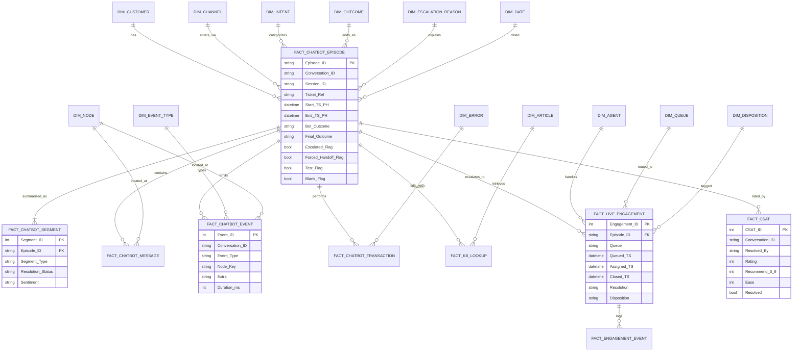
```mermaid
erDiagram
    DIM_CUSTOMER ||--o{ FACT_CHATBOT_EPISODE : has
    DIM_CHANNEL ||--o{ FACT_CHATBOT_EPISODE : enters_via
    DIM_INTENT ||--o{ FACT_CHATBOT_EPISODE : categorizes
    DIM_OUTCOME ||--o{ FACT_CHATBOT_EPISODE : ends_as
    DIM_ESCALATION_REASON ||--o{ FACT_CHATBOT_EPISODE : explains
    DIM_DATE ||--o{ FACT_CHATBOT_EPISODE : dated
    FACT_CHATBOT_EPISODE ||--|{ FACT_CHATBOT_SEGMENT : summarized_as
    FACT_CHATBOT_EPISODE ||--o{ FACT_CHATBOT_MESSAGE : contains
    FACT_CHATBOT_EPISODE ||--o{ FACT_CHATBOT_EVENT : emits
    FACT_CHATBOT_EPISODE ||--o{ FACT_CHATBOT_TRANSACTION : performs
    FACT_CHATBOT_EPISODE ||--o{ FACT_KB_LOOKUP : queries
    FACT_CHATBOT_EPISODE ||--o{ FACT_LIVE_ENGAGEMENT : escalates_to
    FACT_CHATBOT_EPISODE ||--o{ FACT_CSAT : rated_by
    FACT_LIVE_ENGAGEMENT ||--o{ FACT_ENGAGEMENT_EVENT : logs
    DIM_EVENT_TYPE ||--o{ FACT_CHATBOT_EVENT : types
    DIM_NODE ||--o{ FACT_CHATBOT_EVENT : located_at
    DIM_NODE ||--o{ FACT_CHATBOT_MESSAGE : located_at
    DIM_ERROR ||--o{ FACT_CHATBOT_TRANSACTION : fails_with
    DIM_ARTICLE ||--o{ FACT_KB_LOOKUP : retrieves
    DIM_AGENT ||--o{ FACT_LIVE_ENGAGEMENT : handles
    DIM_QUEUE ||--o{ FACT_LIVE_ENGAGEMENT : routed_to
    DIM_DISPOSITION ||--o{ FACT_LIVE_ENGAGEMENT : tagged

    FACT_CHATBOT_EPISODE {
        string Episode_ID PK
        string Conversation_ID
        string Session_ID
        string Ticket_Ref
        datetime Start_TS_PH
        datetime End_TS_PH
        string Bot_Outcome
        string Final_Outcome
        bool Escalated_Flag
        bool Forced_Handoff_Flag
        bool Test_Flag
        bool Blank_Flag
    }
    FACT_CHATBOT_SEGMENT {
        int Segment_ID PK
        string Episode_ID FK
        string Segment_Type
        string Resolution_Status
        string Sentiment
    }
    FACT_CHATBOT_EVENT {
        int Event_ID PK
        string Conversation_ID
        string Event_Type
        string Node_Key
        string Extra
        int Duration_ms
    }
    FACT_LIVE_ENGAGEMENT {
        int Engagement_ID PK
        string Episode_ID FK
        string Queue
        datetime Queued_TS
        datetime Assigned_TS
        datetime Closed_TS
        string Resolution
        string Disposition
    }
    FACT_CSAT {
        int CSAT_ID PK
        string Conversation_ID
        string Resolved_By
        int Rating
        int Recommend_0_9
        int Ease
        bool Resolved
    }
```

---

## 21. Reporting Requirements

| Area | What to monitor | Primary metrics |
| --- | --- | --- |
| **Executive KPIs** | Is the bot reducing agent load while keeping customers satisfied? | Conversations, Eligible episodes, Bot Resolution Rate (episode), Containment Rate, Escalation Rate, Abandonment Rate, End-to-End Resolution, CSAT Top-2-Box (by route), NPS-like |
| **Operations KPIs** | Agent demand created by the bot | Handoffs by hour vs support hours, queue wait, queue abandonment, AHT, agent resolution rate, out-of-hours requests |
| **Bot Performance** | Answer quality and coverage | Intent Recognition (AI answered %), ai_no_answer subtypes, KB answer pass rate, fallback rate, initial response latency |
| **Intent Analytics** | What customers want | Topic volume and share, topic × outcome, menu path usage, top unanswered questions |
| **Transaction Analytics** | Self-service effectiveness | Lookup usage/success, Y/N leaf confirmation rate per node, info-leaf exits |
| **Customer Journey** | Where customers drop | Pre-chat drop-off, blank sessions, abandonment by last step, step conversion |
| **Error Monitoring** | Reliability | Ad Hoc/API failures, threshold_exceeded, SDQ ticket creation gaps (rows without ticket), email pending backlog |
| **Escalation Analysis** | Why customers leave the bot | Reason (requested / forced / offer / Sales), node at escalation, attempts before escalation, frustrated sentiment |
| **Channel Performance** | Web vs Messenger vs page | All core KPIs by channel and page |
| **Daily Monitoring** | Same-day health | Volume vs yesterday, handoffs by hour, queue wait, ai_no_answer spikes, test traffic leakage, data freshness |
| **Weekly Reporting** | Trends and fixes | Topic trend, top 20 unanswered questions, failing KB checks, node drop-offs, CSAT verbatims |
| **Monthly Business Review** | Value and roadmap | Containment and resolution trend, cost avoidance proxy (contained episodes × agent cost), CSAT/NPS, top improvement backlog |

---

## 22. Dashboard Recommendations PROPOSED

| Page | KPIs / content | Recommended visual | Business question answered | Required fields |
| --- | --- | --- | --- | --- |
| **1 — Executive Overview** | Conversations, Eligible Episodes, Bot Resolution %, Containment %, Escalation %, Abandonment %, End-to-End Resolution %, CSAT Top-2-Box, NPS-like (with n) | KPI cards + month-over-month delta; outcome stacked bar | Is the bot working and improving? | Episode outcome, flags, CSAT |
| **2 — Volume & Trends** | Conversations / episodes by day and hour, by channel | Line + heatmap (hour × weekday) with support-hours overlay | When do customers come, and is that covered? | Start_TS (PH), channel |
| **3 — Intent Analytics** | Topic volume, share, topic × final outcome, menu path tree usage | Ranked bar, 100% stacked bar, treemap of nodes | What do customers ask about, and which topics fail? | Topic, node, outcome |
| **4 — Transaction Performance** | Lookups started/succeeded, Y/N confirmation % per leaf, info-leaf exits | Table with conditional colors; funnel per lookup | Which self-service paths work? | Node events, lookup result |
| **5 — Customer Journey Funnel** | Consent → episode → need stated → answer → confirmation → resolved / escalated / abandoned | Funnel + Sankey | Where do customers drop off? | Consent, episode, events |
| **6 — Escalation Analysis** | Escalation by reason type, node, attempts before handoff, within hours, queue wait, queue abandon, agent resolution | Stacked bars, box plot of wait | Why and where do we lose customers to agents? | Handoff events, engagement |
| **7 — Errors, Fallback & AI Quality** | Fallback rate, ai_no_answer subtypes, KB pass rate, top unanswered questions, failing articles | Trend lines + top-N tables | What must the KB/bot team fix this week? | Event log, KB checks |
| **8 — Channel Analysis** | Core KPIs by channel and FB page | Small multiples | Which touchpoint performs best? | Channel, page |
| **9 — Session / Episode Explorer** | Filterable episode list with summary, outcome, ticket, journey link | Detail table | Show me examples behind any number | Episode fact + summary text |
| **10 — CSAT & VoC** | CSAT by route, response rate, NPS-like, CES, FCR, verbatims | Bars + comment table | How do customers feel by route? | CSAT fact |

---

## 23. Business Questions

**Volume & demand**

1. How many customers use the bot daily, weekly and monthly (conversations and unique senders)?
2. What share of chat volume is web chat vs website widget vs Messenger, and which FB page?
3. At what hours does demand peak, and how much of it is outside live-agent support hours (00:00–06:00) or sales hours?
4. How many sessions are blank (opened but no request), and where do they come from?
5. How many consenting customers never send a message (pre-chat drop-off)?
6. How many customers come back within 7 or 30 days, and with the same topic?

**Intent**

7. What are customers contacting us about (topic share)?
8. Which topics are growing week over week?
9. Which menu paths are used most, and which are never used?
10. How often do customers type instead of tapping, and for which topics?
11. What are the top unanswered questions, and do they need a new article or a better one?
12. How often does the topic tagged by AI differ from the menu path the customer chose?

**Resolution & containment**

13. What percentage of eligible episodes does the bot resolve without an agent?
14. What percentage of eligible episodes are contained (no agent), and how much of that is abandonment?
15. Which topics and menu leaves have the highest customer-confirmed resolution?
16. Which leaves have the highest "No, still need help" rate?
17. How do rule-flow vs AI-chat resolutions compare in CSAT?
18. What is the end-to-end resolution rate (bot + agent) by topic?

**Transactions**

19. How many account lookups are attempted, and how many succeed?
20. Do customers skip the account-number prompt, and what happens next?
21. Do postpaid and prepaid customers get routed correctly?

**Escalation**

22. What causes escalation (requested, forced node, upsell/save-offer accepted, Sales)?
23. How many KB attempts happen before a customer asks for an agent?
24. Which flow nodes generate the most handoffs (e.g., Account Management)?
25. What is the queue wait and abandonment by queue and hour?
26. How many escalations happen outside support hours, and what do those customers do next?
27. What share of escalated episodes are resolved by agents, and by which disposition?

**Fallback & quality**

28. Which flows or topics produce the most fallbacks and AI no-answers?
29. What is the KB answer self-check pass rate, and which articles fail most?
30. Are internal agent-only articles being shown to customers?
31. Are greetings, blank messages or abusive messages inflating "unanswered" counts?

**Journey & abandonment**

32. Where do customers abandon (consent, account prompt, info leaf, after AI answer, queue)?
33. How long do bot episodes last before resolution, escalation or abandonment?
34. Do customers who abandon come back later?

**CX & business value**

35. What is CSAT Top-2-Box and NPS-like by route (rule flow, AI, agent) and by channel?
36. What is the CSAT response rate, and is the sample biased?
37. How many upsell offers are shown and accepted, and how many become sales handoffs?
38. How many disconnection requests get a save offer, and how many are retained?
39. How many agent hours did the bot save this month (contained episodes × average handle time)?
40. Do SDQ ticket counts reconcile with bot episodes and live engagements?

---

## 24. Backend Validation Questions

These are open questions for the Bot/IT team. **Do not guess the answers.**

**Identity & grain**

1. What officially defines a *session*, a *conversation* and an *episode*? When is each ID generated?
2. Why can one `session_id` hold many `conversation_id`s (14 in one case)?
3. What is the exact formula of the dashboard "Sessions / unique conversations" KPI (392 vs 379 distinct session IDs vs 465 conversation IDs)?
4. Is the post-agent summary row (same ticket, status resolved/unresolved) intentional? Is there a field that marks a row as *bot segment* vs *agent segment*?
5. Why do 55 summary rows have no ticket?
6. How should repeat users be identified across devices (mobile, account number, CRM ID)?

**Timing**

7. Are all timestamps now Manila time (IT said fixed), or still UTC? API responses on 2 Oct still show `+00:00`, and dashboard days are UTC buckets.
8. Is summary `created` the episode end time? Is an episode start time stored?
9. Confirm the session timeout (30 min in settings). The beta showed `idle_session_reset` after about 60–70 seconds — is that gone in production?

**Outcomes**

10. What officially counts as *bot resolved*? Is it AI-judged from the transcript, customer-confirmed (`resolved_yes`), or both? When is "Resolved (Unconfirmed)" used?
11. What officially counts as *contained*? Which sessions are excluded (Sales, test, forced handoff nodes)?
12. What do `human_only` and `user_stuck` handoff reasons mean?
13. Why does the event-level reason (`user_requested`) differ from the summary-level text ("User requested live agent")?
14. Is `resolved_yes` / `resolved_no` (and the node where it happened) stored anywhere besides the transcript?
15. Why is the event `node_key` usually `welcome` even after the customer navigated the flow?
16. Can abandoned sessions be split into "never asked", "mid-flow" and "after answer"?

**AI / KB**

17. What triggers a `fallback` event vs `ai_no_answer`?
18. Is intent confidence stored for topic classification and for skill classification?
19. Why does a greeting ("Hi") or a blank message produce a KB hit? Can these be excluded from KB metrics?
20. How is `answered_recommend_handoff` decided, and should it count as "couldn't answer"?
21. Why are internal articles (scripts, L1 handling, TP directory) retrievable for customer answers?

**Transactions & errors**

22. Are account lookup attempts, successes and failures logged? What are the retry limits and error messages?
23. Is account type (postpaid/prepaid) stored after routing?
24. Are API/backend errors (lookup, SDQ, Gemini) classified and logged? Where?
25. What happens when SDQ ticket creation fails? (The default service/category settings currently point to invalid IDs.)
26. What is stored for upsell and save-offer shown/accepted/declined?

**Live agent & CSAT**

27. Is agent transfer success recorded (first assignment vs final)? Is first agent response time stored?
28. Can one ticket have several engagements? How should engagements link to tickets (not only conversation)?
29. What are the stored values of the CSAT scales (overall satisfaction appears as 1, 2, 4, 5 — is it a 4-option scale)?
30. Is the survey "offered" event stored (to compute response rate)? Is "survey declined" stored?
31. Is the product (Cignal/SatLite/Cignal Play) a stored column, and why is most traffic "Unattributed"?
32. What is the data retention period for summaries, events and transcripts?

---

## 25. Known Limitations

| # | Limitation |
| --- | --- |
| L1 | Read-only role `cegadmin`: **no access** to Technical Settings, Audit Logs, Logs, Integrations, Identity Clients, Role Permissions, Widget Embed & Identity docs, Live-Agent API docs |
| L2 | **No customer-side test chats were run.** The Test Chat page creates real production sessions and SDQ tickets, and has Cloudflare verification. Customer-side behavior was mapped from configuration, transcripts and logs |
| L3 | Data window was about 1.5 days after go-live and includes test traffic. All numbers are indicative |
| L4 | Ad Hoc Reports blocks schema queries (`INFORMATION_SCHEMA`), so the table inventory is based on observed outputs and earlier validated prompts |
| L5 | Account-lookup failure messages, retry limits and backend error messages could not be observed |
| L6 | Node-visit and resolution-check events are not logged, so menu funnels need transcript parsing until events exist |
| L7 | The Sales bot and archived Telesales flow were reviewed from configuration only |
| L8 | Live-agent console actions (Monitor, Reassign, End, Rebuild index, Refresh cache) were intentionally **not** clicked |

---

## 26. Observed vs Inferred vs Proposed Items

| Item | OBSERVED | INFERRED | PROPOSED |
| --- | --- | --- | --- |
| Hybrid architecture (flow + AI + agent + SDQ + AI summary) | ✅ |  |  |
| 73-node menu, 147 options, actions, payloads | ✅ |  |  |
| Business settings values (timeouts, hours, gates, CSAT, upsell, save offer) | ✅ |  |  |
| Two summary rows per handed-off ticket | ✅ (258 tickets) | Intentional design ❓ | Episode grain |
| Console KPI formulas (AI answered %, KB hit %, handoffs, CSAT) | ✅ reconciled | Sessions total ❓ | Renaming |
| KB hit counts greetings/blank messages | ✅ |  | Exclude from KB KPI |
| Mixed timezones | ✅ |  | Convert to PH |
| Test traffic included | ✅ |  | Exclusion rule |
| Closing sequence order | Settings text ✅ | Exact runtime order |  |
| Account lookup failure handling |  | ✅ | AUTH events |
| Free text bypasses 3-attempt gate |  | ✅ |  |
| `no_further_action` triggered by system |  | ✅ |  |
| Product attribution only on button choice |  | ✅ |  |
| Episode/Conversation/Segment grain model |  |  | ✅ |
| Proposed event model, metric dictionary, dashboard |  |  | ✅ |
| NPS-like cut-offs for a 0–9 scale |  |  | ✅ |
| CSAT 4-option scale (1, 2, 4, 5) | Values ✅ | Scale design | Top-2-box |

---

## 27. Final Recommendations

**For the Reports Analyst (now)**

1. **Report at episode (ticket) grain for outcomes**, conversation grain for unique volume, and **never count summary rows as volume**. Classify each ticket as Bot Resolved / Bot Abandoned / Bot Unresolved / Handed Off → Agent Resolved / Agent Unresolved / Open.
2. **Rename the console's "Bot Resolution"** to *AI Answer Rate* in all decks. Present bot containment and bot resolution separately.
3. **Apply standard exclusions:** `webchat:test`, test FB pages, Sales bot / Apply Now, blank episodes (shown as a separate line).
4. **Convert all times to Manila** before bucketing (until IT confirms the fix in the API).
5. **Treat "unresolved" as an agent outcome.** Define "Couldn't Answer" from events (`ai_no_answer` subtypes + `resolved_no`) instead of the summary status.
6. **Pin CSAT to episodes by time window**, report Top-2-Box with n, and split by `resolved_by`.
7. Start a **weekly Top Unanswered Questions + Failing KB Checks** list for the KB team, after excluding greetings, blank and abusive messages.

**For the Bot/IT team (requests)**

8. Log node visits, resolution checks (`resolved_yes/no` with node), lookup start/success/fail, upsell/save-offer outcomes, survey offered/declined, and session end as events.
9. Add `segment_type` (bot/agent) and `episode_start` to the session summary. Add `product` and `account_type` columns.
10. Fix the SDQ default service/category (currently invalid IDs).
11. Add "Yes/No resolved" to the 9 info leaves and buttons to `cignal_billing_load_store`. Add the missing SatLite error-code and video branches if they apply.
12. Exclude greetings and blank messages from KB retrieval metrics. Review internal articles that are retrievable for customer answers.
13. Clarify the "Loading" skill guidance (buffering vs prepaid loading).
14. Consider turning on Filipino button labels to match the Filipino messages.

---

## 28. Exploration Coverage Checklist & Final Coverage Summary

### 28.1 Coverage checklist

| Area / Page | Status | Notes |
| --- | --- | --- |
| Home | ✅ Explored | Role-based landing |
| Menu Flow — Cignal Web Chat / Main Support Flow v1 | ✅ Explored | All 73 nodes, options, actions read via Flow Chart view (read-only) |
| Menu Flow — Telesales flow (inactive, archived) | ✅ Explored | Config only |
| Menu Flow — Sales bot / Sales Default | ✅ Explored | Config only |
| Page Flow Assignment | ✅ Explored | 5 FB pages |
| Business Settings | ✅ Explored | All 15 sections read (expanded view only) |
| Technical Settings | ❌ Not accessible | No access for role |
| Greetings | ✅ Explored | 4 active |
| Canned Responses | ✅ Explored | 8 |
| Agent Profiles | ⚠️ Partially explored | Roster seen on Supervisor page; personal details not recorded |
| Skill Categories | ✅ Explored | 13 |
| Teams | ✅ Explored | 2 |
| Agent Statuses | ✅ Explored | 14 |
| Landing Page Concerns | ✅ Explored | 13 (topic taxonomy) |
| Feed Response Actions | ✅ Explored | 5 classes |
| Dashboard | ✅ Explored | KPIs reconciled |
| Analytics (Performance + Knowledge Base) | ✅ Explored | — |
| Ad Hoc Reports | ⚠️ Partially explored | Schema blocked; event log and CSAT probes run (read-only) |
| Session Summaries | ✅ Explored | 825 rows analyzed in-browser (PII not exported) |
| Feed Events | ✅ Explored | — |
| App Reviews | ✅ Explored | Adjacent to the bot |
| DPA Consent | ✅ Explored | — |
| KB Diagnostics | ✅ Explored | Rebuild/refresh **not** clicked |
| Live Agent Reports | ✅ Explored | — |
| Customer Journey | ✅ Explored | 1 ticket traced |
| Email/SMS Log | ✅ Explored | — |
| Audit Logs, Logs | ❌ Not accessible | — |
| Integrations, Identity Clients, Role Permissions | ❌ Not accessible | — |
| Widget Embed & Identity, Live-Agent API docs | ❌ Not accessible | — |
| Agent Workspace | ⚠️ Partially explored | Not opened, to avoid accepting live chats |
| Supervisor Dashboard | ✅ Explored | View only; no Monitor/Reassign/End |
| Realtime Dashboard | ✅ Explored | — |
| QA Reviews | ✅ Explored | View only |
| Test Chat (customer widget) | 🔐 Requires interaction / ⚠️ | Entry screen seen; no chat started (creates production tickets, Cloudflare check) |
| Account lookup flows (4) | 🔐 Requires authentication | Config mapped; runtime not tested |
| Lookup failure / error handling | ❓ Requires backend clarification | — |

### 28.2 Final coverage summary

| Measure | Count |
| --- | --- |
| Main menus discovered | **1** welcome menu with **3** product menus (Cignal, SatLite, Cignal Play) |
| Submenus (category menus) discovered | **8** (Cignal 3, SatLite 2, Cignal Play 3) — **28** decision/menu nodes in total |
| Intents discovered | **73** menu nodes; **13** AI topics; **13** skill categories; **4** system intents (account status, ticket status, account information, last concern) + disconnect/save-offer + upsell; **49** dispositions |
| Transactions discovered | **10** (§7: 4 lookup/route transactions, handoff, ticket, survey, email, links, ticket-status) |
| Complete flows mapped (configuration level) | **44** leaf paths + Sales flow + Telesales flow |
| Partially explored flows | **6** — 4 account-lookup flows (runtime), AI free-text path (thresholds), `no_further_action` trigger |
| Authentication-dependent flows | **5** — 4 account-lookup nodes + account status lookup |
| Unresolved questions | **32** (§24) |

### 28.3 Top reporting risks

1. Double counting from two summary rows per handed-off ticket.
2. "Bot Resolution 53.5%" mistaken for containment or resolution.
3. KB Hit Rate (≈99%) inflated by greetings and blank messages.
4. Mixed UTC / Manila timestamps shifting daily and monthly totals.
5. Test traffic in all built-in numbers.
6. "Unresolved" status misread as bot failure (it is mostly agent outcome).
7. CSAT joined by conversation duplicating across episodes (83 rows vs 29 responses in session data).
8. Mixed grains on one dashboard (events vs sessions vs rows).

### 28.4 Top data gaps

1. No node-visit, resolution-check or lookup events.
2. No explicit bot vs agent segment flag; no episode start time.
3. No intent confidence; no backend error classification.
4. Product mostly "Unattributed"; account type not stored.
5. No survey-offered / survey-declined events (no CSAT response-rate denominator).
6. Engagement ↔ ticket linkage only through conversation_id.
7. No stable customer ID across devices.

### 28.5 Metrics that can be created immediately (from existing data)

Conversations, sessions, episodes, unique senders · topic volume and share · bot-only resolved / abandoned / handed-off episodes (ticket grouping) · escalation rate and reasons (events + summaries) · AI answer rate, ai_no_answer subtypes, fallback rate · KB answer pass rate · live-agent wait, AHT, resolution rate, queue abandonment · CSAT Top-2-Box, NPS-like, CES, FCR by route · DPA → episode drop-off · messages per episode · channel and page splits · initial response latency.

### 28.6 Metrics requiring backend data

Confirmed self-service completion rate · transaction / lookup success rate · authentication success rate · node drop-off and step conversion · error rate · intent recognition confidence · CSAT response rate · upsell and save-offer conversion · repeat contact across devices · true session duration (start time).

### 28.7 Recommended next steps for the Reports Analyst

1. Send §24 questions 1, 4, 7, 10, 11, 14 and 22 to IT first — they decide the KPI definitions.
2. Build v6 of the EOM template on the **episode grain** (ticket grouping with segment order) and add a Final Outcome column.
3. Add an **Events** raw sheet (event log: event_type, extra, node_key, conversation_id, created) for AI/KB/handoff metrics.
4. Re-label console metrics in reports (AI Answer Rate, Handoff Events) and add a one-page metric dictionary from §14.
5. Agree the standard exclusions and Manila-time rule with your manager, then lock them in the template.
6. Run a monthly reconciliation: bot episodes vs SDQ tickets vs live engagements.
7. After IT adds the missing events, add the menu funnel and transaction pages (§22 pages 4–5).

# Cignal Chatbot (TALA) — Process Flow Documentation (Visual)

Companion to `CIGNAL_CHATBOT_SYSTEM_DISCOVERY.md`. Discovery date: 2 Oct 2026 (read-only exploration of `https://chatbot.mycignal.ph/admin`).

**Labels:** **OBSERVED** = seen in configuration, logs or transcripts · **INFERRED** = likely, needs backend validation · **PROPOSED** = recommended for reporting. In the diagrams, dashed arrows (`-.->`) mark **inferred** paths.

## Contents

1. Overall chatbot flow
2. Entry, consent & pre-chat
3. Menu hierarchy — Cignal
4. Menu hierarchy — SatLite
5. Menu hierarchy — Cignal Play
6. Customer journey (stages)
7. Authentication / account lookup flow
8. Transaction flow — Pay Bill or Topup (lookup + routing)
9. Successful transaction (sequence)
10. Failed transaction (sequence)
11. Resolution check & closing sequence
12. AI free-text & fallback flow
13. Escalation flow
14. Live-agent lifecycle (sequence)
15. Sales / Apply Now flow
16. Session termination & abandonment
17. Conversation state model
18. Data / reporting event flow
19. Episode & summary-row model (why rows double-count)
20. Proposed reporting pipeline

---

## 1. Overall chatbot flow OBSERVED, closing order INFERRED

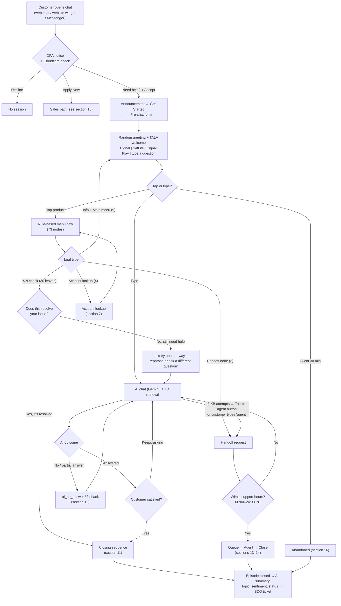
```mermaid
flowchart TD
    A["Customer opens chat<br/>(web chat / website widget / Messenger)"] --> B{"DPA notice<br/>+ Cloudflare check"}
    B -- "Decline" --> X0["No session"]
    B -- "Apply Now" --> S["Sales path (see section 15)"]
    B -- "Need help? + Accept" --> C["Announcement → Get Started<br/>→ Pre-chat form"]
    C --> D["Random greeting + TALA welcome<br/>Cignal | SatLite | Cignal Play | type a question"]
    D --> E{"Tap or type?"}
    E -- "Tap product" --> F["Rule-based menu flow<br/>(73 nodes)"]
    E -- "Type" --> G["AI chat (Gemini) + KB retrieval"]
    F --> H{"Leaf type"}
    H -- "Y/N check (30 leaves)" --> I{"Does this resolve<br/>your issue?"}
    H -- "Info + Main menu (9)" --> D
    H -- "Account lookup (4)" --> L["Account lookup<br/>(section 7)"]
    H -- "Handoff node (3)" --> Q["Handoff request"]
    I -- "Yes, it's resolved" --> K["Closing sequence<br/>(section 11)"]
    I -- "No, still need help" --> R["'Let's try another way —<br/>rephrase or ask a different question'"]
    R --> G
    L --> F
    G --> M{"AI outcome"}
    M -- "Answered" --> N{"Customer satisfied?"}
    N -. "Yes" .-> K
    N -- "Keeps asking" --> G
    M -- "No / partial answer" --> O["ai_no_answer / fallback<br/>(section 12)"]
    O --> G
    G -- "3 KB attempts → Talk to agent button<br/>or customer types 'agent'" --> Q
    Q --> P{"Within support hours?<br/>06:00–24:00 PH"}
    P -- "No" --> G
    P -- "Yes" --> T["Queue → Agent → Close<br/>(sections 13–14)"]
    K --> Z["Episode closed → AI summary,<br/>topic, sentiment, status → SDQ ticket"]
    T --> Z
    E -- "Silent 30 min" --> AB["Abandoned (section 16)"]
    AB --> Z
```

---

## 2. Entry, consent & pre-chat OBSERVED

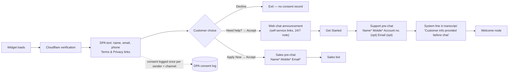
```mermaid
flowchart LR
    W["Widget loads"] --> CF["Cloudflare verification"]
    CF --> DPA["DPA text: name, email, phone<br/>Terms & Privacy links"]
    DPA --> CH{"Customer choice"}
    CH -- "Decline" --> END0["Exit — no consent record"]
    CH -- "Apply Now → Accept" --> SF["Sales pre-chat<br/>Name* Mobile* Email*"]
    CH -- "Need help? → Accept" --> AN["Web chat announcement<br/>(self-service links, 24/7 note)"]
    AN --> GS["Get Started"]
    GS --> PF["Support pre-chat<br/>Name* Mobile* Account no. (opt) Email (opt)"]
    PF --> SYS["System line in transcript:<br/>'Customer info provided before chat'"]
    SYS --> WEL["Welcome node"]
    SF --> SALES["Sales bot"]
    DPA -. "consent logged once per sender + channel" .-> LOG[("DPA consent log")]
```

Messenger: consent text comes from the *DPA Consent Message* setting. Each FB page has its own plain-text announcement and its own entry node (Page Flow Assignment). **OBSERVED**

---

## 3. Menu hierarchy — Cignal OBSERVED

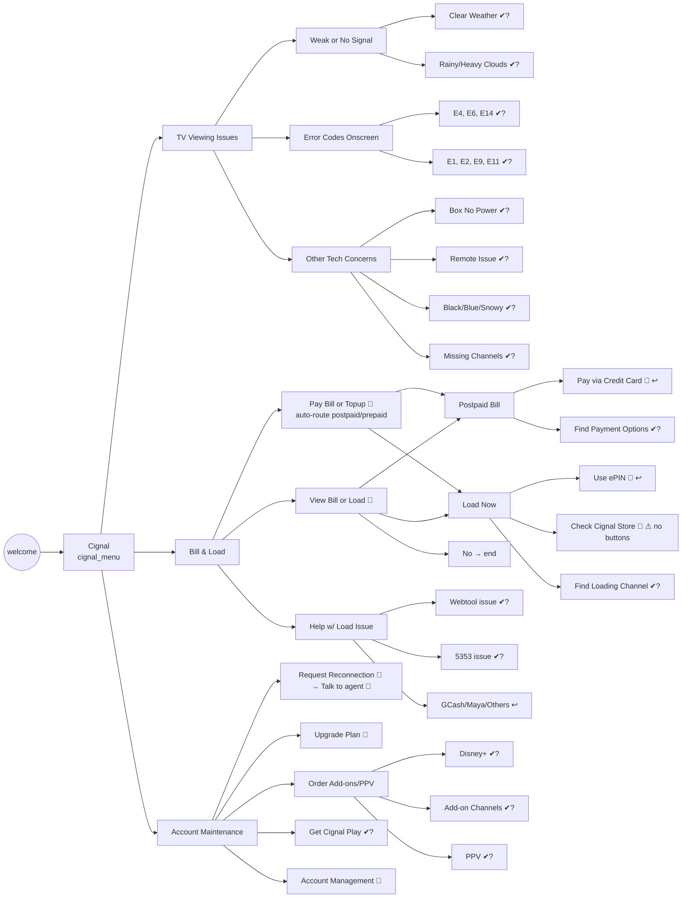
```mermaid
flowchart LR
    W(("welcome")) --> CM["Cignal<br/>cignal_menu"]
    CM --> T["TV Viewing Issues"]
    CM --> B["Bill & Load"]
    CM --> AC["Account Maintenance"]

    T --> WS["Weak or No Signal"]
    WS --> WC["Clear Weather ✔?"]
    WS --> WR["Rainy/Heavy Clouds ✔?"]
    T --> ER["Error Codes Onscreen"]
    ER --> E1["E4, E6, E14 ✔?"]
    ER --> E2["E1, E2, E9, E11 ✔?"]
    T --> OT["Other Tech Concerns"]
    OT --> BP["Box No Power ✔?"]
    OT --> RM["Remote Issue ✔?"]
    OT --> VB["Black/Blue/Snowy ✔?"]
    OT --> MC["Missing Channels ✔?"]

    B --> VI["View Bill or Load 🔐"]
    VI --> PP
    VI --> LN
    VI --> VIN["No → end"]
    B --> PT["Pay Bill or Topup 🔐<br/>auto-route postpaid/prepaid"]
    PT --> PP["Postpaid Bill"]
    PT --> LN["Load Now"]
    PP --> CC["Pay via Credit Card 🔗 ↩"]
    PP --> PO["Find Payment Options ✔?"]
    LN --> EP["Use ePIN 🔗 ↩"]
    LN --> ST["Check Cignal Store 🔗 ⚠ no buttons"]
    LN --> OC["Find Loading Channel ✔?"]
    B --> HL["Help w/ Load Issue"]
    HL --> WT["Webtool issue ✔?"]
    HL --> F5["5353 issue ✔?"]
    HL --> GC["GCash/Maya/Others ↩"]

    AC --> RC["Request Reconnection 🔐 → Talk to agent 👤"]
    AC --> UP["Upgrade Plan 👤"]
    AC --> AD["Order Add-ons/PPV"]
    AD --> DS["Disney+ ✔?"]
    AD --> CH["Add-on Channels ✔?"]
    AD --> PV["PPV ✔?"]
    AC --> GP["Get Cignal Play ✔?"]
    AC --> AM["Account Management 👤"]
```

Legend: ✔? = Yes/No resolution check · 🔐 = account lookup · 👤 = live-agent handoff · 🔗 = link · ↩ = "Main menu" button only · ⚠ = dead end.

---

## 4. Menu hierarchy — SatLite OBSERVED

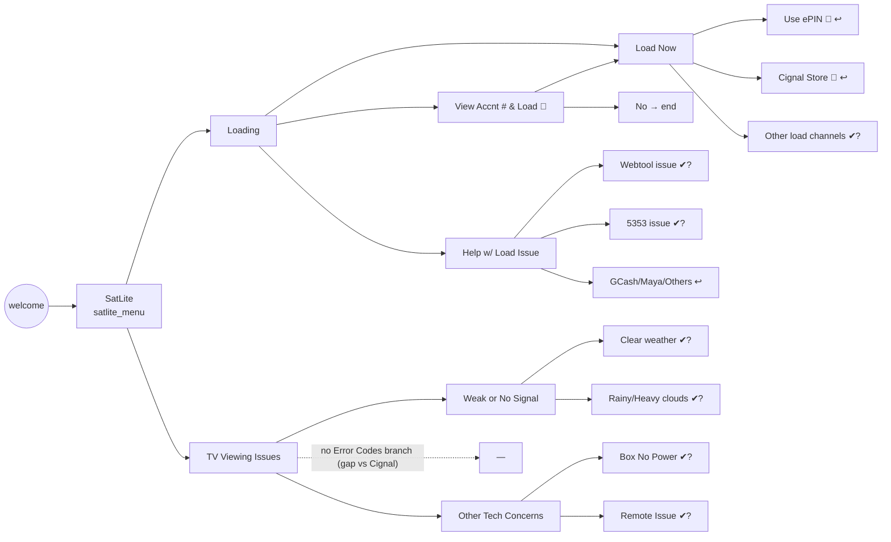
```mermaid
flowchart LR
    W(("welcome")) --> SM["SatLite<br/>satlite_menu"]
    SM --> LO["Loading"]
    SM --> TV["TV Viewing Issues"]
    LO --> VA["View Accnt # & Load 🔐"]
    VA --> LN["Load Now"]
    VA --> NO["No → end"]
    LO --> LN
    LN --> EP["Use ePIN 🔗 ↩"]
    LN --> CS["Cignal Store 🔗 ↩"]
    LN --> OL["Other load channels ✔?"]
    LO --> HL["Help w/ Load Issue"]
    HL --> WT["Webtool issue ✔?"]
    HL --> F5["5353 issue ✔?"]
    HL --> GC["GCash/Maya/Others ↩"]
    TV --> WS["Weak or No Signal"]
    WS --> WC["Clear weather ✔?"]
    WS --> WR["Rainy/Heavy clouds ✔?"]
    TV --> OT["Other Tech Concerns"]
    OT --> BP["Box No Power ✔?"]
    OT --> RM["Remote Issue ✔?"]
    TV -. "no Error Codes branch (gap vs Cignal)" .-> GAP["—"]
```

---

## 5. Menu hierarchy — Cignal Play OBSERVED

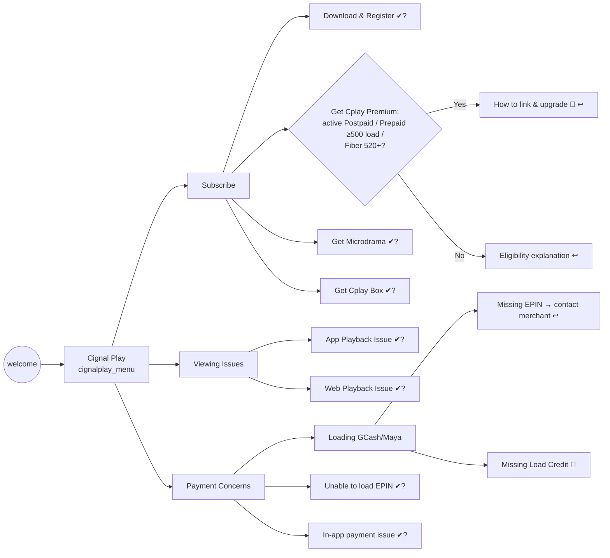
```mermaid
flowchart LR
    W(("welcome")) --> PM["Cignal Play<br/>cignalplay_menu"]
    PM --> SU["Subscribe"]
    PM --> VI["Viewing Issues"]
    PM --> PA["Payment Concerns"]
    SU --> DL["Download & Register ✔?"]
    SU --> PR{"Get Cplay Premium:<br/>active Postpaid / Prepaid ≥500 load /<br/>Fiber 520+?"}
    PR -- "Yes" --> PRY["How to link & upgrade 🔗 ↩"]
    PR -- "No" --> PRN["Eligibility explanation ↩"]
    SU --> MD["Get Microdrama ✔?"]
    SU --> BX["Get Cplay Box ✔?"]
    VI --> AP["App Playback Issue ✔?"]
    VI --> WB["Web Playback Issue ✔?"]
    PA --> GM["Loading GCash/Maya"]
    GM --> ME["Missing EPIN → contact merchant ↩"]
    GM --> MLC["Missing Load Credit 👤"]
    PA --> UE["Unable to load EPIN ✔?"]
    PA --> IA["In-app payment issue ✔?"]
```

The *Cignal Play* Facebook page enters directly at `cignalplay_menu`. **OBSERVED**

---

## 6. Customer journey (stages) PROPOSED reporting view

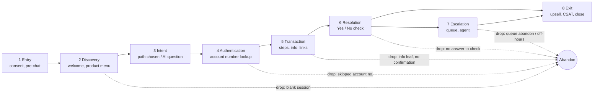
```mermaid
flowchart LR
    S1["1 Entry<br/>consent, pre-chat"] --> S2["2 Discovery<br/>welcome, product menu"]
    S2 --> S3["3 Intent<br/>path chosen / AI question"]
    S3 --> S4["4 Authentication<br/>account number lookup"]
    S4 --> S5["5 Transaction<br/>steps, info, links"]
    S5 --> S6["6 Resolution<br/>Yes / No check"]
    S6 --> S8["8 Exit<br/>upsell, CSAT, close"]
    S6 --> S7["7 Escalation<br/>queue, agent"]
    S7 --> S8
    S2 -. "drop: blank session" .-> D1(("Abandon"))
    S4 -. "drop: skipped account no." .-> D1
    S5 -. "drop: info leaf, no confirmation" .-> D1
    S6 -. "drop: no answer to check" .-> D1
    S7 -. "drop: queue abandon / off-hours" .-> D1
```

---

## 7. Authentication / account lookup flow OBSERVED config; failure path INFERRED

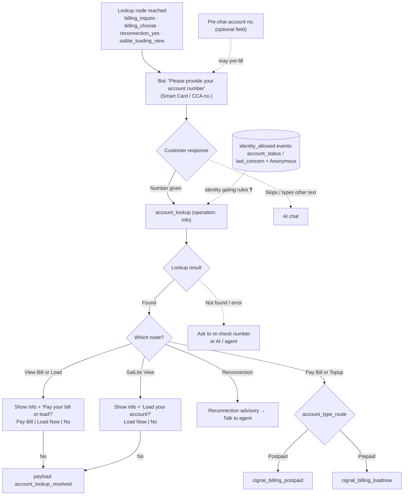
```mermaid
flowchart TD
    A["Lookup node reached<br/>billing_inquire · billing_choose ·<br/>reconnection_yes · satlite_loading_view"] --> B["Bot: 'Please provide your account number'<br/>(Smart Card / CCA no.)"]
    PC["Pre-chat account no.<br/>(optional field)"] -. "may pre-fill" .-> B
    B --> C{"Customer response"}
    C -- "Number given" --> D["account_lookup (operation: info)"]
    C -. "Skips / types other text" .-> AI["AI chat"]
    D --> E{"Lookup result"}
    E -- "Found" --> F{"Which node?"}
    F -- "View Bill or Load" --> G["Show info + 'Pay your bill or load?'<br/>Pay Bill | Load Now | No"]
    F -- "Pay Bill or Topup" --> H{"account_type_route"}
    H -- "Postpaid" --> I["cignal_billing_postpaid"]
    H -- "Prepaid" --> J["cignal_billing_loadnow"]
    F -- "Reconnection" --> K["Reconnection advisory → Talk to agent"]
    F -- "SatLite View" --> L["Show info + 'Load your account?'<br/>Load Now | No"]
    E -. "Not found / error" .-> M["Ask to re-check number<br/>or AI / agent"]
    G -- "No" --> N["payload account_lookup_resolved"]
    L -- "No" --> N
    ID[("identity_allowed events:<br/>account_status / last_concern = Anonymous")] -. "identity gating rules ❓" .-> D
```

No OTP/PIN step was observed. **OBSERVED absence**

---

## 8. Transaction flow — Pay Bill or Topup OBSERVED

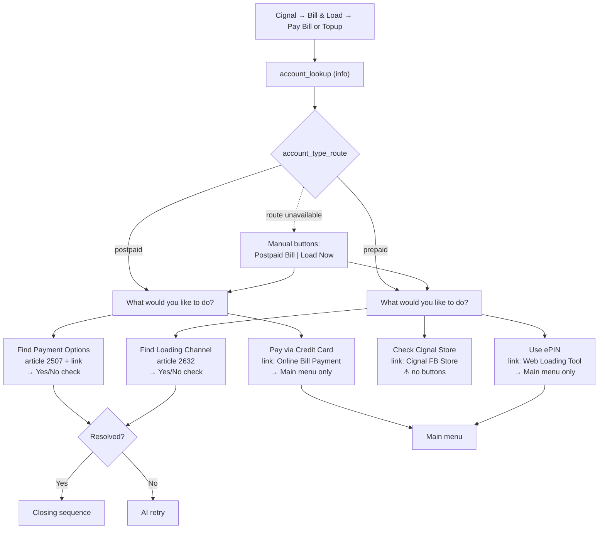
```mermaid
flowchart TD
    A["Cignal → Bill & Load → Pay Bill or Topup"] --> B["account_lookup (info)"]
    B --> C{"account_type_route"}
    C -- "postpaid" --> D["What would you like to do?"]
    C -- "prepaid" --> E["What would you like to do?"]
    C -. "route unavailable" .-> F["Manual buttons:<br/>Postpaid Bill | Load Now"]
    F --> D
    F --> E
    D --> D1["Pay via Credit Card<br/>link: Online Bill Payment<br/>→ Main menu only"]
    D --> D2["Find Payment Options<br/>article 2507 + link<br/>→ Yes/No check"]
    E --> E1["Use ePIN<br/>link: Web Loading Tool<br/>→ Main menu only"]
    E --> E2["Check Cignal Store<br/>link: Cignal FB Store<br/>⚠ no buttons"]
    E --> E3["Find Loading Channel<br/>article 2632<br/>→ Yes/No check"]
    D2 --> Y{"Resolved?"}
    E3 --> Y
    Y -- "Yes" --> CL["Closing sequence"]
    Y -- "No" --> AI["AI retry"]
    D1 --> MM["Main menu"]
    E1 --> MM
```

The bot **does not process payments**. It routes to external payment and loading tools, and those outcomes are **not visible** to reporting. **OBSERVED**

---

## 9. Successful transaction (sequence) OBSERVED

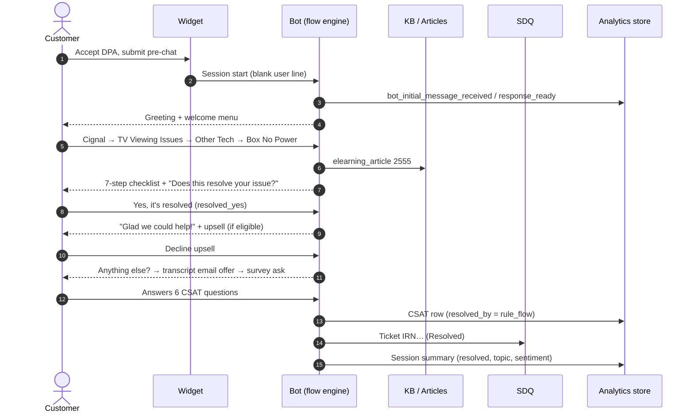
```mermaid
sequenceDiagram
    autonumber
    actor C as Customer
    participant W as Widget
    participant B as Bot (flow engine)
    participant K as KB / Articles
    participant S as SDQ
    participant A as Analytics store
    C->>W: Accept DPA, submit pre-chat
    W->>B: Session start (blank user line)
    B->>A: bot_initial_message_received / response_ready
    B-->>C: Greeting + welcome menu
    C->>B: Cignal → TV Viewing Issues → Other Tech → Box No Power
    B->>K: elearning_article 2555
    B-->>C: 7-step checklist + "Does this resolve your issue?"
    C->>B: Yes, it's resolved (resolved_yes)
    B-->>C: "Glad we could help!" + upsell (if eligible)
    C->>B: Decline upsell
    B-->>C: Anything else? → transcript email offer → survey ask
    C->>B: Answers 6 CSAT questions
    B->>A: CSAT row (resolved_by = rule_flow)
    B->>S: Ticket IRN… (Resolved)
    B->>A: Session summary (resolved, topic, sentiment)
```

---

## 10. Failed transaction (sequence) OBSERVED transcript

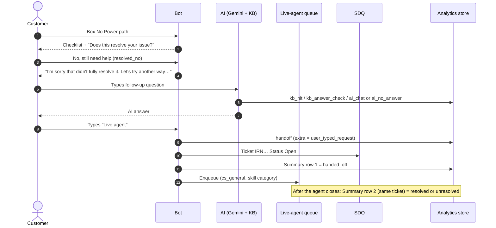
```mermaid
sequenceDiagram
    autonumber
    actor C as Customer
    participant B as Bot
    participant G as AI (Gemini + KB)
    participant Q as Live-agent queue
    participant S as SDQ
    participant A as Analytics store
    C->>B: Box No Power path
    B-->>C: Checklist + "Does this resolve your issue?"
    C->>B: No, still need help (resolved_no)
    B-->>C: "I'm sorry that didn't fully resolve it. Let's try another way…"
    C->>G: Types follow-up question
    G->>A: kb_hit / kb_answer_check / ai_chat or ai_no_answer
    G-->>C: AI answer
    C->>B: Types "Live agent"
    B->>A: handoff (extra = user_typed_request)
    B->>S: Ticket IRN… Status Open
    B->>A: Summary row 1 = handed_off
    B->>Q: Enqueue (cs_general, skill category)
    Note over Q,A: After the agent closes: Summary row 2 (same ticket) = resolved or unresolved
```

---

## 11. Resolution check & closing sequence OBSERVED settings; exact order INFERRED

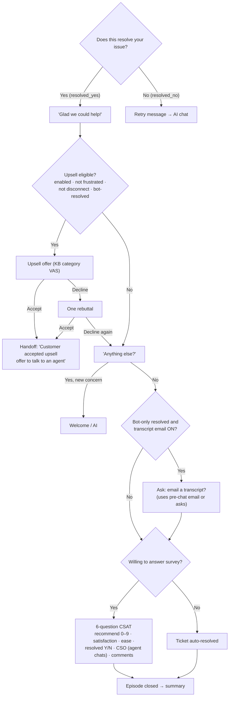
```mermaid
flowchart TD
    A{"Does this resolve your issue?"} -- "Yes (resolved_yes)" --> B["'Glad we could help!'"]
    A -- "No (resolved_no)" --> R["Retry message → AI chat"]
    B --> U{"Upsell eligible?<br/>enabled · not frustrated ·<br/>not disconnect · bot-resolved"}
    U -- "Yes" --> U1["Upsell offer (KB category VAS)"]
    U1 -- "Accept" --> H["Handoff: 'Customer accepted upsell<br/>offer to talk to an agent'"]
    U1 -- "Decline" --> U2["One rebuttal"]
    U2 -- "Accept" --> H
    U2 -- "Decline again" --> E
    U -- "No" --> E["'Anything else?'"]
    E -- "Yes, new concern" --> W["Welcome / AI"]
    E -- "No" --> T{"Bot-only resolved and<br/>transcript email ON?"}
    T -- "Yes" --> T1["Ask: email a transcript?<br/>(uses pre-chat email or asks)"]
    T -- "No" --> SV
    T1 --> SV{"Willing to answer survey?"}
    SV -- "Yes" --> CS["6-question CSAT<br/>recommend 0–9 · satisfaction · ease ·<br/>resolved Y/N · CSO (agent chats) · comments"]
    SV -- "No" --> AR["Ticket auto-resolved"]
    CS --> END["Episode closed → summary"]
    AR --> END
```

---

## 12. AI free-text & fallback flow OBSERVED events; thresholds INFERRED

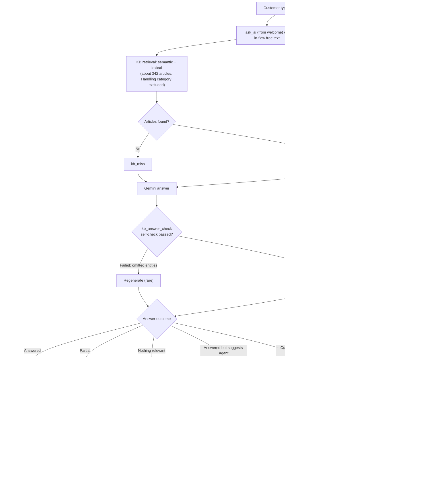
```mermaid
flowchart TD
    A["Customer types a message"] --> B["ask_ai (from welcome) or in-flow free text"]
    B --> C["KB retrieval: semantic + lexical<br/>(about 342 articles; Handling category excluded)"]
    C --> D{"Articles found?"}
    D -- "No" --> KM["kb_miss"]
    D -- "Yes (even for 'Hi')" --> KH["kb_hit"]
    KH --> G["Gemini answer"]
    KM --> G
    G --> SC{"kb_answer_check<br/>self-check passed?"}
    SC -- "Failed: omitted entities" --> RG["Regenerate (rare)"]
    RG --> OUT
    SC -- "Passed" --> OUT{"Answer outcome"}
    OUT -- "Answered" --> AC["ai_chat"]
    OUT -- "Partial" --> NP["ai_no_answer: kb_partial"]
    OUT -- "Nothing relevant" --> NN["ai_no_answer: kb_none"]
    OUT -- "Answered but suggests agent" --> NR["ai_no_answer: answered_recommend_handoff"]
    OUT -- "Customer dismissive / frustrated" --> NF["ai_no_answer: frustrated_dismissal"]
    B -. "not understood" .-> FB["fallback event (node 'fallback')"]
    NP --> CNT{"KB attempts ≥ 3?"}
    NN --> CNT
    NR --> CNT
    FB --> CNT
    CNT -- "Yes" --> TA["Show 'Talk to agent' button"]
    CNT -- "No" --> RP["Ask to rephrase / continue"]
    RP --> A
    TA --> HO["Handoff (section 13)"]
    AC --> NEXT["Customer continues, closes, or leaves"]
```

Invalid input · unknown intent · repeated invalid input · lookup failure · backend failure — summary of what is known:

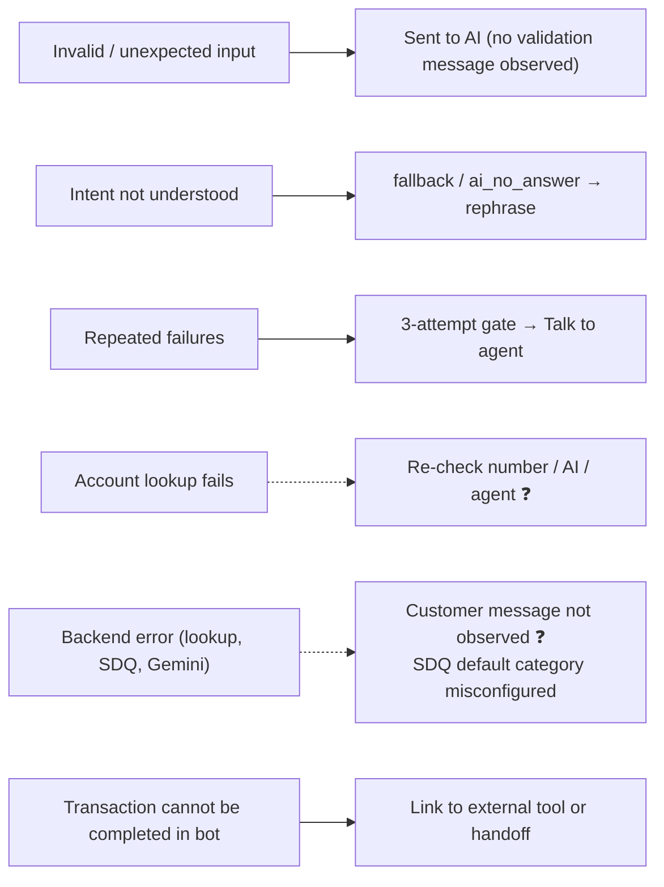
```mermaid
flowchart LR
    I1["Invalid / unexpected input"] --> AI["Sent to AI (no validation message observed)"]
    I2["Intent not understood"] --> FB["fallback / ai_no_answer → rephrase"]
    I3["Repeated failures"] --> GATE["3-attempt gate → Talk to agent"]
    I4["Account lookup fails"] -.-> RE["Re-check number / AI / agent ❓"]
    I5["Backend error (lookup, SDQ, Gemini)"] -.-> UNK["Customer message not observed ❓<br/>SDQ default category misconfigured"]
    I6["Transaction cannot be completed in bot"] --> LINK["Link to external tool or handoff"]
```

---

## 13. Escalation flow OBSERVED

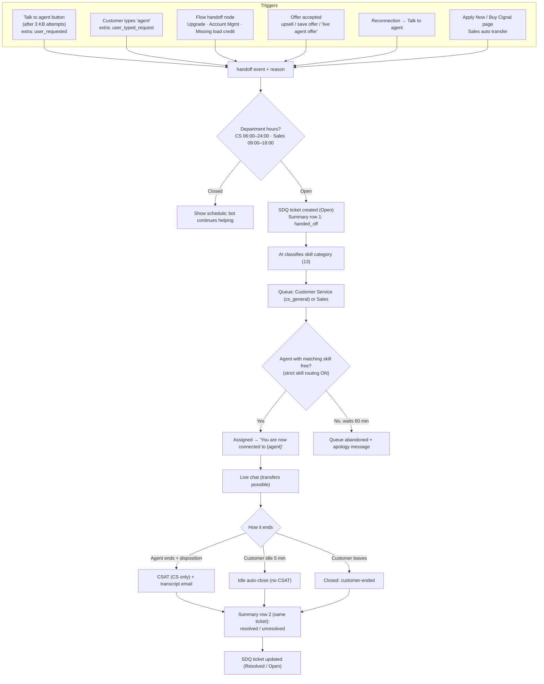
```mermaid
flowchart TD
    subgraph Triggers
        T1["Talk to agent button<br/>(after 3 KB attempts)<br/>extra: user_requested"]
        T2["Customer types 'agent'<br/>extra: user_typed_request"]
        T3["Flow handoff node<br/>Upgrade · Account Mgmt · Missing load credit"]
        T4["Offer accepted<br/>upsell / save offer / 'live agent offer'"]
        T5["Reconnection → Talk to agent"]
        T6["Apply Now / Buy Cignal page<br/>Sales auto transfer"]
    end
    T1 --> H["handoff event + reason"]
    T2 --> H
    T3 --> H
    T4 --> H
    T5 --> H
    T6 --> H
    H --> HR{"Department hours?<br/>CS 06:00–24:00 · Sales 09:00–18:00"}
    HR -- "Closed" --> SCH["Show schedule; bot continues helping"]
    HR -- "Open" --> TK["SDQ ticket created (Open)<br/>Summary row 1: handed_off"]
    TK --> SK["AI classifies skill category (13)"]
    SK --> QU["Queue: Customer Service (cs_general) or Sales"]
    QU --> AS{"Agent with matching skill free?<br/>(strict skill routing ON)"}
    AS -- "Yes" --> AG["Assigned → 'You are now connected to {agent}'"]
    AS -- "No, waits 60 min" --> QA["Queue abandoned + apology message"]
    AG --> CH["Live chat (transfers possible)"]
    CH --> CL{"How it ends"}
    CL -- "Agent ends + disposition" --> CS["CSAT (CS only) + transcript email"]
    CL -- "Customer idle 5 min" --> IC["Idle auto-close (no CSAT)"]
    CL -- "Customer leaves" --> CE["Closed: customer-ended"]
    CS --> R2["Summary row 2 (same ticket):<br/>resolved / unresolved"]
    IC --> R2
    CE --> R2
    R2 --> TU["SDQ ticket updated (Resolved / Open)"]
```

---

## 14. Live-agent lifecycle (sequence) OBSERVED Customer Journey timeline

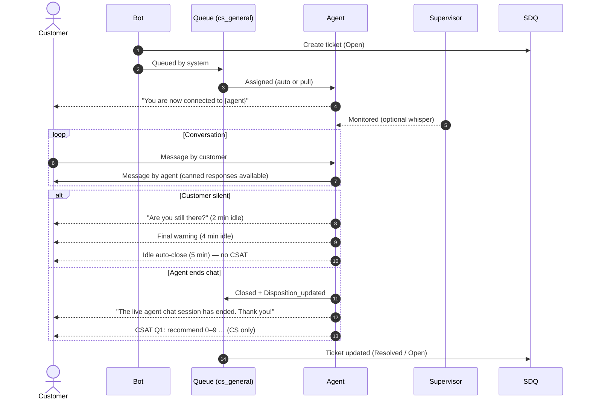
```mermaid
sequenceDiagram
    autonumber
    actor C as Customer
    participant B as Bot
    participant Q as Queue (cs_general)
    participant AG as Agent
    participant SV as Supervisor
    participant S as SDQ
    B->>S: Create ticket (Open)
    B->>Q: Queued by system
    Q->>AG: Assigned (auto or pull)
    AG-->>C: "You are now connected to {agent}"
    SV-->>AG: Monitored (optional whisper)
    loop Conversation
        C->>AG: Message by customer
        AG->>C: Message by agent (canned responses available)
    end
    alt Customer silent
        AG-->>C: "Are you still there?" (2 min idle)
        AG-->>C: Final warning (4 min idle)
        AG-->>C: Idle auto-close (5 min) — no CSAT
    else Agent ends chat
        AG->>Q: Closed + Disposition_updated
        AG-->>C: "The live agent chat session has ended. Thank you!"
        AG-->>C: CSAT Q1: recommend 0–9 … (CS only)
    end
    Q->>S: Ticket updated (Resolved / Open)
```

---

## 15. Sales / Apply Now flow OBSERVED

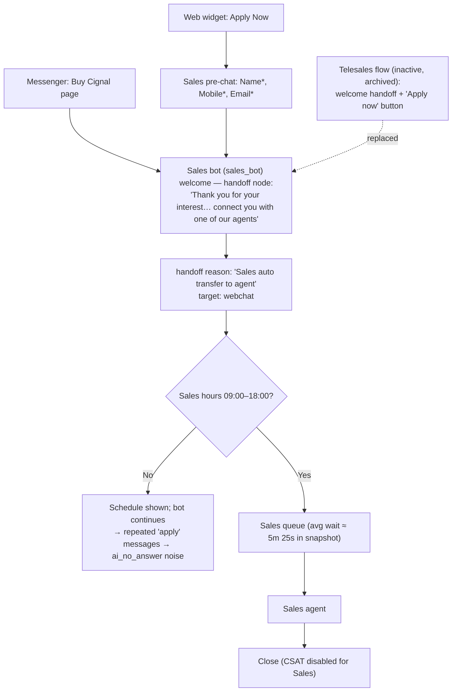
```mermaid
flowchart TD
    A1["Web widget: Apply Now"] --> F["Sales pre-chat: Name*, Mobile*, Email*"]
    A2["Messenger: Buy Cignal page"] --> SB
    F --> SB["Sales bot (sales_bot) welcome — handoff node:<br/>'Thank you for your interest… connect you with one of our agents'"]
    SB --> H["handoff reason: 'Sales auto transfer to agent'<br/>target: webchat"]
    H --> HR{"Sales hours 09:00–18:00?"}
    HR -- "No" --> SC["Schedule shown; bot continues<br/>→ repeated 'apply' messages → ai_no_answer noise"]
    HR -- "Yes" --> Q["Sales queue (avg wait ≈ 5m 25s in snapshot)"]
    Q --> AG["Sales agent"]
    AG --> END["Close (CSAT disabled for Sales)"]
    OLD["Telesales flow (inactive, archived):<br/>welcome handoff + 'Apply now' button"] -. "replaced" .-> SB
```

---

## 16. Session termination & abandonment OBSERVED

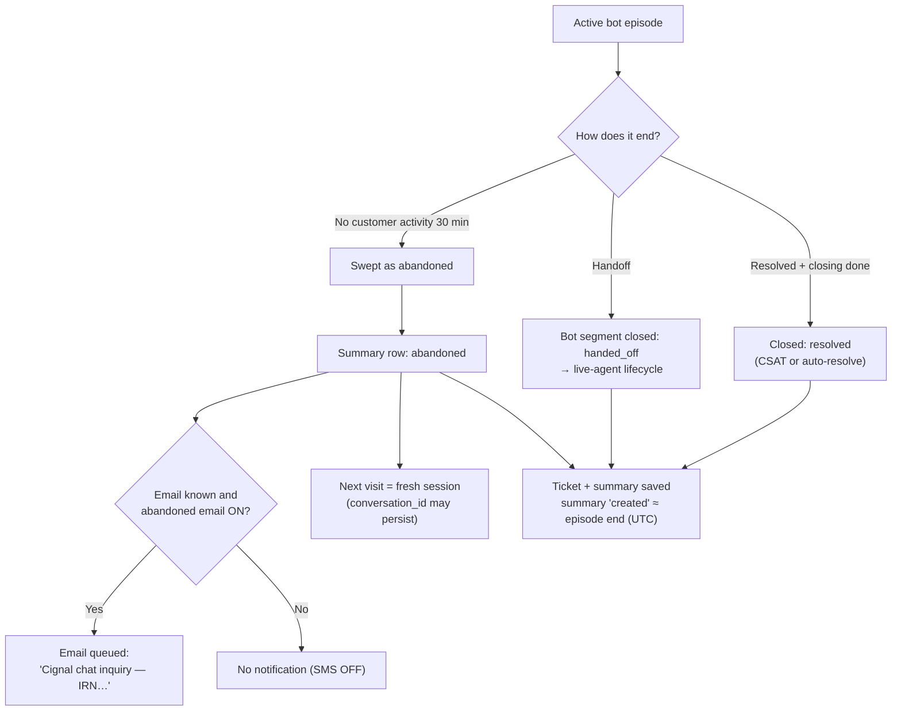
```mermaid
flowchart TD
    A["Active bot episode"] --> B{"How does it end?"}
    B -- "Resolved + closing done" --> C["Closed: resolved<br/>(CSAT or auto-resolve)"]
    B -- "Handoff" --> D["Bot segment closed: handed_off<br/>→ live-agent lifecycle"]
    B -- "No customer activity 30 min" --> E["Swept as abandoned"]
    E --> E1["Summary row: abandoned"]
    E1 --> E2{"Email known and<br/>abandoned email ON?"}
    E2 -- "Yes" --> E3["Email queued:<br/>'Cignal chat inquiry — IRN…'"]
    E2 -- "No" --> E4["No notification (SMS OFF)"]
    E1 --> E5["Next visit = fresh session<br/>(conversation_id may persist)"]
    C --> Z["Ticket + summary saved<br/>summary 'created' ≈ episode end (UTC)"]
    D --> Z
    E1 --> Z
```

---

## 17. Conversation state model OBSERVED + PROPOSED

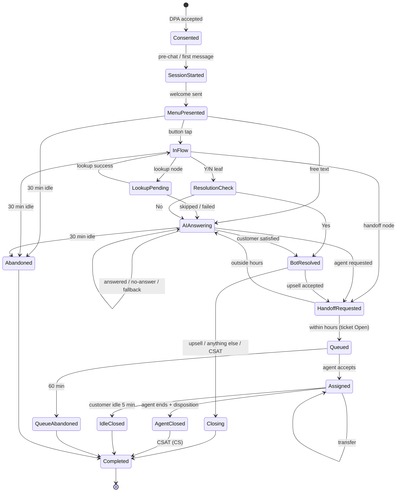
```mermaid
stateDiagram-v2
    [*] --> Consented: DPA accepted
    Consented --> SessionStarted: pre-chat / first message
    SessionStarted --> MenuPresented: welcome sent
    MenuPresented --> InFlow: button tap
    MenuPresented --> AIAnswering: free text
    InFlow --> LookupPending: lookup node
    LookupPending --> InFlow: lookup success
    LookupPending --> AIAnswering: skipped / failed
    InFlow --> ResolutionCheck: Y/N leaf
    ResolutionCheck --> BotResolved: Yes
    ResolutionCheck --> AIAnswering: No
    AIAnswering --> AIAnswering: answered / no-answer / fallback
    AIAnswering --> BotResolved: customer satisfied
    InFlow --> HandoffRequested: handoff node
    AIAnswering --> HandoffRequested: agent requested
    BotResolved --> HandoffRequested: upsell accepted
    HandoffRequested --> AIAnswering: outside hours
    HandoffRequested --> Queued: within hours (ticket Open)
    Queued --> Assigned: agent accepts
    Queued --> QueueAbandoned: 60 min
    Assigned --> Assigned: transfer
    Assigned --> AgentClosed: agent ends + disposition
    Assigned --> IdleClosed: customer idle 5 min
    BotResolved --> Closing: upsell / anything else / CSAT
    Closing --> Completed
    AgentClosed --> Completed: CSAT (CS)
    IdleClosed --> Completed
    QueueAbandoned --> Completed
    MenuPresented --> Abandoned: 30 min idle
    InFlow --> Abandoned: 30 min idle
    AIAnswering --> Abandoned: 30 min idle
    Abandoned --> Completed
    Completed --> [*]
```

---

## 18. Data / reporting event flow OBSERVED sources

```mermaid
flowchart LR
    subgraph Customer_Side["Customer side"]
        W["Widget / Messenger"]
    end
    subgraph Bot_Platform["Bot platform"]
        FE["Flow engine"]
        AI["Gemini + KB"]
        LA["Live Agent Console"]
        SUM["Post-session AI summarizer"]
    end
    subgraph Stores["Data stores (observed)"]
        DPA[("DPA consent log")]
        EV[("Analytics event log<br/>kb_hit · ai_chat · ai_no_answer ·<br/>handoff · fallback · ask_ai ·<br/>bot_initial_*")]
        KB[("KB answer checks / article usage")]
        SS[("chatbot_session_summary<br/>1–2 rows per episode")]
        CS[("chatbot_csat_response")]
        EN[("engagement + engagement_event")]
        NQ[("Notification queue")]
    end
    SDQ[("SDQ tickets")]
    W --> DPA
    W --> FE
    FE --> EV
    FE --> AI
    AI --> EV
    AI --> KB
    FE --> LA
    LA --> EN
    FE --> SUM
    LA --> SUM
    SUM --> SS
    FE --> CS
    LA --> CS
    FE --> SDQ
    LA --> SDQ
    SUM --> NQ
    LA --> NQ
    EV --> RPT["Admin Dashboard / Analytics /<br/>Ad Hoc / EOM template"]
    SS --> RPT
    CS --> RPT
    EN --> RPT
    KB --> RPT
```

Join key across all sources: **conversation_id** (32-hex). Ticket ref exists only on summaries and SDQ. Timestamps: API and events in **UTC**; journey, SDQ and engagement timeline in **Manila**. **OBSERVED**

---

## 19. Episode & summary-row model — why rows double-count OBSERVED

```mermaid
flowchart TD
    CV["Conversation (conversation_id)"] --> E1["Episode 1 = Ticket A"]
    CV --> E2["Episode 2 = Ticket B (customer returns)"]
    E1 --> R1["Summary row 1<br/>bot segment: handed_off"]
    E1 --> R2["Summary row 2<br/>after agent: resolved / unresolved<br/>(re-summarizes whole chat)"]
    E1 --> EG["Engagement #n"]
    E2 --> R3["Summary row 3<br/>bot-only: resolved / abandoned"]
    CV --> CSAT["CSAT rows (linked by conversation only)"]
    R1 -. "count rows = 2 for one ticket ✗" .-> X["Double count"]
    R2 -. "status ≠ bot outcome" .-> X
```

Snapshot proof: 258 tickets had several rows — 145 `handed_off → unresolved`, 108 `handed_off → resolved`, 3 `abandoned → abandoned`, 1 `handed_off → abandoned`, 1 `handed_off → resolved → resolved`.

---

## 20. Proposed reporting pipeline PROPOSED

```mermaid
flowchart LR
    A["Raw pulls (Ad Hoc / API)<br/>summaries · events · CSAT · engagements · KB"] --> B["Normalize<br/>UTC → Manila · strip prefixes ·<br/>GUID → 32-hex"]
    B --> C["Exclude<br/>webchat:test · test pages ·<br/>sales_bot · blank episodes (flagged)"]
    C --> D["Build Episode table<br/>group by ticket · order segments ·<br/>Bot_Outcome · Final_Outcome"]
    D --> E["Attach events / CSAT / engagements<br/>by conversation_id + time window"]
    E --> F["Metric layer<br/>(metric dictionary §14)"]
    F --> G["Dashboard pages 1–10<br/>+ EOM / MBR"]
```